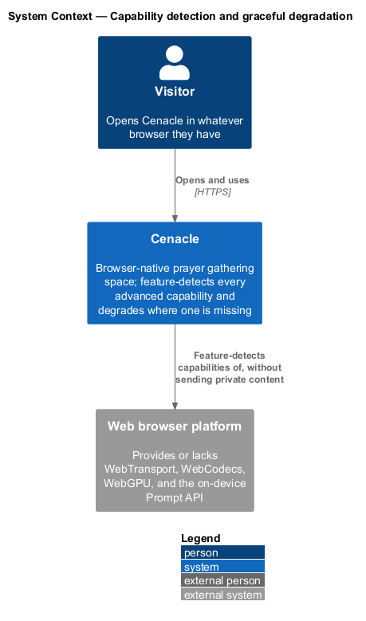
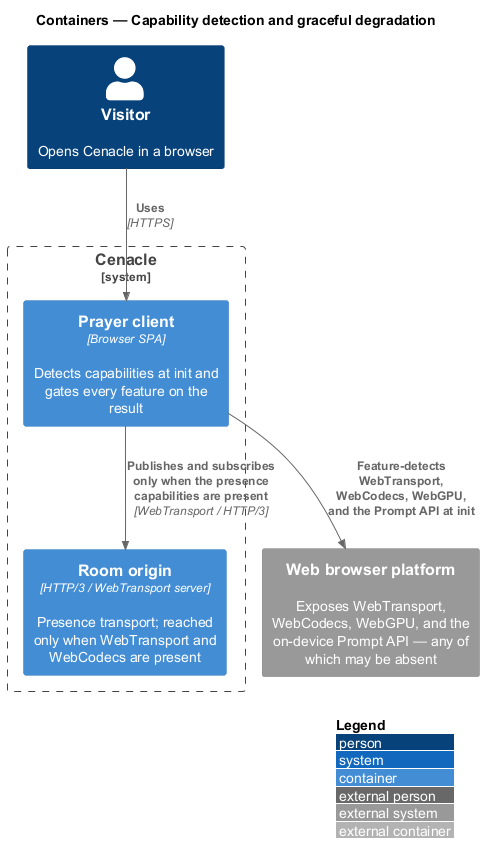
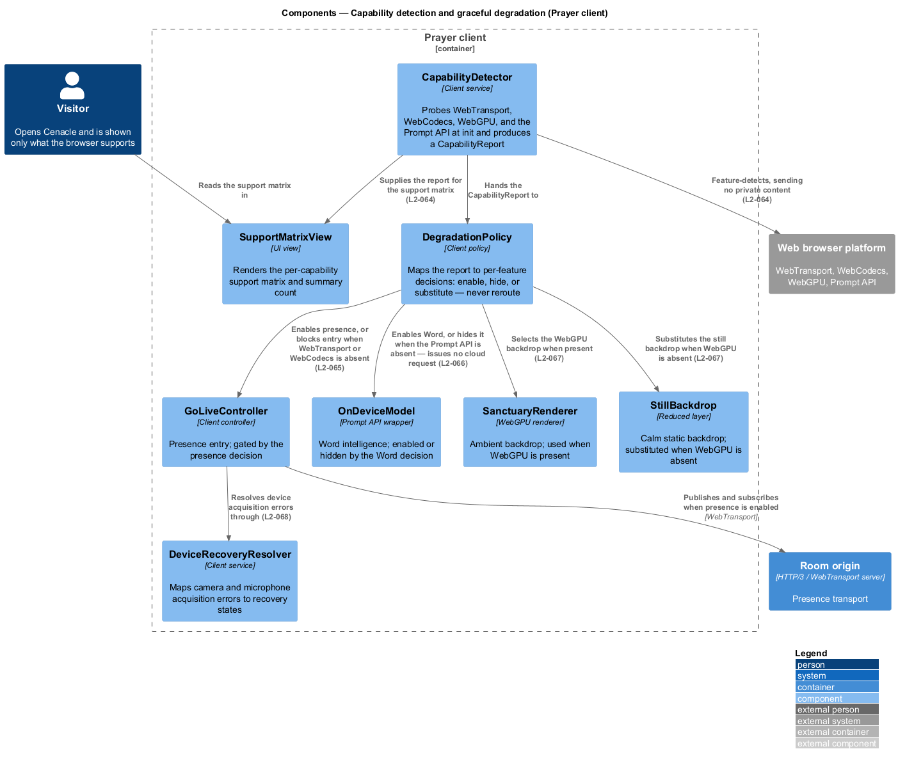
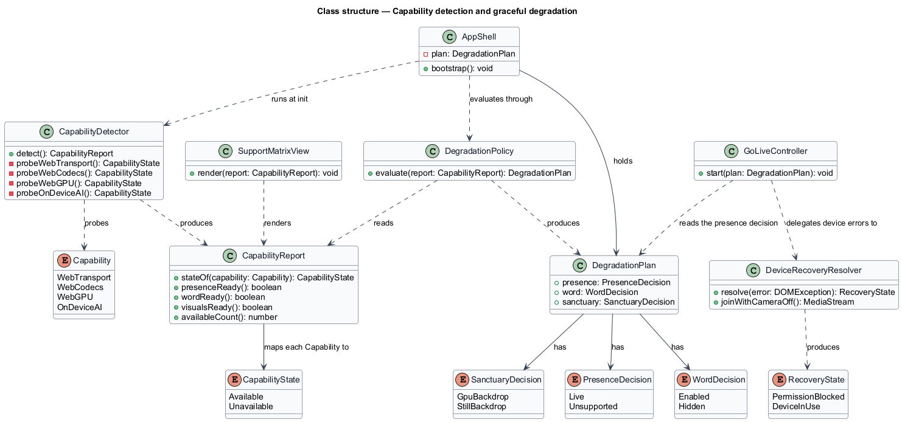
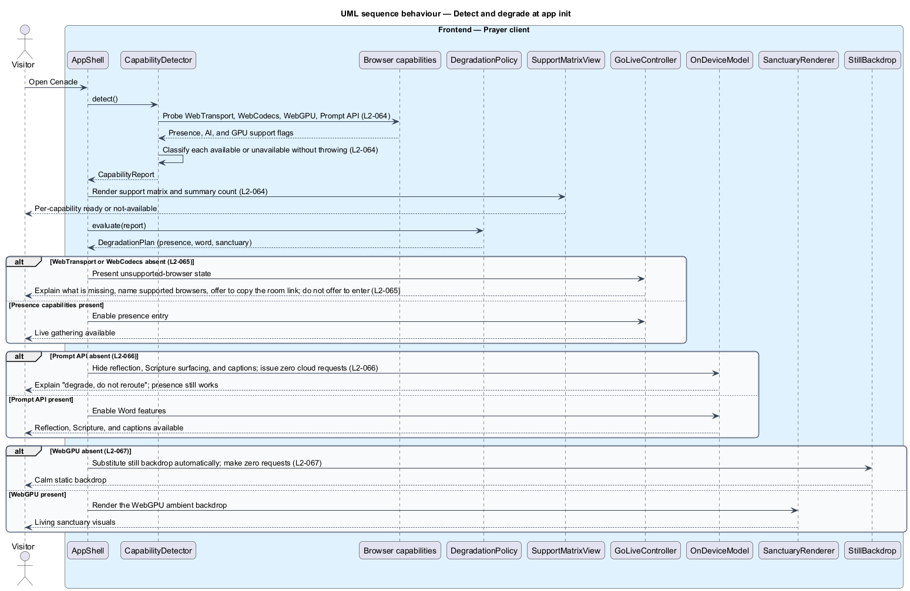
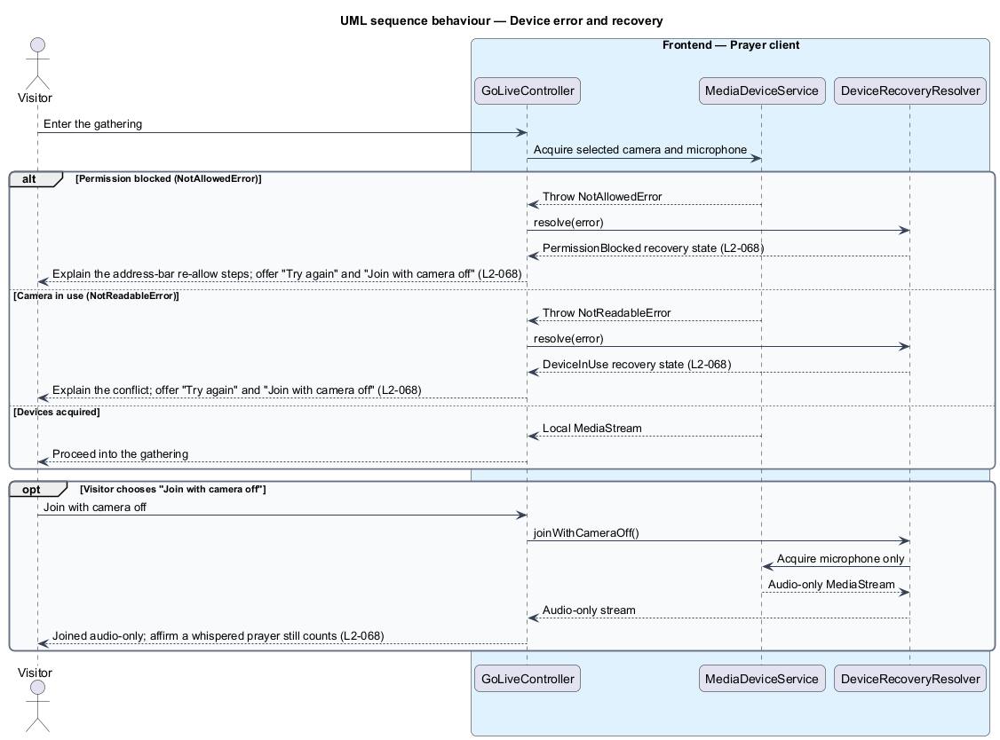

# Capability detection and graceful degradation

## Overview

Cenacle is a browser-native prayer gathering space that depends on advanced
browser capabilities not present in every browser: *WebTransport* (the HTTP/3
transport that carries live media), *WebCodecs* (the encode and decode path for
that media), *WebGPU* (the GPU surface behind the ambient sanctuary), and the
on-device *Prompt API* (the local model behind reflections, Scripture matching,
and captions). This feature is the cross-cutting machinery that feature-detects
each capability at start-up and decides, per feature, what the browser can
actually run.

- **capability** — an advanced browser API the product depends on: WebTransport,
  WebCodecs, WebGPU, or the on-device Prompt API
- **graceful degradation** — hiding or substituting an affected feature with a
  plain explanation when its capability is absent, rather than blocking the whole
  experience
- **degrade, don't reroute** — the governing rule: a missing capability hides or
  substitutes its feature locally and never sends the feature's work to a server

The guiding principle throughout is *degrade, don't reroute*. Where a capability
is missing, the affected feature is hidden or substituted on the device; no
capability gap is answered by a network call that a supported browser would not
have made. Detection itself sends no private content off the device (L2-064).
The remaining browser experience continues: a browser without the Prompt API
still hosts and joins gatherings, and a browser without WebGPU still shows a calm
backdrop.

This document assumes no prior knowledge of Cenacle's internals. Local terms are
defined at first use, and the diagrams show where the detection and degradation
machinery sits and how the rest of the Prayer client consults it.

## Description

The feature is a cross-cutting slice inside the Prayer client — the browser
single-page application where all UI and on-device logic live. It runs at
app initialization and produces decisions that every other feature reads.

- **`CapabilityDetector`** — client service that probes WebTransport, WebCodecs,
  WebGPU, and the Prompt API at start-up. It classifies each capability as
  available or unavailable and completes without throwing on a browser missing
  any of them. It sends no private content while probing.
- **`CapabilityReport`** — the result of detection: the available/unavailable
  state of each capability, plus derived readiness for presence, Word, and
  visuals, and a summary count.
- **`DegradationPolicy`** — client policy that reads the `CapabilityReport` and
  produces a `DegradationPlan`. It maps each capability gap to one local outcome —
  enable, hide, or substitute — and never to a server call.
- **`DegradationPlan`** — the per-feature decision set: a `PresenceDecision`, a
  `WordDecision`, and a `SanctuaryDecision`.
- **`AppShell`** — the bootstrap that runs detection once at init, evaluates the
  policy, and holds the `DegradationPlan` for feature shells to consult.
- **`SupportMatrixView`** — UI view that renders the per-capability support
  matrix — each capability as ready or not-available — with a summary count.
- **`DeviceRecoveryResolver`** — client service that maps a camera or microphone
  acquisition error to a recovery state and offers a camera-off join path.
- **`GoLiveController`** — the shared presence-entry controller. It reads the
  presence decision before entering, and delegates device acquisition errors to
  the `DeviceRecoveryResolver`.
- **`OnDeviceModel`** — the shared Prompt API wrapper behind the Word features.
  The Word decision enables or hides the features that use it; it is never
  replaced by a server model.
- **`SanctuaryRenderer`** / **`StillBackdrop`** — the shared WebGPU ambient
  renderer and its reduced still layer. The sanctuary decision selects the
  renderer when WebGPU is present and the still backdrop when it is absent.

Presence readiness depends on both WebTransport and WebCodecs; either one absent
makes the live gathering unavailable (L2-065). Word readiness depends on the
on-device Prompt API; its absence hides the Word features while presence
continues (L2-066). Visuals readiness depends on WebGPU; its absence substitutes
the still backdrop automatically (L2-067). Runtime device errors at go-live or
join — permission denial and device-in-use — resolve to recovery states that
include an audio-only join (L2-068). The presence transport, the on-device model,
and the sanctuary renderer are neighbouring slices; this feature gates them
rather than owning them.

## Requirements

The feature realizes the following level-2 (L2) requirements. Each L2 refines a
level-1 (L1) requirement, cited by identifier.

| L2 ID | Refines (L1) | Requirement |
|-------|--------------|-------------|
| `L2-064` | `L1-016` | The system shall detect WebTransport, WebCodecs, WebGPU, and on-device AI at initialization, classify each as available or unavailable without throwing, and present a per-capability support matrix with a summary count. |
| `L2-065` | `L1-016` | Where WebTransport or WebCodecs is missing, the system shall report the live gathering unavailable, explain what is missing, name supported browsers, offer to copy the room link for a supported device, and shall not offer to enter the live room. |
| `L2-066` | `L1-016` | Where on-device AI is unavailable, the system shall hide the Word features — journal reflection, Scripture surfacing, and captions — with an explanation, shall keep presence working, and shall issue no cloud fallback request. |
| `L2-067` | `L1-016` | Where WebGPU is unavailable, the system shall fall back automatically to a still backdrop that makes zero requests, while presence, captions, and companion keep working. |
| `L2-068` | `L1-016` | The system shall map camera or microphone permission denial and device-in-use to recovery states that explain the cause and offer to try again and to join with the camera off, audio-only. |

## Diagrams

### System context

The visitor opens Cenacle in whatever browser they have; Cenacle feature-detects
that browser's capabilities and never sends private content while doing so.

### Containers

The Prayer client feature-detects the browser platform at init and reaches the
room origin for presence only when WebTransport and WebCodecs are both present.

### Components

Inside the Prayer client, `CapabilityDetector` produces a `CapabilityReport`;
`DegradationPolicy` turns it into per-feature decisions that enable
`GoLiveController`, enable or hide `OnDeviceModel`, and select `SanctuaryRenderer`
or `StillBackdrop`; `SupportMatrixView` renders the matrix and
`DeviceRecoveryResolver` handles device errors.

### Class structure

`CapabilityDetector` produces a `CapabilityReport`; `DegradationPolicy` reads it
and produces a `DegradationPlan` carrying a `PresenceDecision`, a `WordDecision`,
and a `SanctuaryDecision`; `AppShell` holds the plan and `GoLiveController` reads
the presence decision and delegates device errors to `DeviceRecoveryResolver`.

### Behaviour — detect and degrade

At init, `AppShell` runs `CapabilityDetector`, which probes each capability
without throwing (`L2-064`) and returns a report; `SupportMatrixView` renders it,
and `DegradationPolicy` produces the plan. Each feature area then degrades
independently: presence is blocked with a copy-link path when WebTransport or
WebCodecs is absent (`L2-065`); Word features are hidden with zero cloud requests
when the Prompt API is absent (`L2-066`); and the still backdrop is substituted
automatically when WebGPU is absent (`L2-067`).

### Behaviour — device error and recovery

At go-live or join, `GoLiveController` acquires the selected devices; on a
permission denial or a device-in-use error, `DeviceRecoveryResolver` returns the
matching recovery state, each offering "Try again" and "Join with camera off"
(`L2-068`). Choosing camera-off acquires the microphone only and joins audio-only.

