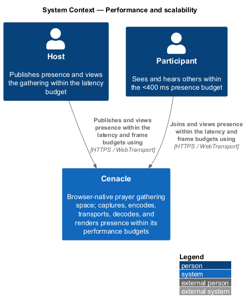
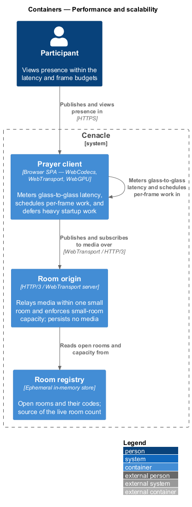
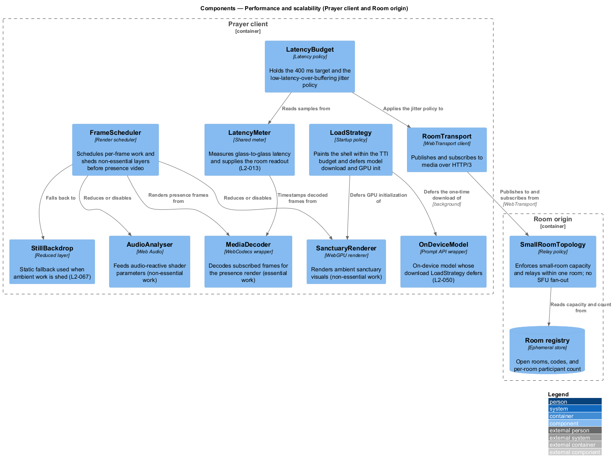
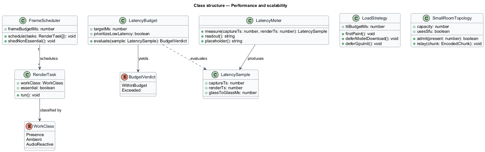
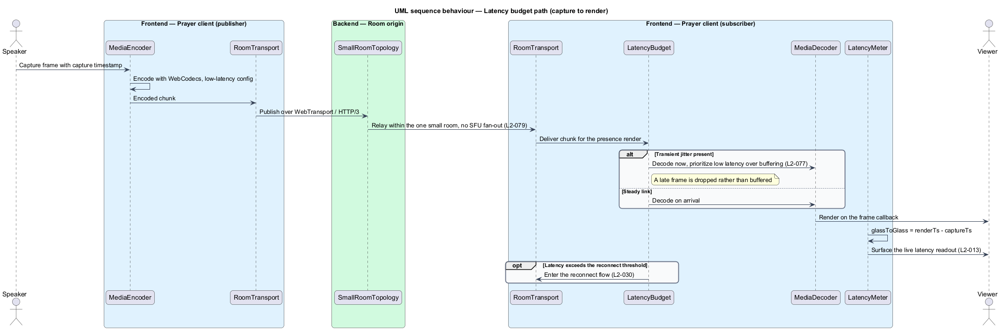
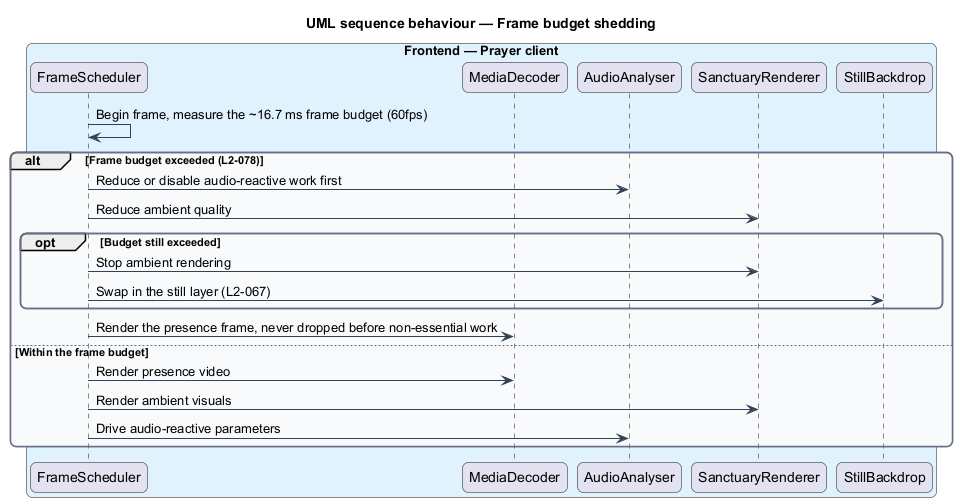

# Performance and scalability

## Overview

Cenacle is a browser-native prayer gathering space. Its presence, sanctuary, and
Word features share four performance budgets that decide whether a gathering
feels co-located rather than buffered. This cross-cutting design gathers the
parts that govern those budgets into one place and names the policy each one
enforces.

Four terms recur below and are defined at first use.

- **glass-to-glass latency** — elapsed time from a frame's capture at one
  participant's camera to its display on another participant's screen
- **frame budget** — time available to render one animation frame at the target
  rate (about 16.7 ms at 60fps)
- **small-room topology** — arrangement in which one origin relays media within a
  single small room, with no large-scale fan-out
- **time-to-interactive (TTI)** — point at which the application shell responds to
  input

This design is cross-cutting, so its diagrams are scoped to the
performance-governing parts rather than to a single screen. The presence latency
budget holds glass-to-glass latency under 400 ms on a LAN-class connection and
prioritizes low latency over buffering under transient jitter (L2-077). Rendering
targets 60fps and sheds non-essential work before it degrades presence video
(L2-078). The room runs on a small-room topology with a defined capacity and no
SFU (L2-079). The shell reaches interactivity within its TTI budget while heavy
startup work is deferred (L2-080).

## Description

The design introduces four policy parts in the Prayer client and one at the Room
origin. Each governs one budget and reuses the shared presence, sanctuary, and
transport vocabulary rather than duplicating it.

- **`LatencyMeter`** — shared meter that measures glass-to-glass latency from a
  frame's capture timestamp to its render time. It supplies the room's live
  latency readout and a neutral placeholder when a measurement is missing
  (L2-013).
- **`LatencyBudget`** — latency policy holding the 400 ms target and the
  jitter rule. Under transient jitter it prioritizes low latency over buffering,
  dropping a late frame rather than queuing it (L2-077).
- **`FrameScheduler`** — render scheduler that measures the per-frame budget and
  classifies work as essential or non-essential. On an exceeded budget it reduces
  or disables audio-reactive and ambient work before it degrades presence video
  (L2-078).
- **`LoadStrategy`** — startup policy that paints the shell within the TTI budget
  and defers heavy work off the first-paint path: the one-time on-device model
  download (L2-050) and WebGPU initialization (L2-067).
- **`SmallRoomTopology`** — relay policy at the Room origin. It admits publishers
  and subscribers up to a defined small-room capacity and relays media within one
  room; it implements no SFU and no large-scale fan-out (L2-079).

The sheddable and deferred work belongs to neighbouring slices that this design
governs rather than owns: `SanctuaryRenderer` and `AudioAnalyser` are the
non-essential layers the `FrameScheduler` reduces first, `StillBackdrop` is the
reduced layer it falls back to (L2-067), `MediaDecoder` renders the presence
frames it protects, and `OnDeviceModel` holds the download `LoadStrategy` defers
(L2-050). The reconnect flow the `LatencyBudget` hands off to on sustained loss
is owned elsewhere (L2-030).

The small-room capacity count is not fixed in the specifications and is marked
`<TO SUPPLY>` here; the room-full refusal that enforces it against a join is a
neighbouring slice (L2-031).

## Requirements

The feature realizes the following level-2 (L2) requirements. Each L2 refines a
level-1 (L1) requirement, cited by identifier.

| L2 ID | Refines (L1) | Requirement |
|-------|--------------|-------------|
| `L2-077` | `L1-019` | The system shall hold glass-to-glass presence latency under 400 ms on a LAN-class connection, shall prioritize low latency over buffering under transient jitter, and shall surface the measured latency in the room readout. |
| `L2-078` | `L1-019` | Video and sanctuary rendering shall target 60fps, and the client shall shed non-essential ambient and audio-reactive work before it degrades presence video. |
| `L2-079` | `L1-019` | The system shall operate within a defined small-room capacity and shall implement no large-scale fan-out or SFU in v1. |
| `L2-080` | `L1-019` | The application shell shall become interactive within a defined budget (TTI ≤ 3 s on a mid-range device), and shall defer model download and GPU initialization without blocking first paint. |

## Diagrams

### System context

Both the host and a participant view presence within the latency and frame
budgets, connecting to Cenacle over HTTPS and WebTransport. The context is scoped
to the people whose experience the budgets protect.

### Containers

The Prayer client meters glass-to-glass latency and schedules per-frame work; it
publishes and subscribes to the Room origin over WebTransport. The origin relays
within one small room and reads capacity and the live room count from the Room
registry.

### Components

Inside the Prayer client, `LoadStrategy` defers the model download and GPU init,
`FrameScheduler` reduces `SanctuaryRenderer` and `AudioAnalyser` before the
presence render, and `LatencyBudget` reads `LatencyMeter` samples and applies the
jitter policy to `RoomTransport`. At the Room origin, `SmallRoomTopology` reads
capacity from the `Room registry` and relays without an SFU.

### Class structure

`LatencyMeter` produces a `LatencySample` that `LatencyBudget` evaluates into a
`BudgetVerdict`; `FrameScheduler` schedules `RenderTask`s classified by
`WorkClass`; `LoadStrategy` and `SmallRoomTopology` hold the TTI and capacity
policies.

### Behaviour — latency budget path

A captured frame is encoded with WebCodecs, published over WebTransport, relayed
within the one small room (L2-079), decoded, and rendered; `LatencyMeter`
computes glass-to-glass latency and surfaces the readout (L2-013). Under jitter,
`LatencyBudget` decodes immediately and drops a late frame rather than buffering
(L2-077), and hands off to reconnect only past the threshold (L2-030).

### Behaviour — frame budget shedding

`FrameScheduler` measures the ~16.7 ms frame budget each frame. When the budget
is exceeded it reduces audio-reactive work first, then ambient quality, and swaps
in `StillBackdrop` if needed (L2-067), while the presence frame is rendered and
never dropped before non-essential work (L2-078).

