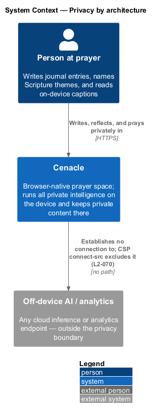
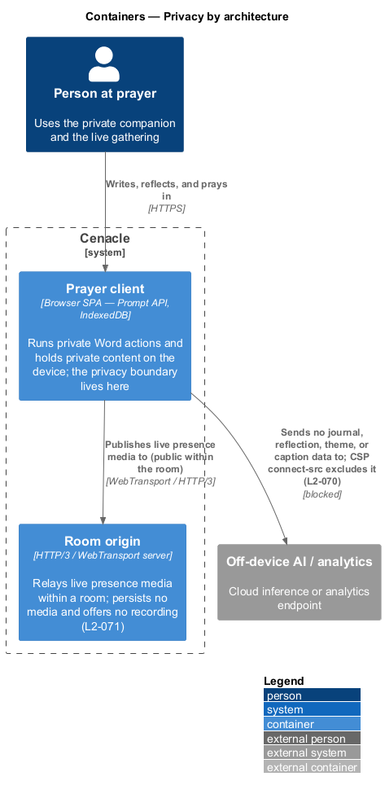
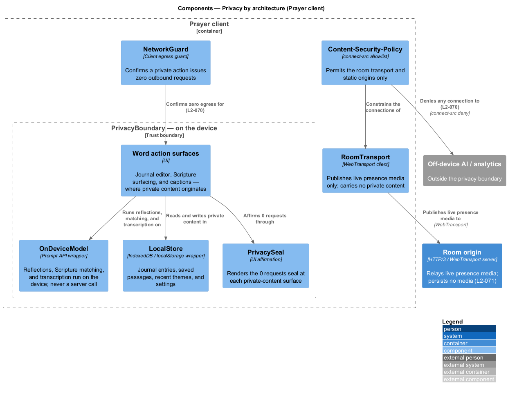
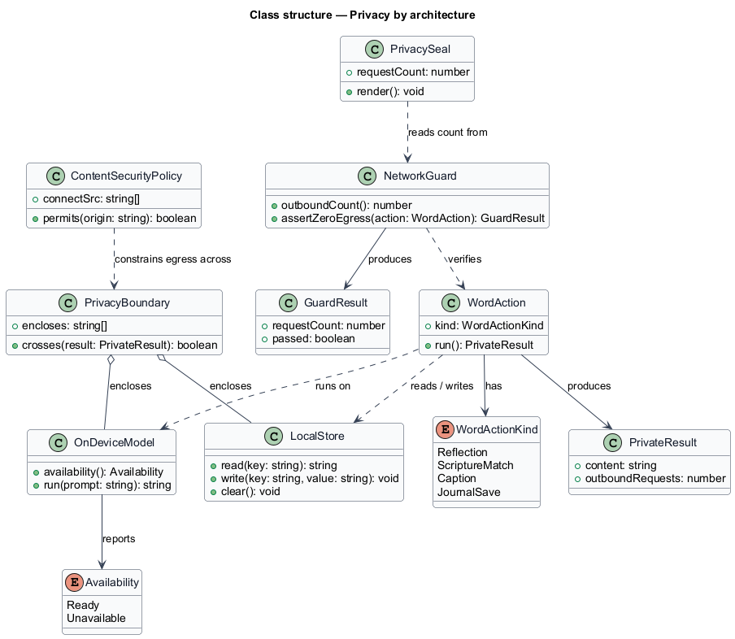
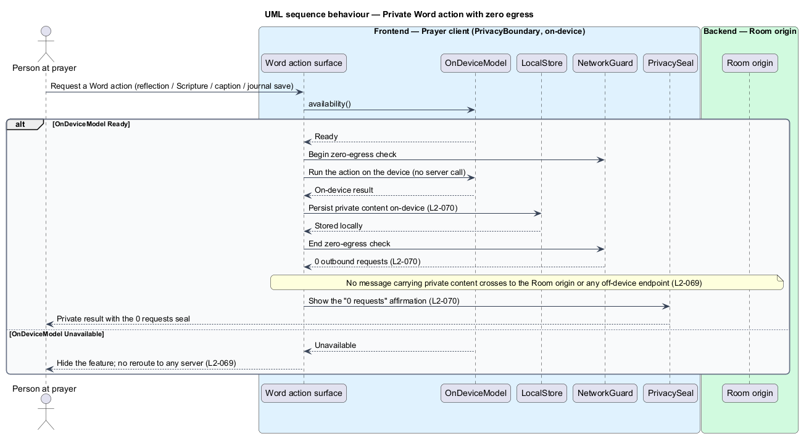
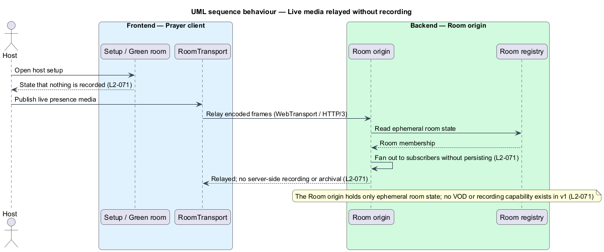

# Privacy by architecture

## Overview

Cenacle is a browser-native prayer gathering space. Some of what a person does in
it is private: journal entries, the reflections drawn from them, the plain-word
themes named for Scripture, and the audio and transcripts behind live captions.
This feature states how the system keeps that content private by *architecture*
rather than by policy — the guarantee rests on where the code can run and what it
can reach, not on a promise to behave.

*private content* — journal text, reflections, Scripture themes, and caption
audio or transcripts

*privacy boundary* — the on-device edge inside which private content is created,
processed, and stored, and which it never crosses

The guarantee has three parts, each an architectural fact. First, no code path
sends private content to any server; where an on-device capability is missing the
affected feature is hidden, never rerouted. Second, the guarantee is verifiable:
exercising a private feature produces zero outbound network requests, the UI
carries a `0 requests` affirmation, and a Content-Security-Policy `connect-src`
allowlist excludes any AI or analytics endpoint. Third, live audio and video are
not recorded — the Room origin relays media and persists none, and v1 ships no
recording or video-on-demand capability.

This document assumes no prior knowledge of Cenacle's internals. The terms are
defined at first use, and the diagrams show where the boundary sits and what may
and may not cross it.

## Description

The feature is a cross-cutting concern realized inside the Prayer client — the
browser single-page application that holds all UI and on-device logic. It
introduces one boundary and the parts that enforce and attest it.

- **`PrivacyBoundary`** — the on-device trust boundary the guarantee rests on. It
  encloses the Word action surfaces, `OnDeviceModel`, `LocalStore`, and
  `PrivacySeal`. Private content originates, is processed, and is stored inside it
  and has no component edge leaving it.
- **`OnDeviceModel`** — wrapper over the browser Prompt API. It runs reflections,
  Scripture matching, and transcription on the device. It is never a server call.
- **`LocalStore`** — wrapper over origin-scoped browser storage (`IndexedDB` /
  `localStorage`). It holds journal entries, saved passages, recent themes, and
  settings, and the person may clear it.
- **`NetworkGuard`** — client-side egress guard. It confirms that a private action
  issues zero outbound requests and yields a `GuardResult` carrying the count.
- **`Content-Security-Policy`** — a `connect-src` allowlist delivered as a response
  header and enforced by the browser. It permits the room transport and the
  required static origins only, and denies connections to any AI or analytics
  endpoint.
- **`PrivacySeal`** — UI affirmation. It reads the request count and renders the
  `0 requests` seal at each private-content surface.
- **`RoomTransport`** — WebTransport client. It publishes live presence media only;
  it carries no private content. The `Content-Security-Policy` constrains where it
  may connect.
- **`Room origin`** — HTTP/3 / WebTransport server. It relays live presence media
  within one room and persists no media; it sits outside the privacy boundary.

The Word features that produce private content — the lament journal (L2-038…044),
Scripture surfacing (L2-033…037), and live captions (L2-045…048) — own their own
behaviour and are neighbouring slices; this feature states the boundary they run
inside and the attestation they share. Where a value is fixed elsewhere — for
example the exact `connect-src` allowlist entries — it is stated in the security
slice (L2-074) rather than duplicated here.

## Requirements

The feature realizes the following level-2 (L2) requirements. Each L2 refines the
level-1 (L1) requirement `L1-017`, cited by identifier.

| L2 ID | Refines (L1) | Requirement |
|-------|--------------|-------------|
| `L2-069` | `L1-017` | The system shall contain no code path that sends journal text, reflections, Scripture themes, or caption audio or transcripts to any server, and shall hide an unavailable on-device feature rather than reroute it. |
| `L2-070` | `L1-017` | The system shall make the zero-egress guarantee verifiable: a private action shall produce zero outbound requests, the UI shall surface a `0 requests` affirmation, and the Content-Security-Policy `connect-src` allowlist shall exclude any AI or analytics endpoint. |
| `L2-071` | `L1-017` | The system shall not record or persist live audio or video server-side, shall state this at setup and in the green room, and shall offer no recording or video-on-demand capability in v1. |

## Diagrams

### System context

The person at prayer writes and reflects privately in Cenacle, which runs all
private intelligence on the device. Cenacle establishes no connection to any
off-device AI or analytics endpoint; the `connect-src` allowlist excludes it
(`L2-070`).

### Containers

Within Cenacle, the Prayer client holds the privacy boundary and keeps private
content on the device. It publishes only live presence media to the Room origin,
which persists none (`L2-071`), and it sends no private content to the off-device
endpoint the Content-Security-Policy excludes (`L2-070`).

### Components

Inside the Prayer client, the `PrivacyBoundary` encloses the Word action surfaces,
`OnDeviceModel`, `LocalStore`, and `PrivacySeal`; no edge carrying private content
leaves it. `NetworkGuard` confirms zero egress, the `Content-Security-Policy`
denies any connection to the off-device endpoint (`L2-070`), and only
`RoomTransport` reaches the Room origin — with presence media, never private
content.

### Class structure

A `WordAction` runs on `OnDeviceModel`, reads and writes through `LocalStore`, and
produces a `PrivateResult`. `NetworkGuard` verifies the action and yields a
`GuardResult`; `PrivacySeal` reads its count; the `PrivacyBoundary` encloses
`OnDeviceModel` and `LocalStore`, and the `ContentSecurityPolicy` constrains egress
across it.

### Behaviour — private Word action with zero egress

A Word action runs entirely within the on-device boundary: `OnDeviceModel`
produces the result, `LocalStore` persists it, and `NetworkGuard` reports zero
outbound requests before `PrivacySeal` shows the `0 requests` affirmation
(`L2-070`). No message carrying private content crosses to the Room origin. When
`OnDeviceModel` is unavailable, the surface hides the feature rather than rerouting
it to a server (`L2-069`).

### Behaviour — live media relayed without recording

Live presence media travels from `RoomTransport` to the Room origin, which reads
ephemeral room state, fans the frames out to subscribers, and persists nothing;
setup and the green room state that nothing is recorded, and v1 exposes no
recording or video-on-demand capability (`L2-071`).

