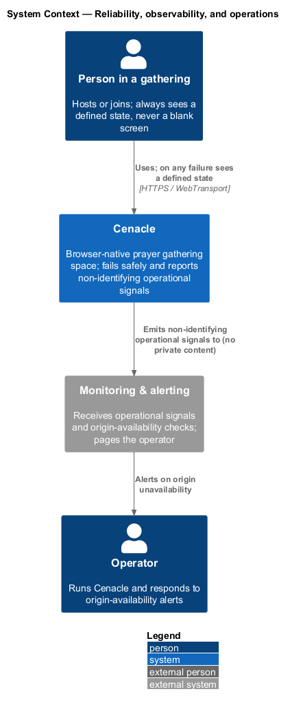
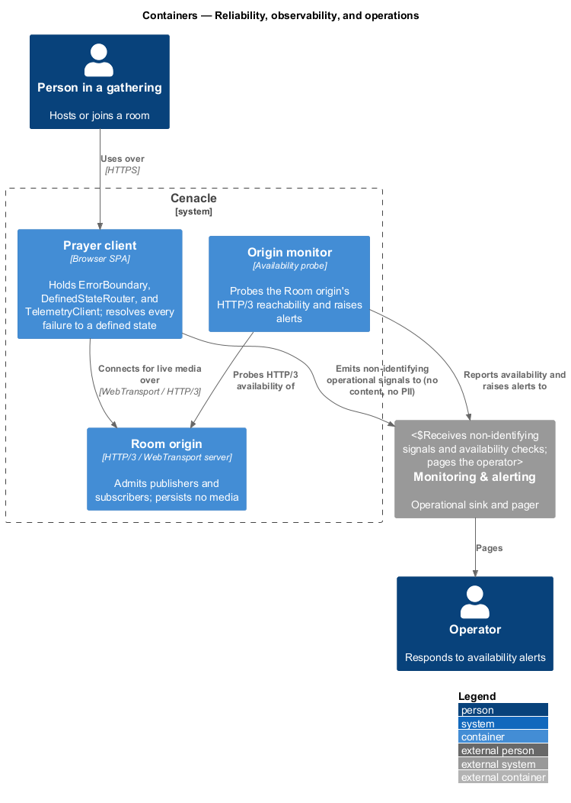
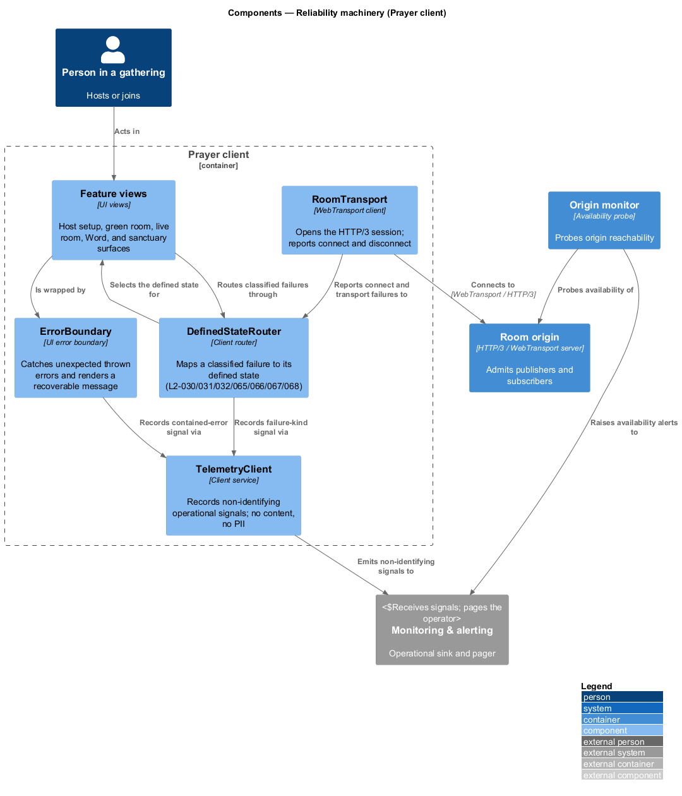
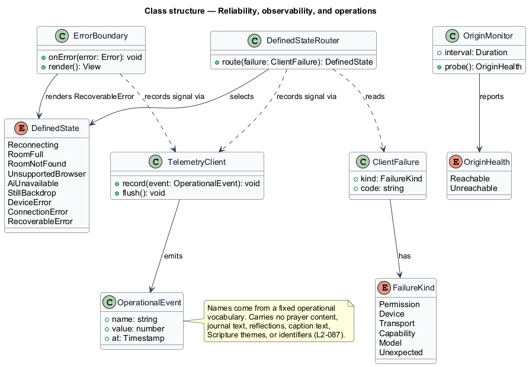
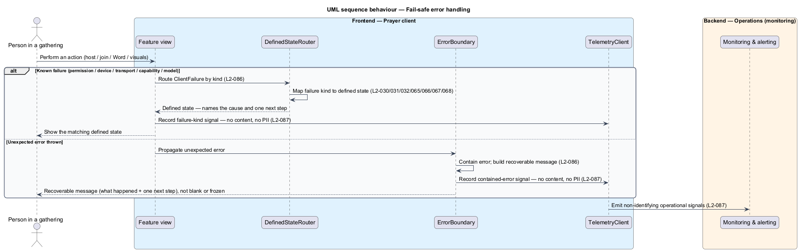
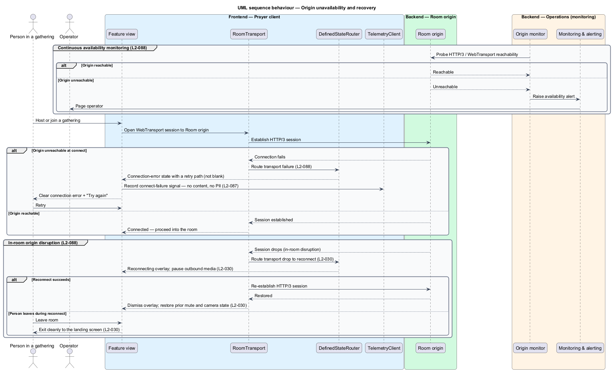

# Reliability, observability, and operations

## Overview

Cenacle is a browser-native prayer gathering space. Its features — presence,
the private companion, and the sanctuary visuals — each fail in their own way:
a permission is denied, a device is busy, a transport drops, a capability is
missing, a model is absent. This feature is the cross-cutting machinery that
holds all of those failures to one standard, watches the live origin, and reports
only what operations needs while private words stay on the device.

*cross-cutting concern* — a design responsibility that spans every feature rather
than living inside one. *defined state* — a named, designed screen or message for
a known outcome, such as the reconnect overlay (L2-030) or the room-not-found
state (L2-032). *operational signal* — a non-identifying measurement of how the
system runs, such as a connection success or a latency figure. *origin
monitoring* — continuous checking that the live transport origin answers.

The feature answers three obligations. First, the client fails safely and
visibly: every failure path resolves to a defined state or a recoverable message
that names what happened and one next step, and no unexpected error leaves a blank
or frozen screen (L2-086). Second, observability preserves privacy: telemetry
carries only non-identifying operational signals and never prayer content, journal
text, reflections, caption text, Scripture themes, or personal identifiers
(L2-087), consistent with the zero-egress guarantee for private content
(L2-069, L2-070). Third, the WebTransport-over-HTTP/3 Room origin is monitored and
alertable, and the client handles origin unavailability with a clear retry path
rather than a dead screen (L2-088).

This feature owns the mapping and the reporting, not the individual states. The
reconnect flow (L2-030), room-full (L2-031), room-not-found (L2-032),
unsupported-browser (L2-065), on-device-AI-unavailable (L2-066), still-backdrop
(L2-067), and device-error (L2-068) states are designed in their own slices; the
`DefinedStateRouter` routes to them.

## Description

The feature is a cross-cutting slice that runs from the surfaces in the Prayer
client, through the reliability machinery, to the Room origin and the operations
sink.

- **`ErrorBoundary`** — UI error boundary in the Prayer client. It wraps the
  feature views, catches an unexpected thrown error, and renders a recoverable
  message that names what happened and one next step, so an unhandled fault never
  becomes a blank or frozen screen.
- **`DefinedStateRouter`** — client router. It reads a classified `ClientFailure`
  and selects the matching `DefinedState` — the reconnect (L2-030), room-full
  (L2-031), room-not-found (L2-032), unsupported-browser (L2-065),
  AI-unavailable (L2-066), still-backdrop (L2-067), or device-error (L2-068)
  screen — so every known failure resolves to a designed outcome.
- **`TelemetryClient`** — client service that records operational signals as
  `OperationalEvent` values and flushes them to the operations sink. Event names
  come from a fixed operational vocabulary; the payload carries no content and no
  identifiers.
- **`OriginMonitor`** — availability probe. It checks the Room origin's HTTP/3 /
  WebTransport reachability on an interval and raises an alert when the origin is
  unreachable. Its probe interval and alert threshold are `<TO SUPPLY>`.
- **`RoomTransport`** — WebTransport client (shared vocabulary). It opens the
  HTTP/3 session to the Room origin and reports connect and disconnect events to
  the `DefinedStateRouter`.
- **`Room origin`** — HTTP/3 / WebTransport server (shared vocabulary). It admits
  publishers and subscribers and persists no media; here it is the monitored
  origin.
- **`Monitoring & alerting`** — external operations sink and pager. It receives
  non-identifying operational signals and origin-availability checks and pages the
  operator on unavailability.
- **`ClientFailure`** — a classified failure carrying a `FailureKind` and an
  operational `code`, never private content.
- **`FailureKind`** — enumeration of failure origins: `Permission`, `Device`,
  `Transport`, `Capability`, `Model`, `Unexpected`.
- **`DefinedState`** — enumeration of the designed outcomes the router selects,
  including `RecoverableError`, which the `ErrorBoundary` renders.
- **`OperationalEvent`** — a non-identifying signal with a vocabulary `name`, a
  numeric `value`, and a timestamp.
- **`OriginHealth`** — enumeration of a probe result: `Reachable` or
  `Unreachable`.

The `TelemetryClient` endpoint is an operational-signals endpoint on the
Content-Security-Policy `connect-src` allowlist; it carries no private content and
so does not weaken the privacy guarantee (L2-070, L2-074). No private-content
feature emits its content to any endpoint (L2-069).

## Requirements

The feature realizes the following level-2 (L2) requirements. Each L2 refines a
level-1 (L1) requirement, cited by identifier.

| L2 ID | Refines (L1) | Requirement |
|-------|--------------|-------------|
| `L2-086` | `L1-021` | The client shall resolve every failure path to a defined state, contain unexpected errors as recoverable messages, and name what happened with one next step, rather than showing a blank or frozen screen. |
| `L2-087` | `L1-021` | Operational telemetry shall be limited to non-identifying operational signals, excluding prayer content, journal text, reflections, caption text, Scripture themes, and personal identifiers. |
| `L2-088` | `L1-021` | The Room origin's HTTP/3 / WebTransport availability shall be monitored and alertable, and the client shall show a clear connection error with a retry path when the origin is unreachable. |

## Diagrams

### System context

A person in a gathering uses Cenacle and, on any failure, sees a defined state;
Cenacle emits non-identifying operational signals to an external monitoring
service, which pages the operator when the origin is unavailable.

### Containers

The Prayer client connects to the Room origin for live media and emits
non-identifying signals to the monitoring service; a separate origin monitor
probes the origin's HTTP/3 availability and raises alerts to the same service.

### Components

Inside the Prayer client, `RoomTransport` reports connect and transport failures
to the `DefinedStateRouter`, which selects the matching defined state; the
`ErrorBoundary` contains unexpected errors; both record non-identifying signals
through the `TelemetryClient`.

### Class structure

`DefinedStateRouter` reads a `ClientFailure` and selects a `DefinedState`;
`ErrorBoundary` renders the `RecoverableError` state; both record through
`TelemetryClient`, whose `OperationalEvent` carries no private content;
`OriginMonitor` reports an `OriginHealth`.

### Behaviour — fail-safe error handling

On a known failure, the view routes a `ClientFailure` and `DefinedStateRouter`
maps it to the matching defined state (`L2-086`); on an unexpected throw, the
`ErrorBoundary` contains it as a recoverable message (`L2-086`); each path records
only a non-identifying signal (`L2-087`).

### Behaviour — origin unavailability and recovery

The origin monitor probes HTTP/3 reachability and alerts the operator on failure;
an unreachable origin at connect yields a connection-error state with a retry path
(`L2-088`), and an in-room disruption enters the reconnect flow (`L2-030`).

