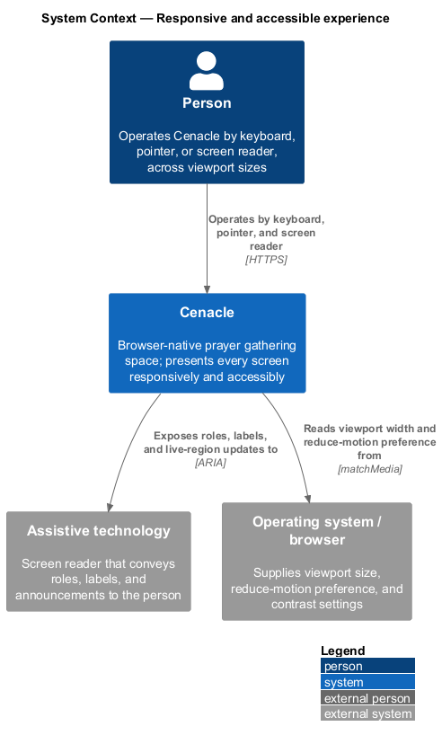
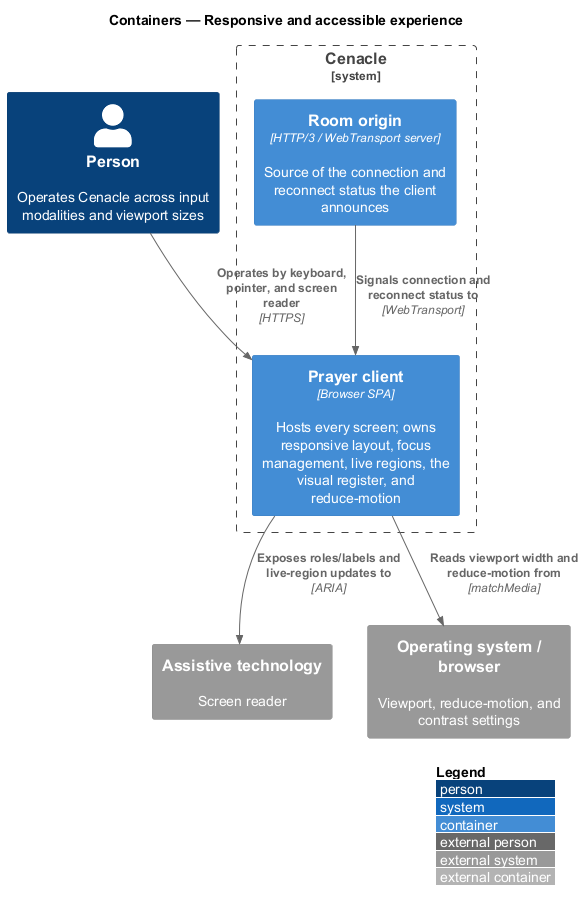
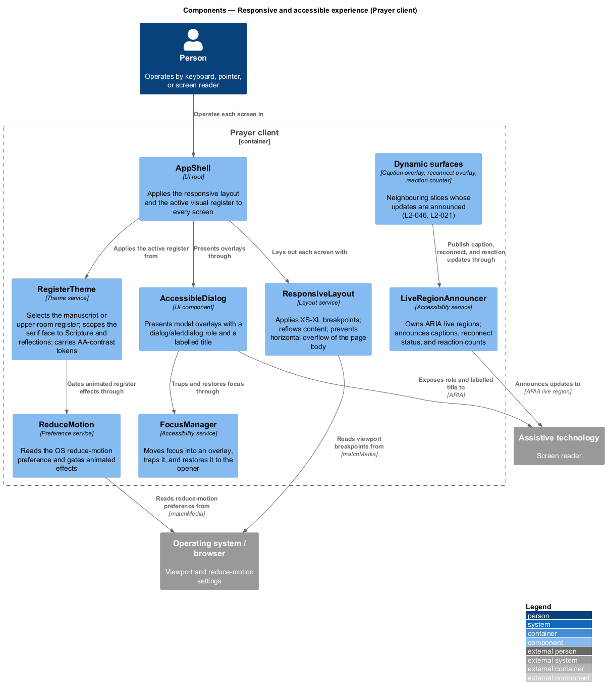
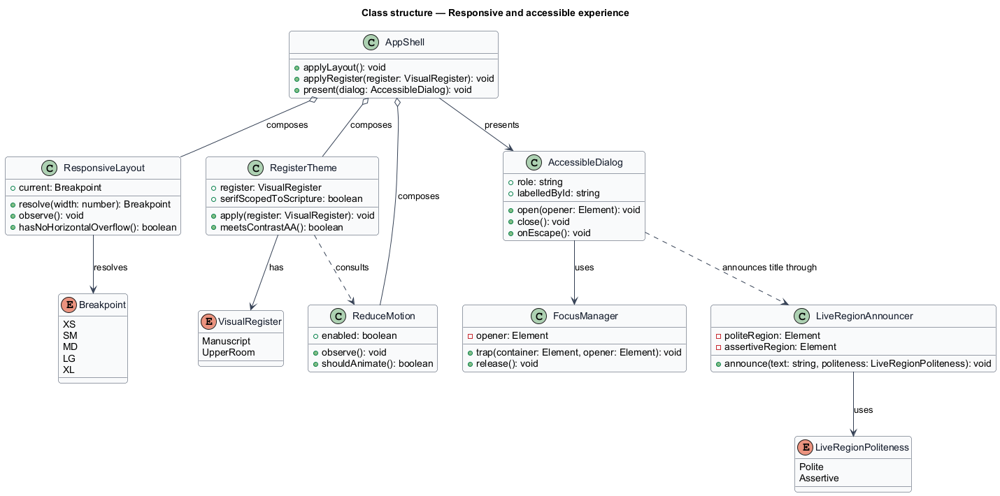
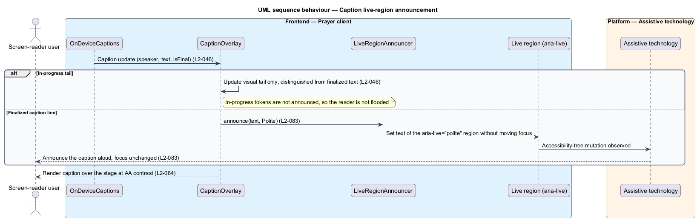
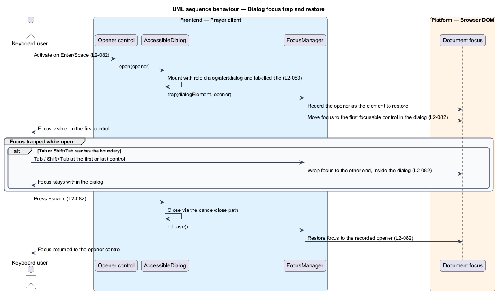

# Responsive and accessible experience

## Overview

Cenacle is a browser-native prayer gathering space. Its screens run on phones,
tablets, and desktops, and they serve people who navigate by keyboard, by
pointer, or through a screen reader. This feature is the cross-cutting concern
that holds those obligations for every screen at once: it defines how layout
reflows across viewport sizes, how keyboard focus behaves, how dynamic content
reaches assistive technology, how motion and contrast honour the person's
settings, and which of the two visual registers each screen applies.

Four local terms recur below.

- **responsive layout** — arrangement of screen content that reflows to the
  viewport width across defined breakpoints, without horizontal overflow of the
  page body
- **visual register** — coordinated set of colour, type, and texture tokens that
  gives a screen one of two looks: light "manuscript" or night "upper room"
- **live region** — DOM region marked so assistive technology announces its
  changes without focus moving to it
- **focus trap** — confinement of keyboard focus to an open overlay until it
  closes, after which focus returns to the control that opened it

The responsive breakpoints are fixed: XS `<576px`, SM `≥576px`, MD `≥768px`,
LG `≥992px`, XL `≥1200px`. The two registers divide by screen purpose: the night
upper-room register applies to the live gathering, the journal, the floating
window, and in-room dialogs; the light manuscript register applies to marketing,
onboarding, forms, and most error screens. The serif face appears only for
Scripture and reflections.

Because responsiveness is a property of every layout rather than a single ordered
action, this document sequences two representative run-time behaviours instead: a
caption live-region announcement (L2-083) and a dialog focus trap (L2-082). The
static structure below applies to every screen.

## Description

The feature is a set of client-side services and one dialog component in the
Prayer client. Each screen composes them; none of them reaches the network.

- **`AppShell`** — UI root that wraps every screen. It applies the responsive
  layout and the active visual register, and it presents overlays through
  `AccessibleDialog`.
- **`ResponsiveLayout`** — layout service that resolves the current breakpoint
  from the viewport width, reflows content across XS–XL, and holds the page body
  to no horizontal overflow. It collapses the side rail below LG in concert with
  the in-room layout (L2-021).
- **`RegisterTheme`** — theme service that selects the manuscript or upper-room
  register per screen. It scopes the serif face to Scripture and reflections and
  carries colour tokens that meet WCAG AA contrast in both registers.
- **`ReduceMotion`** — preference service that reads the operating system
  reduce-motion preference and gates animated effects, including the breathing
  glows, reaction motes, and audio-reactive motion of the sanctuary (L2-053).
- **`AccessibleDialog`** — UI component that presents a modal overlay with the
  correct role (`dialog` or `alertdialog`) and a labelled title. It delegates
  focus handling to `FocusManager` and closes on Escape.
- **`FocusManager`** — accessibility service that records the opener, moves focus
  into an overlay, traps it there while the overlay is open, and restores focus to
  the opener when the overlay closes.
- **`LiveRegionAnnouncer`** — accessibility service that owns two ARIA live
  regions, one polite and one assertive. It announces finalized captions,
  reconnect status, and rolling reaction counts without moving focus.

The dynamic surfaces whose updates reach assistive technology — the caption
overlay (L2-046), the reconnect overlay, and the reaction counter — belong to
neighbouring slices and publish through `LiveRegionAnnouncer` rather than owning a
live region each. Where a screen's specific breakpoint layout is fixed by that
screen's own design — for example the in-room stage and 320px rail (L2-021) — this
feature supplies the breakpoint signal and the overflow guarantee, and the screen
owns its columns.

## Requirements

The feature realizes the following level-2 (L2) requirements. Each L2 refines a
level-1 (L1) requirement, cited by identifier.

| L2 ID | Refines (L1) | Requirement |
|-------|--------------|-------------|
| `L2-081` | `L1-020` | Every screen shall remain usable across XS–XL viewports, reflowing rather than truncating, with no horizontal overflow of the page body. |
| `L2-082` | `L1-020` | Every interactive control shall be keyboard-operable, and each dialog or overlay shall trap focus while open, close on Escape, and restore focus to the control that opened it. |
| `L2-083` | `L1-020` | The UI shall expose correct roles and labels, and shall announce dynamic content — captions, reconnect status, and reaction counts — through live regions without stealing focus. |
| `L2-084` | `L1-020` | The system shall honour the OS reduced-motion preference and shall meet WCAG AA contrast for text and essential UI in both the manuscript and upper-room registers. |
| `L2-085` | `L1-020` | Each screen shall apply the register the style guide assigns to its purpose, and the serif face shall appear only for Scripture and reflections. |

## Diagrams

### System context

The person operates Cenacle by keyboard, pointer, or screen reader. Cenacle reads
viewport size and the reduce-motion preference from the operating system and
browser, and exposes roles, labels, and live-region updates to the assistive
technology that speaks to the person.

### Containers

The Prayer client owns the whole feature: responsive layout, focus management,
live regions, the visual register, and reduce-motion. It reads platform settings
over `matchMedia` and announces to assistive technology over ARIA; the room origin
supplies the connection and reconnect status the client announces.

### Components

Inside the Prayer client, `AppShell` applies `ResponsiveLayout` and
`RegisterTheme` to every screen and presents overlays through `AccessibleDialog`,
which traps focus through `FocusManager`. Neighbouring dynamic surfaces publish
their updates through `LiveRegionAnnouncer`, which announces to assistive
technology.

### Class structure

`AppShell` composes `ResponsiveLayout`, `RegisterTheme`, and `ReduceMotion`, and
presents `AccessibleDialog`; the dialog uses `FocusManager` for the trap and
announces through `LiveRegionAnnouncer`. `ResponsiveLayout` resolves a
`Breakpoint`, `RegisterTheme` holds a `VisualRegister`, and `LiveRegionAnnouncer`
writes at a `LiveRegionPoliteness`.

### Behaviour — caption live-region announcement

A caption update reaches `CaptionOverlay`. An in-progress tail updates the visual
text only and is not announced, so the reader is not flooded; a finalized line is
passed to `LiveRegionAnnouncer.announce(text, Polite)`, which sets the text of the
polite ARIA live region without moving focus (`L2-083`). The assistive technology
observes the change and speaks it while focus stays where it was.

### Behaviour — dialog focus trap

When the person activates a control that opens a dialog, `AccessibleDialog` mounts
with a `dialog`/`alertdialog` role and a labelled title (`L2-083`), then calls
`FocusManager.trap`. The manager records the opener, moves focus to the first
control in the dialog, and keeps Tab and Shift+Tab inside the dialog (`L2-082`).
Escape closes the dialog through its cancel path, and `FocusManager.release`
returns focus to the opener (`L2-082`).

