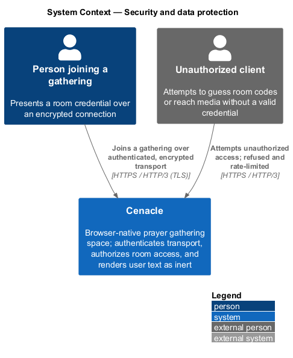
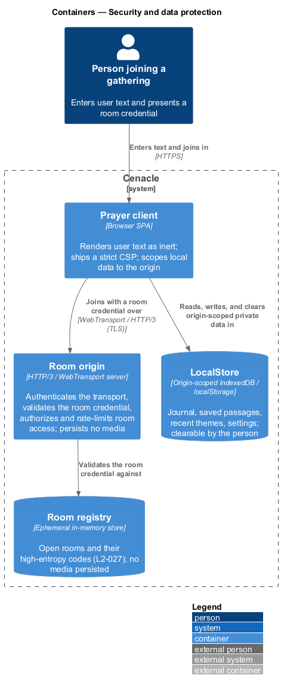
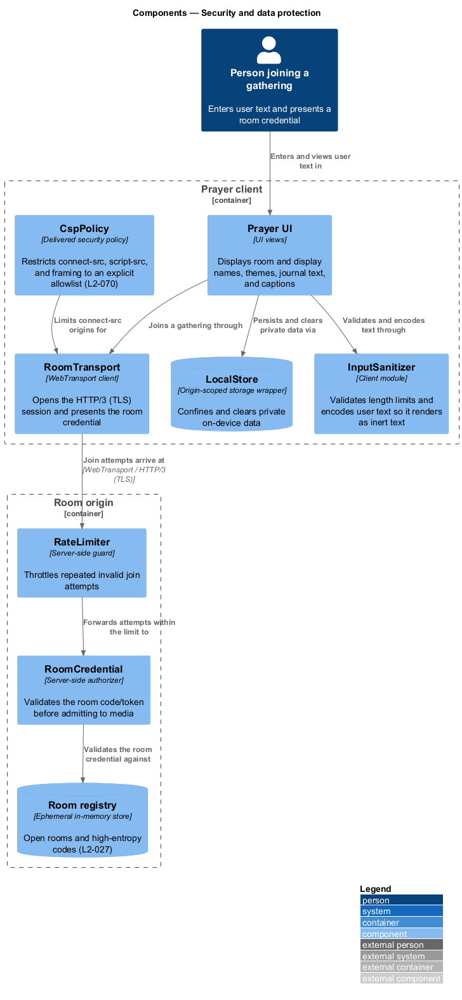
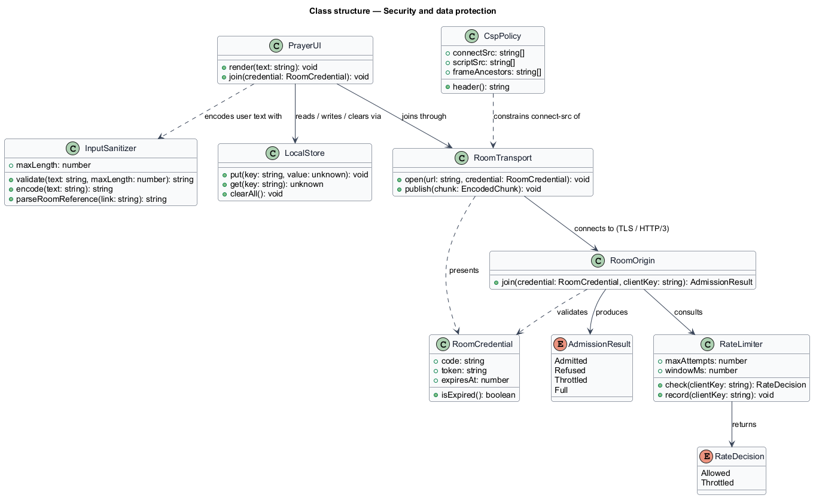
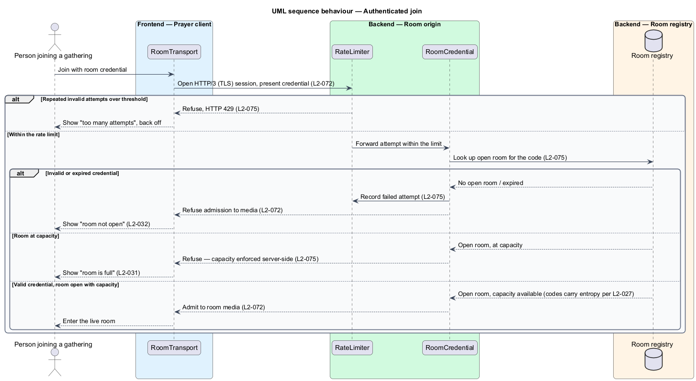
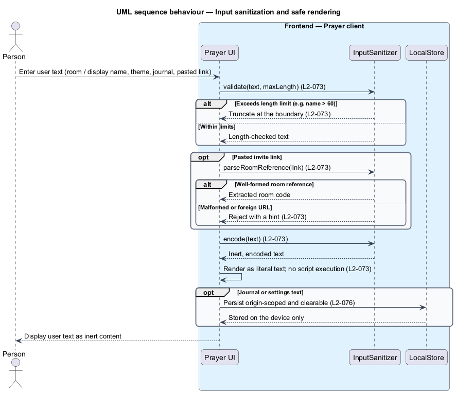

# Security and data protection

## Overview

Cenacle is a browser-native prayer gathering space. A *gathering* is a live,
small-room session that one person opens and others join to see and hear one
another. This feature is the cross-cutting security concern: it protects the
gathering and the data around it, consistent with the OWASP Top 10.

The feature covers four security-relevant surfaces and nothing beyond them.

- **room origin authentication** — admission over an authenticated, encrypted
  HTTP/3 transport, gated by a valid *room credential*.
- **input handling** — validation and safe rendering of all user-supplied text.
- **Content Security Policy** — a strict policy that constrains where the client
  may connect.
- **local data** — origin-scoped device storage that the person can clear.

Two local terms recur below. A *room credential* is the room code or token a
client presents to join a gathering. The *Room origin* is the HTTP/3 /
WebTransport server that admits publishers and subscribers to a single room; it
persists no media. This document assumes no prior knowledge of Cenacle's
internals; terms are defined at first use, and the diagrams show where each part
lives.

The feature reuses the room-code entropy rule (L2-027) and the on-device
zero-egress guarantee (L2-070) rather than restating them: unpredictable codes
make enumeration hard, and the Content Security Policy is the egress lock that
L2-070 depends on.

## Description

The feature spans the browser client and the Room origin. On the client it
governs how user text is rendered, which origins the client may reach, and where
private data is stored; at the origin it governs who is admitted to a room.

- **`Prayer UI`** — the client views that display room and display names, themes,
  journal text, and captions. It renders every user-supplied value as inert text.
- **`InputSanitizer`** — client module that validates length limits, encodes
  user text so markup and control characters render as literal text, and parses a
  pasted invite link to a well-formed room reference or rejects it.
- **`CspPolicy`** — the Content-Security-Policy the client ships. It restricts
  `connect-src`, `script-src`, and framing to an explicit allowlist, and excludes
  any analytics or AI endpoint (L2-070).
- **`RoomTransport`** — WebTransport client. It opens the HTTP/3 session over TLS
  to the Room origin and presents the room credential.
- **`LocalStore`** — wrapper over origin-scoped browser storage (`IndexedDB` /
  `localStorage`). It confines journal entries, saved passages, recent themes,
  and settings to the app origin, and clears them on request.
- **`RateLimiter`** — server-side guard at the Room origin. It throttles repeated
  invalid join attempts so codes cannot be brute-forced.
- **`RoomCredential`** — server-side authorizer at the Room origin. It validates
  the presented code or token against the Room registry before any media is
  admitted, and refuses an invalid or expired credential.
- **`Room registry`** — ephemeral in-memory store of open rooms and their
  high-entropy codes (L2-027); it holds no media.

The high-entropy code generation (L2-027) and the room-full and room-not-found
states (L2-031, L2-032) are neighbouring slices; this feature enforces admission
and hands off to those states rather than owning their presentation. Where a
value is left open by the specs — for example the small-room capacity applied at
the origin — it is marked `<TO SUPPLY>` in that neighbouring design rather than
fixed here.

## Requirements

The feature realizes the following level-2 (L2) requirements. Each L2 refines a
level-1 (L1) requirement, cited by identifier.

| L2 ID | Refines (L1) | Requirement |
|-------|--------------|-------------|
| `L2-072` | `L1-018` | The live transport shall run over an authenticated, encrypted HTTP/3 origin, and a join shall present a valid room credential before the client is admitted to room media. |
| `L2-073` | `L1-018` | The system shall validate all user-supplied text against length limits and render it as inert text, so markup or script does not execute. |
| `L2-074` | `L1-018` | The application shall ship a strict Content-Security-Policy that restricts `connect-src` to the room transport origin and required static origins, and excludes any analytics or AI endpoint. |
| `L2-075` | `L1-018` | The Room origin shall authorize room access server-side, resist code enumeration and brute force, rate-limit repeated invalid attempts, and enforce room capacity server-side. |
| `L2-076` | `L1-018` | The system shall confine locally stored private data to the app origin and let the person clear it. |

## Diagrams

### System context

A person joins a gathering over an authenticated, encrypted connection; an
unauthorized client that attempts to reach media without a valid credential is
refused and rate-limited.

### Containers

The Prayer client renders user text as inert, ships a strict CSP, and scopes
local data to the origin; the Room origin validates the room credential against
the ephemeral Room registry and persists no media.

### Components

Inside the Prayer client, the UI encodes text through `InputSanitizer`, stores
private data through `LocalStore`, and joins through `RoomTransport` under the
`CspPolicy` connect-src allowlist; at the Room origin, `RateLimiter` fronts
`RoomCredential`, which validates against the `Room registry`.

### Class structure

`RoomOrigin` validates a `RoomCredential` and consults `RateLimiter` to produce
an `AdmissionResult`; on the client, `PrayerUI` encodes text with
`InputSanitizer`, persists through `LocalStore`, and joins through
`RoomTransport`, whose reach is constrained by `CspPolicy`.

### Behaviour — authenticated join

`RoomTransport` opens an HTTP/3 (TLS) session and presents the room credential
(`L2-072`); `RateLimiter` throttles a client past the invalid-attempt threshold
with HTTP 429 (`L2-075`), and `RoomCredential` refuses an invalid, expired, or
over-capacity credential before admitting the person to media.

### Behaviour — input sanitization and safe rendering

`InputSanitizer` validates the length of each user-supplied value, parses a
pasted invite link to a room reference or rejects it, and encodes the text so the
`Prayer UI` renders it as literal, inert content (`L2-073`); journal and settings
text is persisted origin-scoped and clearable through `LocalStore` (`L2-076`).

