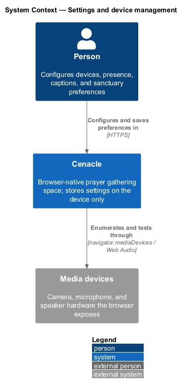
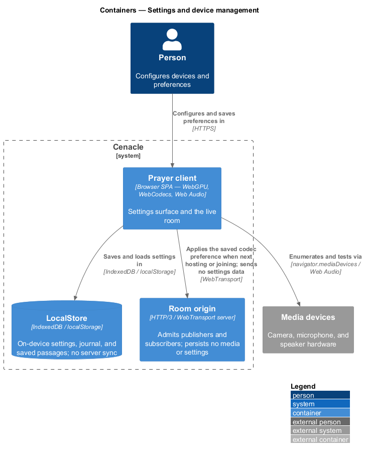
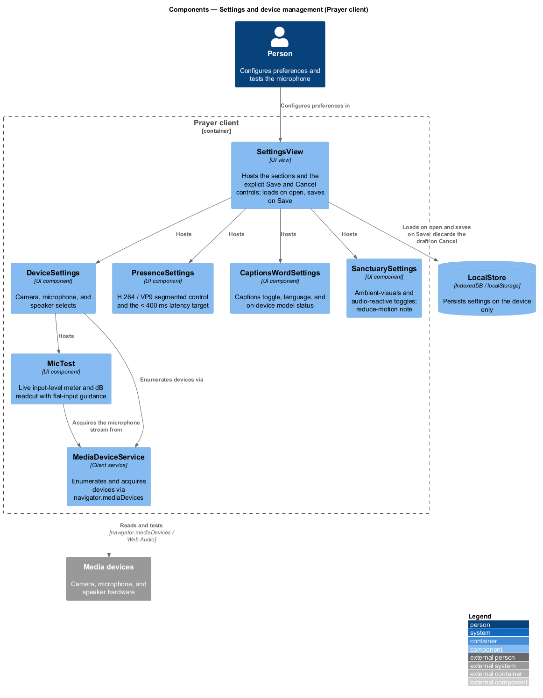
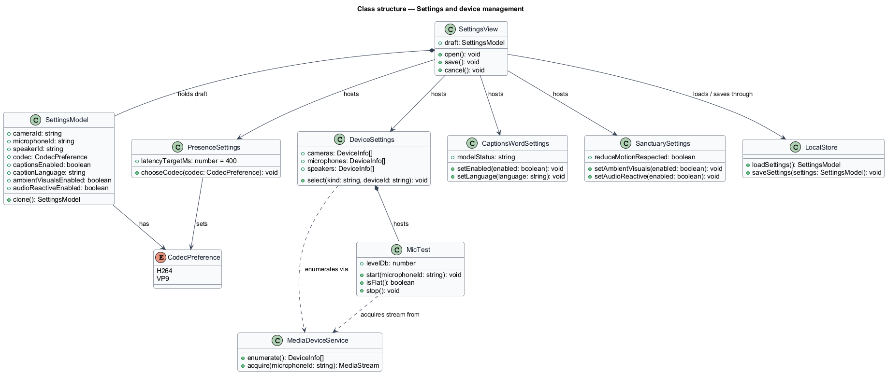
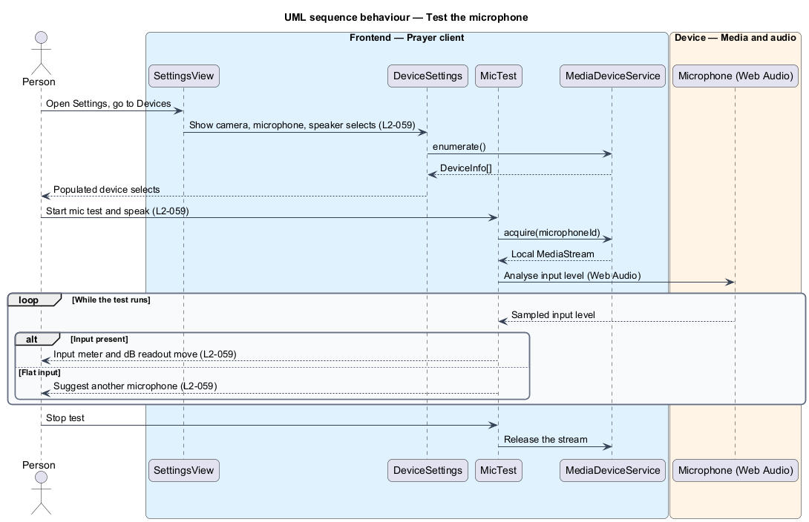
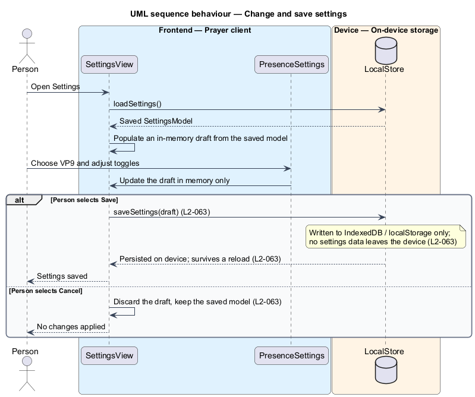

# Settings and device management

## Overview

Cenacle is a browser-native prayer gathering space. Its behaviour is shaped by a
set of *preferences* — chosen values for devices, presence, captions, and
sanctuary visuals — that a person configures once and reuses across gatherings.
This feature covers the *settings surface*: the screen that presents those
preferences, tests the microphone, and persists the choices.

*settings surface* — the screen through which a person reads and changes
preferences and saves them

The feature is cross-cutting: the preferences it stores are read by the presence,
captions, and sanctuary features, and its persistence uses the same on-device
store as the journal and saved passages. The design here is therefore scoped to
the settings surface and its two relationships that matter — to the *Prayer
client* that hosts it and to *LocalStore*, the on-device store that holds the
saved values. It does not redescribe the features that later consume a
preference.

One rule governs the whole surface: settings are stored on the device only.
*LocalStore* wraps origin-scoped browser storage (`IndexedDB` / `localStorage`);
a save writes there and nowhere else. No settings data travels to the Room
origin or any other server. The saved codec preference shapes a later gathering,
but the preference value itself stays on the device.

## Description

The feature is a vertical slice that runs from the settings surface in the
browser to `LocalStore` on the same device. No backend participates in reading or
writing a preference.

- **`SettingsView`** — UI view for the settings surface. It hosts the sections
  and the explicit `Save` and `Cancel` controls. It loads the saved values on
  open into an in-memory *draft*, and on `Save` persists the draft through
  `LocalStore`; on `Cancel` it discards the draft.
- **`DeviceSettings`** — UI component that presents the camera, microphone, and
  speaker selects, each listing the available devices. It hosts `MicTest`.
- **`MicTest`** — UI component that tests the microphone. It shows a live
  input-level meter and a dB readout, and when the input is flat it offers
  guidance to try another device.
- **`PresenceSettings`** — UI component that offers an `H.264` / `VP9` segmented
  control with a plain trade-off hint, and displays the `< 400 ms` glass-to-glass
  latency target.
- **`CaptionsWordSettings`** — UI component that exposes the captions toggle, the
  caption language, and the on-device model status, under a heading that names
  the on-device Prompt API.
- **`SanctuarySettings`** — UI component that exposes the ambient-visuals
  (WebGPU) and audio-reactive toggles, and states that the reduce-motion setting
  is respected.
- **`SettingsModel`** — the preference values: the selected `cameraId`,
  `microphoneId`, and `speakerId`, the `codec`, the caption `captionsEnabled` and
  `captionLanguage`, and the `ambientVisualsEnabled` and `audioReactiveEnabled`
  toggles. `SettingsView` edits a `clone()` of it as the draft.
- **`MediaDeviceService`** — client service over `navigator.mediaDevices`. It
  enumerates the available devices and acquires a microphone `MediaStream` for
  the test.
- **`LocalStore`** — wrapper over origin-scoped browser storage
  (`IndexedDB` / `localStorage`). It loads and saves the `SettingsModel` on the
  device only, and persists nothing to a server.

The codec fallback that a hosted or joined room applies (L2-014), the still
sanctuary fallback shown when WebGPU is absent (L2-067), and the AI explainer the
captions section links to are neighbouring slices; this feature stores the
preference and hands off to them rather than owning them.

## Requirements

The feature realizes the following level-2 (L2) requirements. Each L2 refines a
level-1 (L1) requirement, cited by identifier.

| L2 ID | Refines (L1) | Requirement |
|-------|--------------|-------------|
| `L2-059` | `L1-015` | The settings surface shall list the available cameras, microphones, and speakers for selection, and shall test the microphone with a live input-level meter and a dB readout, offering guidance when the input is flat. |
| `L2-060` | `L1-015` | The settings surface shall offer an `H.264` / `VP9` segmented control with a trade-off hint and shall display the `< 400 ms` glass-to-glass latency target. |
| `L2-061` | `L1-015` | The settings surface shall expose the captions toggle, the caption language, and the on-device model status under a heading that names the on-device Prompt API. |
| `L2-062` | `L1-015` | The settings surface shall expose the ambient-visuals and audio-reactive toggles and shall state that the reduce-motion setting is respected. |
| `L2-063` | `L1-015` | The settings surface shall save preferences to device-local storage only, with explicit save and cancel, and shall not transmit settings data off the device. |

## Diagrams

### System context

A person configures preferences in Cenacle over HTTPS; Cenacle enumerates and
tests the camera, microphone, and speaker hardware the browser exposes, and
stores the resulting preferences on the device.

### Containers

The settings surface lives in the Prayer client, which saves and loads settings
in `LocalStore` on the device. The Room origin holds no settings; the client
applies the saved codec preference to a later gathering without sending the
preference value to the origin.

### Components

Inside the Prayer client, `SettingsView` hosts the five sections and the
`Save` / `Cancel` controls. `DeviceSettings` hosts `MicTest`; both use
`MediaDeviceService` to reach the devices. `SettingsView` loads and saves through
`LocalStore`.

### Class structure

`SettingsView` holds a draft `SettingsModel` and hosts the four remaining
sections; `DeviceSettings` hosts `MicTest`; the device components depend on
`MediaDeviceService`; and `SettingsView` loads and saves through `LocalStore`.

### Behaviour — test the microphone

`DeviceSettings` enumerates the devices through `MediaDeviceService`. On the mic
test, `MicTest` acquires the microphone stream and analyses its level with Web
Audio; while the test runs, the meter and dB readout move when input is present,
and flat input yields guidance to try another microphone (`L2-059`).

### Behaviour — change and save settings

`SettingsView` loads the saved model into an in-memory draft on open. Edits
change the draft only. On `Save`, the draft is persisted through `LocalStore` to
device storage and survives a reload, with no settings data leaving the device;
on `Cancel`, the draft is discarded and nothing is applied (`L2-063`).

