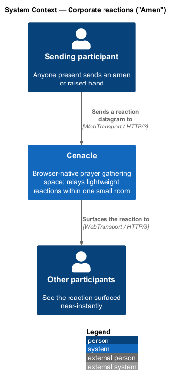
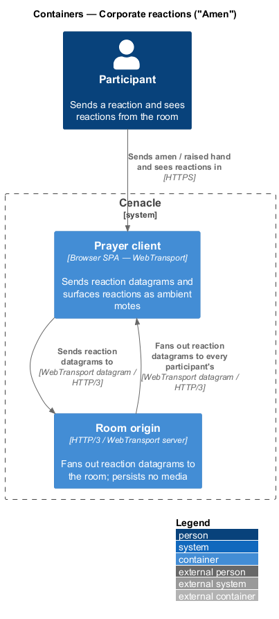
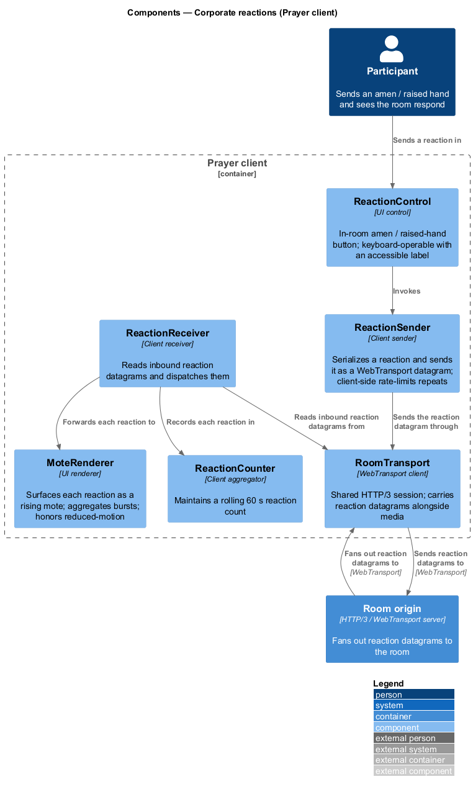
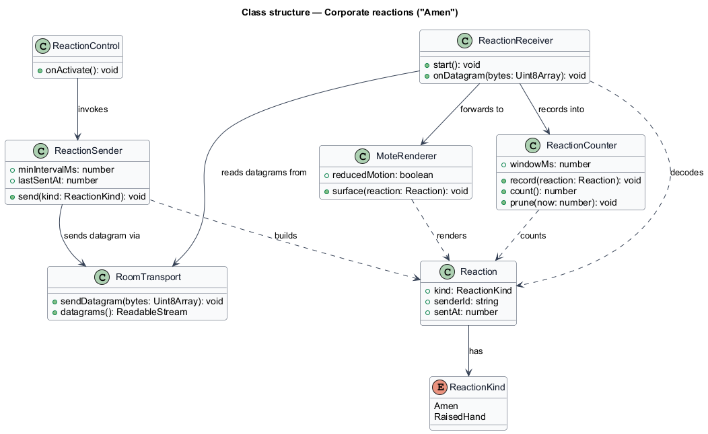
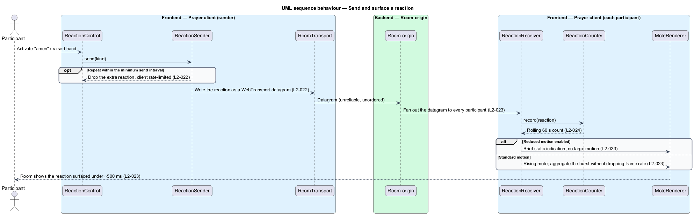

# Corporate reactions ("Amen")

## Overview

Cenacle is a browser-native prayer gathering space. Inside a live room, anyone
present may signal assent to the whole room without speaking over it. This
feature covers that signal: sending a lightweight reaction, surfacing it to every
participant near-instantly, and showing a rolling count so the room reads as one
body responding together.

*reaction* — lightweight signal of assent a participant sends to the room, either
an *amen* or a *raised hand*. *mote* — brief rising visual particle that
represents one received reaction. *datagram* — unreliable, unordered WebTransport
message that carries no delivery guarantee and little overhead.

A reaction travels as a WebTransport datagram rather than a reliable stream. The
choice fits the signal: a reaction values arriving soon over arriving for certain,
so an occasional dropped datagram is acceptable where added latency is not. The
sending client rate-limits repeated activations so a burst of taps does not flood
the room. The Room origin fans each datagram out to every participant, and each
receiving client surfaces it as a rising mote and folds it into a 60-second count.
The origin persists no reaction; nothing about a reaction is recorded.

This document assumes no prior knowledge of Cenacle's internals. The terms above
are defined at first use, and the diagrams show where each part lives.

## Description

The feature is a vertical slice that runs from the in-room reaction control in the
browser, through the Room origin, and back to every participant's client.

- **`ReactionControl`** — UI control in the in-room dock. It offers the amen and
  raised-hand actions, is reachable by keyboard, and carries an accessible label.
- **`ReactionSender`** — client sender. It builds a `Reaction`, sends it as a
  WebTransport datagram through the shared `RoomTransport`, and rate-limits
  repeated activations so the room is not flooded.
- **`RoomTransport`** — shared WebTransport client. It holds the HTTP/3 session to
  the Room origin and exposes a datagram path distinct from the reliable media
  path; reactions ride the datagram path.
- **`Room origin`** — HTTP/3 / WebTransport server. It receives a reaction datagram
  from one publisher and fans it out as datagrams to every participant in the room;
  it persists no media and no reaction.
- **`ReactionReceiver`** — client receiver. It reads inbound reaction datagrams
  from the `RoomTransport`, decodes each into a `Reaction`, and dispatches it to
  the renderer and the counter.
- **`MoteRenderer`** — UI renderer. It surfaces each reaction as a rising mote and
  aggregates a burst of reactions into one ambient effect rather than one animation
  per reaction, so the room frame rate holds. Under reduced motion it shows a brief
  static indication instead of the rising motion.
- **`ReactionCounter`** — client aggregator. It records each received reaction and
  reports a rolling count over the last 60 seconds, ageing out older reactions as
  the window advances.
- **`Reaction`** — the datagram payload: the `ReactionKind` (`Amen` or
  `RaisedHand`), the sender identity, and the send timestamp.

The shared `RoomTransport`, the `Room origin`, and the in-room dock that hosts the
`ReactionControl` are owned by neighbouring slices; this feature reuses them rather
than redefining them. The minimum interval the `ReactionSender` enforces between
reactions is left `<TO SUPPLY>`; the spec fixes the rate-limit obligation but not
the interval.

## Requirements

The feature realizes the following level-2 (L2) requirements. Each L2 refines a
level-1 (L1) requirement, cited by identifier.

| L2 ID | Refines (L1) | Requirement |
|-------|--------------|-------------|
| `L2-022` | `L1-005` | The system shall let any participant send an amen or raised-hand reaction as a WebTransport datagram, not a reliable stream, and shall rate-limit repeated activations on the client. |
| `L2-023` | `L1-005` | The system shall surface each reaction to every participant near-instantly as a rising mote, targeting under ~500 ms on a LAN-class link, aggregating bursts without dropping room frame rate, and conveying the reaction without large motion when reduced motion is enabled. |
| `L2-024` | `L1-005` | The system shall display a rolling reaction count over the most recent 60 seconds, reading zero when the window is empty and decreasing as reactions age out. |

## Diagrams

### System context

One participant sends a reaction to Cenacle, which surfaces it to the other
participants; both directions travel over WebTransport. The picture frames the
corporate nature of the feature: one signal in, the whole room notified.

### Containers

The Prayer client sends a reaction datagram to the Room origin over WebTransport,
and the origin fans that datagram out to every participant's Prayer client. The
origin persists no media and no reaction.

### Components

Inside the Prayer client, `ReactionControl` invokes `ReactionSender`, which sends a
datagram through the shared `RoomTransport` to the Room origin. On the receiving
side, `ReactionReceiver` reads fanned-out datagrams from `RoomTransport` and
dispatches each to `MoteRenderer` and `ReactionCounter`.

### Class structure

`ReactionSender` builds a `Reaction` and sends it via `RoomTransport`;
`ReactionReceiver` reads datagrams from the same transport, forwards each reaction
to `MoteRenderer`, and records it in `ReactionCounter`, which holds the 60-second
window.

### Behaviour — send and surface a reaction

`ReactionControl` invokes `ReactionSender`, which drops a repeat inside the minimum
send interval (`L2-022`) and otherwise writes a datagram through `RoomTransport`.
The Room origin fans the datagram out to every participant (`L2-023`); each
`ReactionReceiver` records the reaction in `ReactionCounter` (`L2-024`) and, under
reduced motion, shows a brief static indication in place of the rising mote
(`L2-023`).

