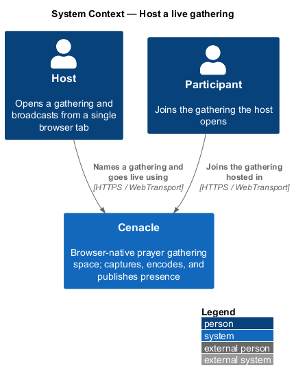
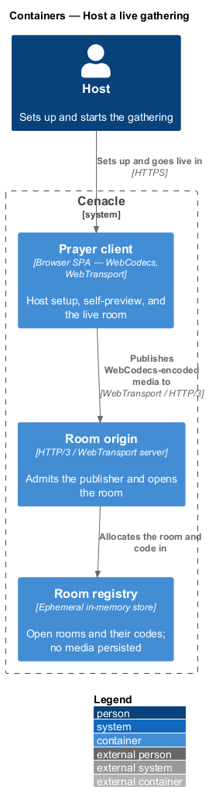
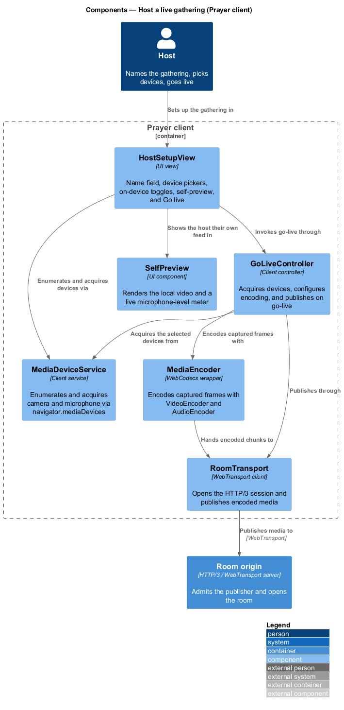
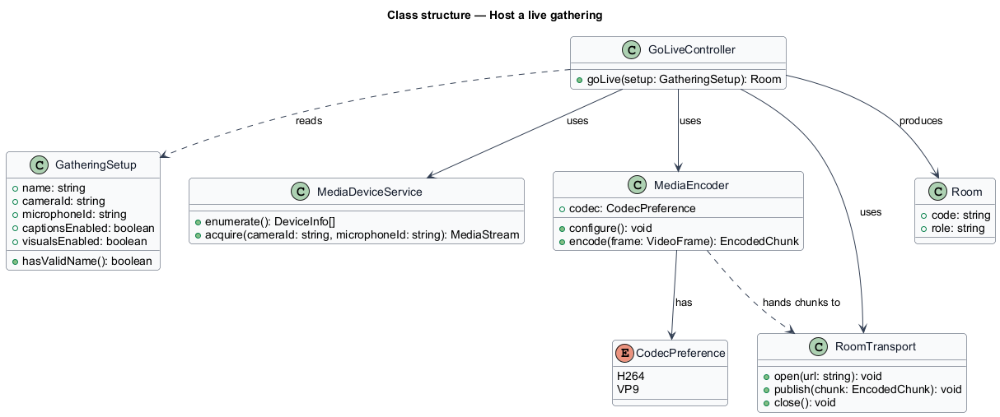
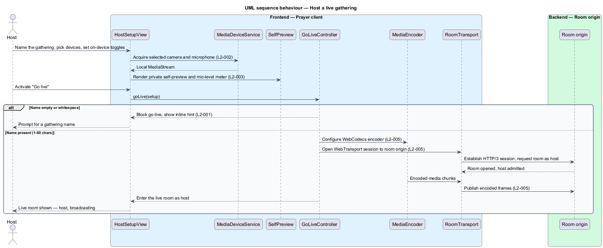

# Host a live gathering

## Overview

Cenacle is a browser-native prayer gathering space. A *gathering* is a live,
small-room session that one person opens and others join to see and hear one
another in near-real time. The person who opens a gathering is the *host*; the
act of opening it turns a single browser tab into a *broadcast origin* — the
source from which live audio and video are published to the room.

This feature covers everything the host does before and at the moment of going
live: naming the gathering, choosing a camera and microphone, previewing
themselves privately, setting two on-device options (live captions and living
sanctuary visuals), and going live. It deliberately requires no plugin, no
encoder software, and no RTMP; capture and encoding happen in the browser and
media is published over a modern web transport.

Two browser capabilities carry the feature and are named throughout. *WebCodecs*
is the browser API that encodes captured video and audio frames into a
compressed stream. *WebTransport* is the browser API that carries that stream to
the server over HTTP/3. The host setup screen uses the night visual register and
states plainly that nothing is recorded, so a newcomer understands both what the
controls do and what the system does not do with their image and voice.

## Description

The feature is a vertical slice that runs from the host setup screen in the
browser to the room origin that opens the room.

- **`HostSetupView`** — UI view for setup. It holds the name field, the camera
  and microphone pickers, the on-device toggles, the self-preview, and the
  `Go live` control, and it blocks go-live until a name is present.
- **`MediaDeviceService`** — client service over `navigator.mediaDevices`. It
  enumerates the available cameras and microphones and acquires a local
  `MediaStream` from the selected devices.
- **`SelfPreview`** — UI component that renders the host's own video and a live
  microphone-level meter. It is labelled visible only to the host.
- **`GatheringSetup`** — the setup state: the gathering `name`, the selected
  `cameraId` and `microphoneId`, and the `captionsEnabled` and `visualsEnabled`
  toggles. It answers whether the name is valid.
- **`GoLiveController`** — client controller that runs go-live. It reads the
  `GatheringSetup`, acquires the selected devices, configures the encoder, opens
  the transport, and hands the host into the live room as host.
- **`MediaEncoder`** — WebCodecs wrapper. It configures a `VideoEncoder` and
  `AudioEncoder` for the chosen codec and encodes captured frames into chunks.
- **`RoomTransport`** — WebTransport client. It opens the HTTP/3 session to the
  room origin and publishes encoded chunks.
- **`Room origin`** — HTTP/3 / WebTransport server. It admits the publisher and
  opens the room, allocating the room and its code in an ephemeral registry; it
  persists no media.

The codec selection and its hardware path (L2-014), the negotiated publish over
WebTransport in steady state (L2-011), and the device-error recovery states
(L2-068) are neighbouring slices; this feature hands off to them rather than
owning them. Where the go-live sequence depends on a value the specs leave open —
for example the small-room capacity applied at the origin — the value is marked
`<TO SUPPLY>` in that neighbouring design rather than fixed here.

## Requirements

The feature realizes the following level-2 (L2) requirements. Each L2 refines a
level-1 (L1) requirement, cited by identifier.

| L2 ID | Refines (L1) | Requirement |
|-------|--------------|-------------|
| `L2-001` | `L1-001` | The host setup shall let the host name the gathering, default the field to a non-empty value, accept 1–60 characters, and require a name before go-live. |
| `L2-002` | `L1-001` | The host setup shall enumerate the available cameras and microphones and let the host select which to use before going live. |
| `L2-003` | `L1-001` | The host setup shall show a private self-preview labelled visible only to the host, with a live microphone-level indicator, and shall state that nothing is recorded. |
| `L2-004` | `L1-001` | The host setup shall let the host toggle on-device live captions and living sanctuary visuals before going live, each defaulting on. |
| `L2-005` | `L1-001` | Go-live shall acquire the selected devices, encode media with WebCodecs, publish it over WebTransport, and transition the host into the live room as host. |

## Diagrams

### System context

The host uses Cenacle to name a gathering and go live; participants join the same
gathering. Both connect over HTTPS and WebTransport.

### Containers

The host works in the Prayer client, which publishes WebCodecs-encoded media to
the room origin over WebTransport; the origin allocates the room and code in an
ephemeral registry.

### Components

Inside the Prayer client, `HostSetupView` drives device selection and the
self-preview, and delegates go-live to `GoLiveController`, which encodes through
`MediaEncoder` and publishes through `RoomTransport` to the room origin.

### Class structure

`GoLiveController` reads a `GatheringSetup`, uses `MediaDeviceService`,
`MediaEncoder`, and `RoomTransport`, and produces a `Room`; the encoder holds a
`CodecPreference`.

### Behaviour — go live

`HostSetupView` acquires the devices and renders the private preview; on
`Go live`, `GoLiveController` guards on a present name (`L2-001`), then configures
the encoder, opens the transport, and publishes to the room origin before the
host enters the live room as host (`L2-005`).

