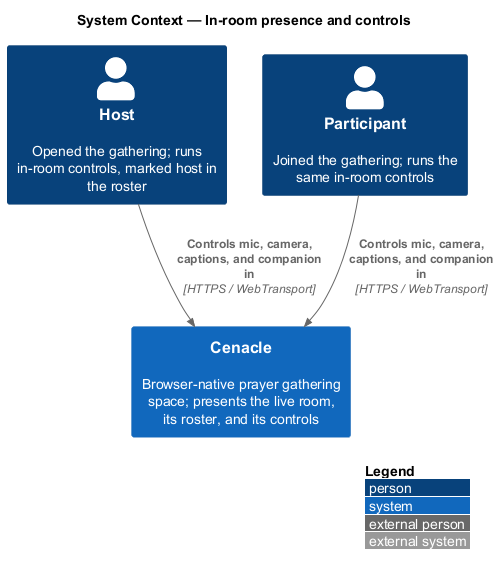
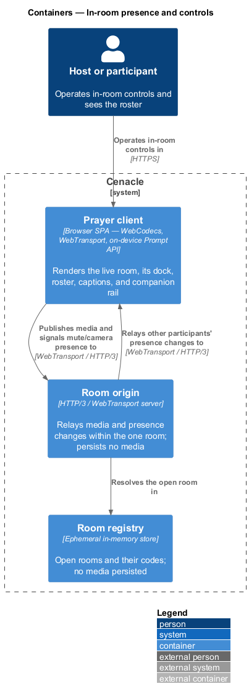
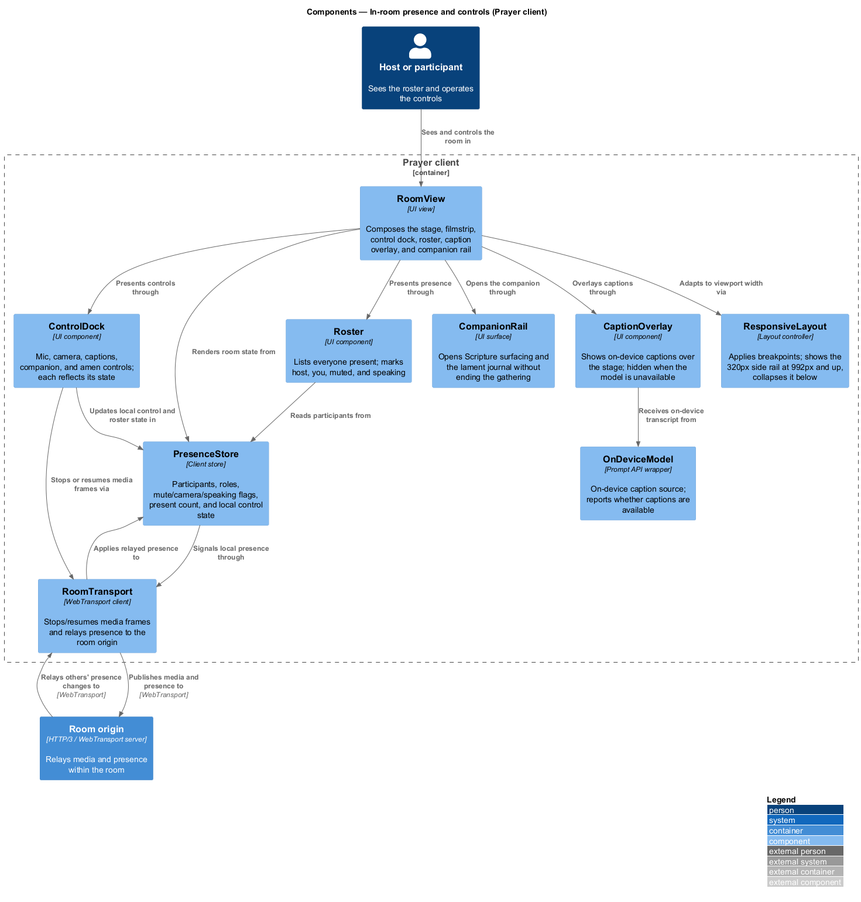
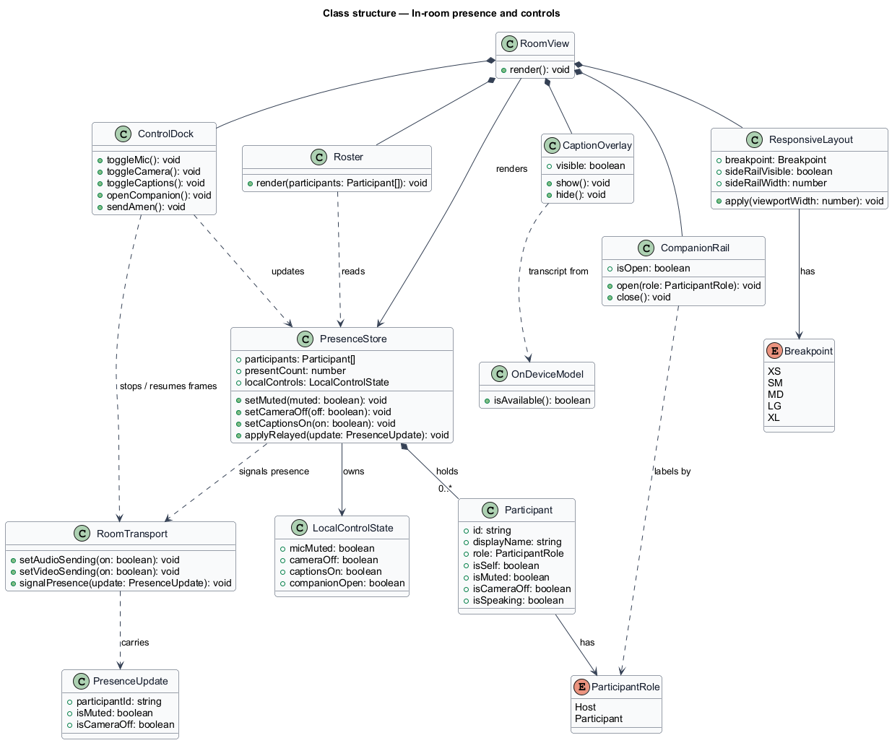
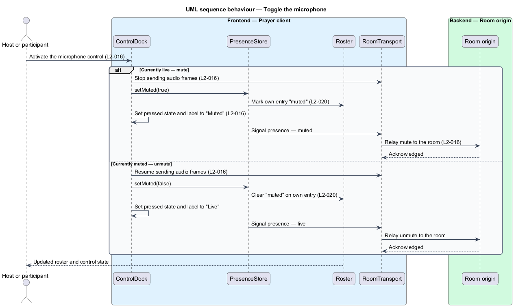
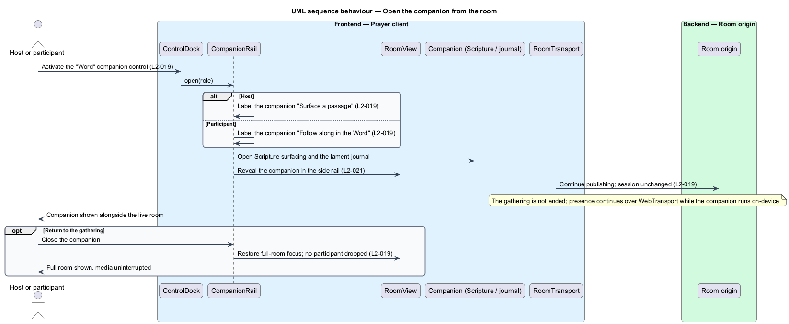

# In-room presence and controls

## Overview

Cenacle is a browser-native prayer gathering space. A *gathering* is a live,
small-room session in which people see and hear one another in near-real time.
The *live room* is the screen a person sees once inside a gathering: an active
speaker on the stage, a filmstrip of participants, and the controls each person
operates.

This feature covers what a person sees and does inside that room. It presents a
*roster* — the list of everyone present — and marks the host, the current
person, who is muted, and who is speaking. It gives each person local controls
over their own microphone, camera, live captions, and access to the companion.
It distinguishes two roles: the *host*, the person who opened the gathering, and
a *participant*, a person who joined it.

Several terms recur below. The *control dock* is the in-room bar of controls —
microphone, camera, captions, companion, and amen. The *companion* is the
private on-device space for Scripture surfacing and the lament journal, reachable
without leaving the gathering. The *side rail* is a 320px column that holds the
roster and companion at wide viewports and collapses on narrow ones. The
*present count* is the number of people in the room, shown in the header.
*WebTransport* is the browser API that carries the media stream to the room over
HTTP/3.

The controls act locally first. Muting the microphone stops audio frames at the
source; turning the camera off stops video frames; neither reaches other
participants until the person re-enables it. Each change also travels to the room
over the same WebTransport connection that carries media, so every roster
reflects a person's mute and camera state after one relay through the room
origin. The companion opens over the live room without ending it: presence keeps
flowing while a person reads or writes on the device.

## Description

The feature is a vertical slice that runs from the live room in the browser to
the room origin that relays presence within the gathering.

- **`RoomView`** — UI view for the live room. It composes the stage, the
  filmstrip, the control dock, the roster, the caption overlay, and the companion
  rail, and it renders from the presence store.
- **`ControlDock`** — in-room control bar. It holds the microphone, camera,
  captions, companion, and amen controls; each reflects its current state and is
  keyboard-operable.
- **`Roster`** — UI component that lists everyone present. It marks the host, the
  current person ("you"), muted participants, and who is speaking.
- **`CaptionOverlay`** — UI component that shows on-device captions over the
  stage. The captions control shows or hides it; it is hidden entirely when the
  on-device model is unavailable.
- **`CompanionRail`** — side-rail surface that opens Scripture surfacing and the
  lament journal without ending the gathering, with labels that match the
  person's role.
- **`PresenceStore`** — client store of room state: the participants and their
  roles, each one's mute, camera, and speaking flags, the present count, and the
  local control state. `RoomView` and `Roster` render from it.
- **`ResponsiveLayout`** — layout controller. It applies the responsive
  breakpoints, showing the 320px side rail at `≥ 992px` and collapsing it below
  while keeping the stage and dock usable.
- **`RoomTransport`** — WebTransport client. The controls stop and resume media
  frames through it; it signals a person's mute and camera changes to the room
  origin and applies other participants' changes back to the store.
- **`OnDeviceModel`** — wrapper over the browser Prompt API. It supplies caption
  text on the device and reports whether captions are available at all.
- **`Room origin`** — HTTP/3 / WebTransport server. It relays media and presence
  changes within the one room and persists no media.

Neighbouring slices supply parts this feature presents but does not own.
Active-speaker detection (L2-015) produces the speaking flag the roster marks;
subscribe-decode-render (L2-012) draws the stage and filmstrip; the latency
readout (L2-013) sits in the header beside the present count; the captions
on/off default is seeded and persisted on the device (L2-048, L2-063); the amen
control's reaction behaviour is a datagram slice (L2-022); and the companion's
own Scripture and journal features belong to the Word subsystem (L1-008,
L1-009). The small-room capacity the origin enforces is fixed in the
room-lifecycle design and marked `<TO SUPPLY>` there rather than here.

## Requirements

The feature realizes the following level-2 (L2) requirements. Each L2 refines a
level-1 (L1) requirement, cited by identifier.

| L2 ID | Refines (L1) | Requirement |
|-------|--------------|-------------|
| `L2-016` | `L1-004` | Each person shall mute and unmute their microphone from the in-room dock; while muted, no audio frames shall be transmitted and the person's roster entry shall show "muted". |
| `L2-017` | `L1-004` | Each person shall turn their camera on and off from the dock; turning it off shall stop video transmission and show a camera-off indicator to other participants. |
| `L2-018` | `L1-004` | Each person shall toggle live captions in the room, the control reflecting the on/off state; the control shall be hidden when the on-device model is unavailable. |
| `L2-019` | `L1-004` | The room shall give each person access to the companion — Scripture surfacing and the lament journal — from the dock and the side rail without ending the gathering, with labels matching the person's role. |
| `L2-020` | `L1-004` | The roster shall list everyone present and shall mark the host, the current person, muted participants, and who is speaking. |
| `L2-021` | `L1-004` | The room shall show the present count and shall collapse the 320px side rail below 992px while keeping the stage and dock usable, with no horizontal overflow of the page body. |

## Diagrams

### System context

The host and a participant operate the same in-room controls and read the same
roster within Cenacle, over HTTPS and WebTransport.

### Containers

The person operates the controls in the Prayer client, which publishes media and
signals mute and camera changes to the room origin; the origin relays other
participants' presence changes back, resolving the open room in the ephemeral
registry.

### Components

Inside the Prayer client, `RoomView` composes the dock, roster, caption overlay,
companion rail, and responsive layout, and renders from `PresenceStore`. The
`ControlDock` updates the store and stops or resumes media frames through
`RoomTransport`, which relays presence to and from the room origin;
`CaptionOverlay` draws its text from `OnDeviceModel`.

### Class structure

`RoomView` owns the `ControlDock`, `Roster`, `CaptionOverlay`, `CompanionRail`,
and `ResponsiveLayout`, and renders from `PresenceStore`. The store holds the
`Participant` list, each participant's `ParticipantRole` and mute/camera/speaking
flags, and the `LocalControlState`; it signals a `PresenceUpdate` through
`RoomTransport`.

### Behaviour — toggle the microphone

Activating the microphone control stops or resumes audio frames through
`RoomTransport` and updates the local control state and the roster entry
(`L2-016`, `L2-020`); the change is relayed to the room origin so every
participant's roster reflects the new mute state.

### Behaviour — open the companion from the room

The companion control opens the `CompanionRail` with a label chosen by role —
"Surface a passage" for the host, "Follow along in the Word" for a participant
(`L2-019`) — revealing it in the side rail (`L2-021`) while presence continues
over WebTransport; closing it restores the full room with no participant dropped.

