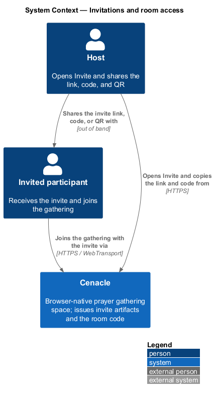
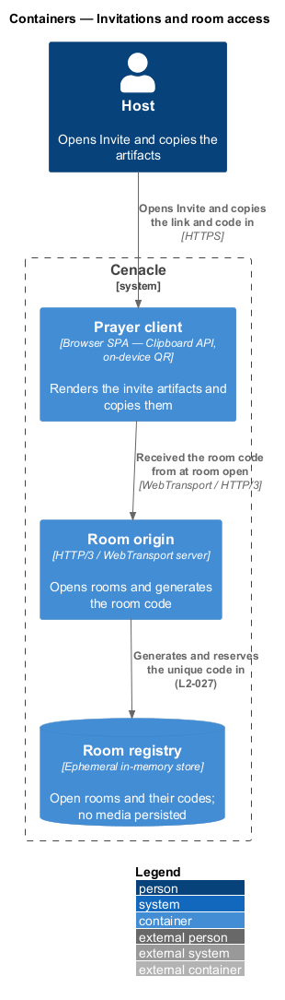
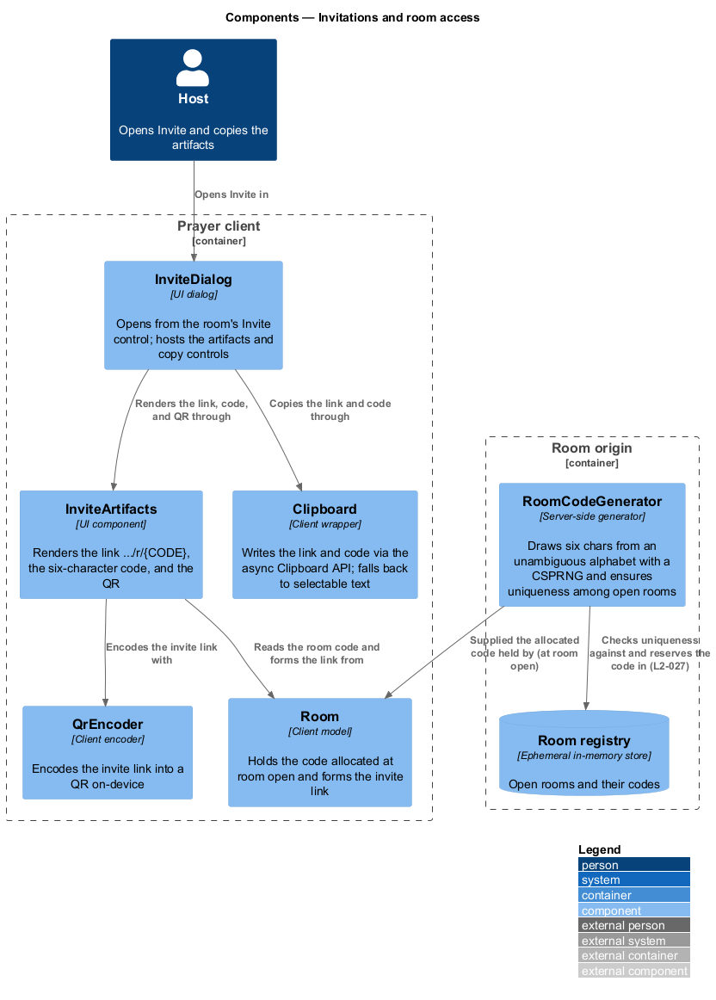
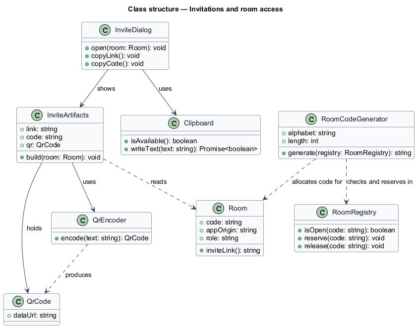
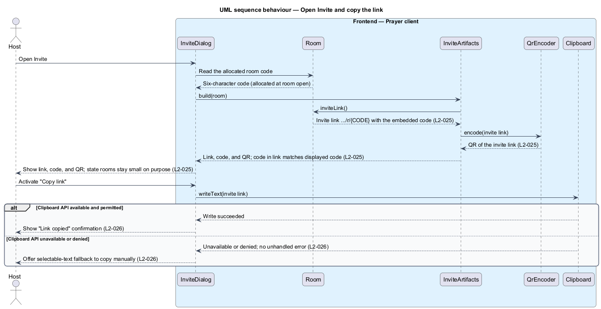
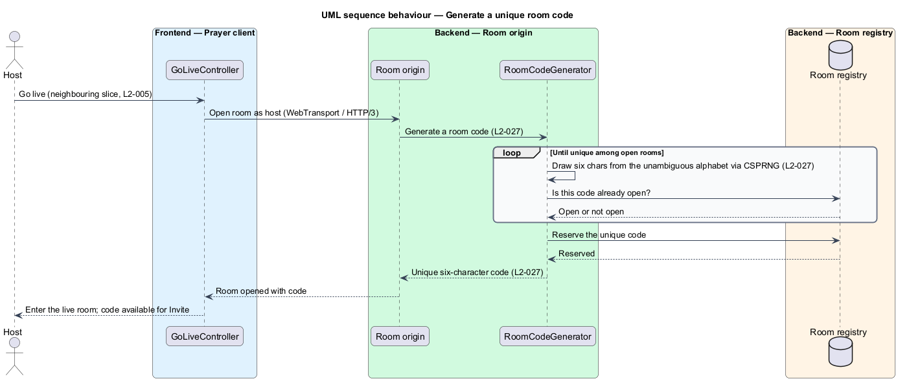

# Invitations and room access

## Overview

Cenacle is a browser-native prayer gathering space. A *gathering* is a live,
small-room session that one person opens and others join to see and hear one
another in near-real time. Once a host is live, others reach the room through an
*invitation* — the set of artifacts a host shares so a specific person can find
and enter one specific gathering.

This feature covers the three invitation artifacts and how a host copies them:

- *invite link* — application URL of the form `<app origin>/r/{CODE}`, where
  `<app origin>` is the served web origin of the Prayer client and `{CODE}` is
  the room code. Opening it resolves toward the green-room entry for that room.
- *room code* — six-character identifier of the open room, drawn from an
  unambiguous alphabet and unique among currently open rooms.
- *QR code* — machine-readable encoding of the invite link, for a person to scan
  with a second device.

A *room code* is the credential a person presents to join, so its generation is a
security concern as much as a display concern. Room codes are generated at the
*Room origin* — the HTTP/3 / WebTransport server that opens rooms — from a
cryptographically strong source, and each code is unique among the open rooms
held in the *Room registry*, the origin's ephemeral in-memory store of open rooms
and their codes. The code embedded in the invite link equals the displayed code,
so link and code name the same room.

This document assumes no prior knowledge of Cenacle's internals. Terms are defined
at first use, and the diagrams show where each part lives. Resolving an invite
link or a typed code back to a room (the join side) is a neighbouring slice
(L2-006, L2-007); this feature produces the artifacts that side consumes.

## Description

The feature is a vertical slice with two homes: the invite surface in the browser
and the code generator at the Room origin.

- **`InviteDialog`** — UI dialog in the Prayer client. It opens from the live
  room's Invite control, hosts the invite artifacts, and offers the copy
  controls. It states that rooms stay small on purpose.
- **`InviteArtifacts`** — UI component that renders the invite link, the
  six-character code, and the QR of the link. It reads the room code from the
  local `Room`, forms the link, and requests the QR, so the code shown in the
  link matches the code shown on its own.
- **`Room`** — client model that holds the `code` allocated at room open and the
  `appOrigin`. Its `inviteLink()` method composes `<app origin>/r/{CODE}`.
- **`QrEncoder`** — client encoder. It encodes the invite-link string into a QR
  code on the device and returns the rendered image; it makes no network request.
- **`Clipboard`** — client wrapper over the asynchronous Clipboard API
  (`navigator.clipboard`). It writes the link or code and reports success; when
  the API is unavailable or the write is denied, it signals a fallback rather than
  raising an unhandled error.
- **`RoomCodeGenerator`** — server-side generator at the Room origin. It draws six
  characters from an unambiguous alphabet using a cryptographically secure
  pseudo-random number generator (CSPRNG), regenerates on collision, and returns a
  code unique among the open rooms in the Room registry.
- **`RoomRegistry`** — the Room registry: an ephemeral in-memory store of open
  rooms and their codes. It answers whether a code is open, reserves a new code,
  and releases a code when its room ends. It persists no media.

The room code is allocated at room open, which belongs to the go-live slice
(L2-005); this feature owns the design of `RoomCodeGenerator` and the code's
format and unpredictability (L2-027), and the invite surface reads the
already-allocated code. The unambiguous alphabet excludes visually confusable
characters (for example `0`/`O` and `1`/`I`); its exact character set is
`<TO SUPPLY>`. The small-room capacity that keeps a gathering intimate is defined
in the room-lifecycle slice (L2-031, L2-079) and is not fixed here.

## Requirements

The feature realizes the following level-2 (L2) requirements. Each L2 refines a
level-1 (L1) requirement, cited by identifier.

| L2 ID | Refines (L1) | Requirement |
|-------|--------------|-------------|
| `L2-025` | `L1-006` | The system shall present, when the host opens Invite for a live room, an invite link of the form `.../r/{CODE}`, the six-character room code, and a QR encoding the link, with the code embedded in the link matching the displayed code, and shall state that rooms stay small on purpose. |
| `L2-026` | `L1-006` | The system shall let the host copy the invite link and code to the clipboard with a confirmation, and shall offer a selectable-text fallback without an unhandled error when the clipboard API is unavailable or denied. |
| `L2-027` | `L1-006` | The system shall generate each room code as six characters from an unambiguous alphabet, unique among currently open rooms, drawn from a cryptographically strong source so adjacent codes are not predictable. |

## Diagrams

### System context

The host opens Invite in Cenacle, shares the link, code, or QR with an invited
participant out of band, and that person joins the gathering with the invite.

### Containers

The Prayer client renders and copies the invite artifacts; the room code it
displays was received from the Room origin at room open, where it was generated
and reserved uniquely in the Room registry.

### Components

Inside the Prayer client, `InviteDialog` shows `InviteArtifacts`, which reads the
`Room` code, forms the link, and encodes it through `QrEncoder`; the dialog copies
through `Clipboard`. At the Room origin, `RoomCodeGenerator` checks and reserves
the code in the Room registry and supplied the code the client holds.

### Class structure

`InviteDialog` shows `InviteArtifacts` and uses `Clipboard`; `InviteArtifacts`
reads a `Room`, uses `QrEncoder`, and holds the resulting `QrCode`;
`RoomCodeGenerator` checks and reserves codes in `RoomRegistry` and allocates the
code a `Room` carries.

### Behaviour — open Invite and copy the link

`InviteDialog` reads the allocated code from `Room`, builds the link and QR
through `InviteArtifacts` and `QrEncoder` so the code in the link matches the
displayed code (`L2-025`), and copies through `Clipboard`; when the clipboard API
is unavailable or denied, it offers a selectable-text fallback with no unhandled
error (`L2-026`).

### Behaviour — generate a unique room code

At room open (`L2-005`), the Room origin asks `RoomCodeGenerator` for a code; the
generator draws six characters from the unambiguous alphabet with a CSPRNG, loops
until the candidate is unique among open rooms in the Room registry, reserves it,
and returns it (`L2-027`) — the code the host later shares through Invite.

