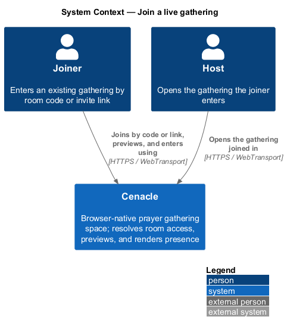
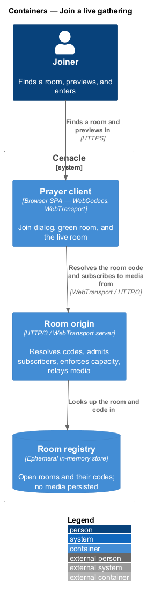
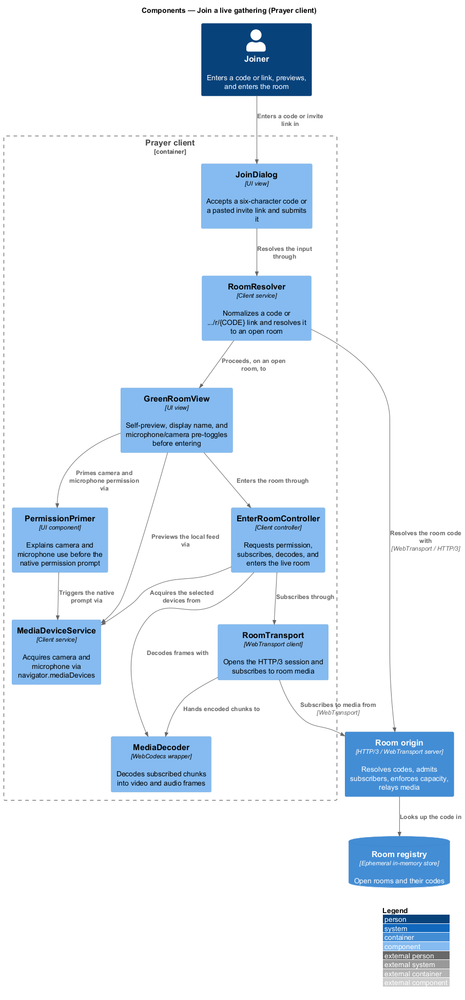
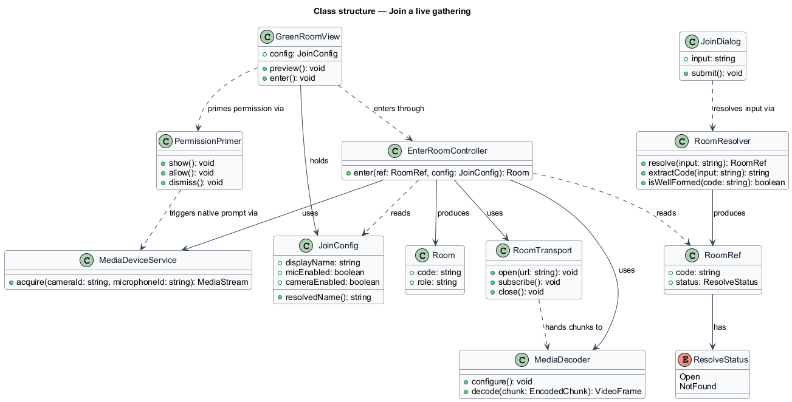
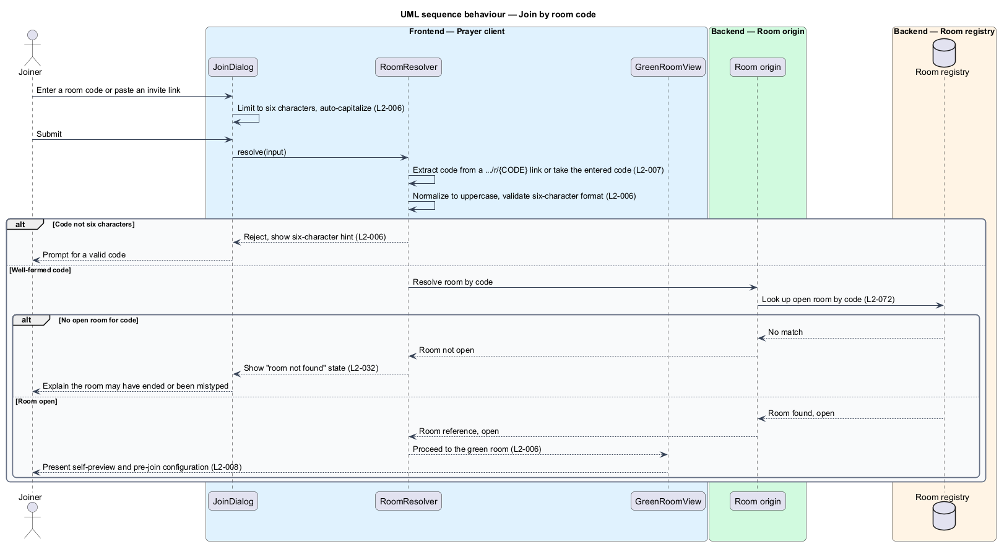
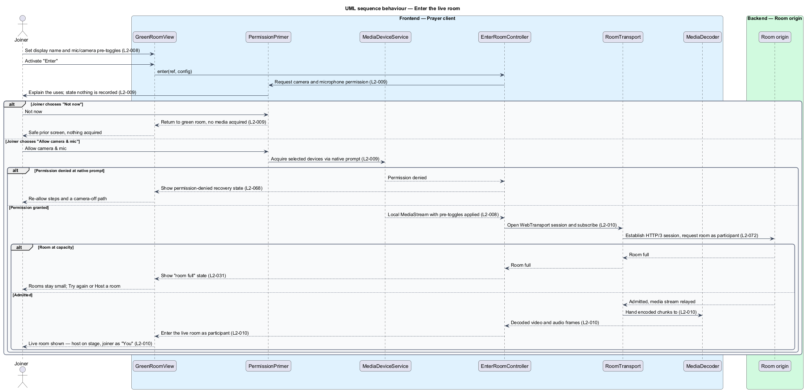

# Join a live gathering

## Overview

Cenacle is a browser-native prayer gathering space. A *gathering* is a live,
small-room session that one person opens and others join to see and hear one
another in near-real time. This feature covers the path a *joiner* takes into a
gathering someone else has already opened.

- **joiner** — person entering a gathering another person opened
- **room code** — six-character reference, from an unambiguous alphabet, that
  identifies an open room
- **invite link** — URL of the form `.../r/{CODE}` that carries a room code
- **green room** — pre-entry screen where the joiner previews privately, sets a
  display name, and pre-toggles microphone and camera before entering

The joiner moves through four steps: finding the room by code or invite link,
previewing privately in the green room, granting camera and microphone
permission through a plain-language primer, and entering the live room. Entry
places the joiner among the participants, with the host on the main stage and
the joiner shown as "You".

Two browser capabilities carry the subscribe side of the feature and are named
throughout. *WebTransport* is the browser API that carries the room's media over
HTTP/3. *WebCodecs* is the browser API that decodes the received frames for
rendering. The green room states plainly that nothing is recorded, so a newcomer
understands both what the controls do and what the system does not do with their
image and voice.

## Description

The feature is a vertical slice that runs from the join dialog in the browser to
the room origin that relays the room's media.

- **`JoinDialog`** — UI view that accepts a six-character code or a pasted invite
  link. It limits code entry to six characters, auto-capitalizes, and submits the
  input to the resolver.
- **`RoomResolver`** — client service that turns an input into a resolved room.
  It extracts the code from a `.../r/{CODE}` link or takes the entered code,
  normalizes it to uppercase, validates the six-character format, and asks the
  room origin whether the room is open.
- **`RoomRef`** — the resolution result: the normalized `code` and a
  `ResolveStatus` of `Open` or `NotFound`.
- **`GreenRoomView`** — UI view for the green room. It renders the self-preview,
  holds the display name and the microphone and camera pre-toggles, and starts
  entry.
- **`JoinConfig`** — the pre-join state: the `displayName` and the `micEnabled`
  and `cameraEnabled` toggles. It supplies a non-empty fallback label when the
  name is left blank, and its state carries into the room.
- **`PermissionPrimer`** — UI component that explains, before the browser's native
  prompt, why camera and microphone are needed and that nothing is recorded. It
  offers "Allow camera & mic" and "Not now".
- **`MediaDeviceService`** — client service over `navigator.mediaDevices`. It
  acquires a local `MediaStream` from the selected devices; acquisition triggers
  the browser's native permission prompt.
- **`EnterRoomController`** — client controller that runs entry. It reads the
  `RoomRef` and `JoinConfig`, requests permission through the primer, acquires
  devices, opens the transport, subscribes, decodes, and hands the joiner into
  the live room as a participant.
- **`RoomTransport`** — WebTransport client, subscribe side. It opens the HTTP/3
  session to the room origin and subscribes to the room's encoded media.
- **`MediaDecoder`** — WebCodecs wrapper. It configures a decoder and decodes
  received chunks into video and audio frames for rendering.
- **`Room origin`** — HTTP/3 / WebTransport server. It resolves codes against the
  room registry, admits the subscriber, enforces room-access authorization and
  capacity, and relays media; it persists no media.
- **`Room registry`** — ephemeral in-memory store at the room origin holding open
  rooms and their codes.

The room-not-found state (L2-032), the room-full state (L2-031), and the
permission-denied and device-error recovery states (L2-068) are neighbouring
slices; this feature detects each condition and hands off to them rather than
owning their screens. The steady-state subscribe, decode, and render loop
(L2-012) and the presence latency target (L2-013) are neighbouring slices this
feature enters on success. Where entry depends on a value the specs leave open —
for example the small-room capacity the origin enforces at admission — the value
is marked `<TO SUPPLY>` in the room-full design rather than fixed here.

## Requirements

The feature realizes the following level-2 (L2) requirements. Each L2 refines a
level-1 (L1) requirement, cited by identifier.

| L2 ID | Refines (L1) | Requirement |
|-------|--------------|-------------|
| `L2-006` | `L1-002` | The system shall let a person join by entering a six-character room code, case-insensitive on entry and normalized to uppercase. |
| `L2-007` | `L1-002` | The system shall let a person join by opening or pasting an invite link of the form `.../r/{CODE}`, resolving it to the same green-room entry flow as a code. |
| `L2-008` | `L1-002` | The green room shall show a self-preview and let the joiner set a display name and pre-toggle microphone and camera, and those pre-join states shall carry into the room. |
| `L2-009` | `L1-002` | The system shall show a plain-language camera and microphone permission primer that states nothing is recorded before triggering the browser's native permission prompt. |
| `L2-010` | `L1-002` | Entering the live room shall subscribe to the room's media, decode it, and render the gathering with the joiner placed among the participants. |

## Diagrams

### System context

The joiner uses Cenacle to reach a gathering by code or invite link and enter it;
the host opens the same gathering. Both connect over HTTPS and WebTransport.

### Containers

The joiner works in the Prayer client, which resolves the room code with the room
origin and subscribes to WebCodecs-encoded media over WebTransport; the origin
looks the code up in an ephemeral registry.

### Components

Inside the Prayer client, `JoinDialog` resolves input through `RoomResolver`,
which proceeds on an open room to `GreenRoomView`; `GreenRoomView` primes
permission through `PermissionPrimer` and enters through `EnterRoomController`,
which subscribes through `RoomTransport` and decodes through `MediaDecoder`.

### Class structure

`RoomResolver` produces a `RoomRef`; `GreenRoomView` holds a `JoinConfig` and
delegates entry to `EnterRoomController`, which reads both, uses
`MediaDeviceService`, `RoomTransport`, and `MediaDecoder`, and produces a `Room`.

### Behaviour — join by room code

`JoinDialog` limits and capitalizes the code (`L2-006`); `RoomResolver` extracts
a code from a pasted invite link (`L2-007`), normalizes and validates it, and
resolves it against the origin. A well-formed code that matches no open room
shows the "room not found" state (`L2-032`); an open room proceeds to the green
room (`L2-008`).

### Behaviour — enter the live room

`EnterRoomController` requests permission through `PermissionPrimer` (`L2-009`),
which triggers the native prompt through `MediaDeviceService`; on grant, the
pre-toggles carry into the acquired stream (`L2-008`) and `RoomTransport`
subscribes to the origin. A room at capacity shows the "room full" state
(`L2-031`); admission decodes and renders the gathering with the joiner placed
among the participants (`L2-010`).

