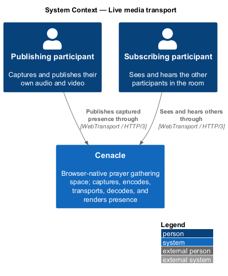
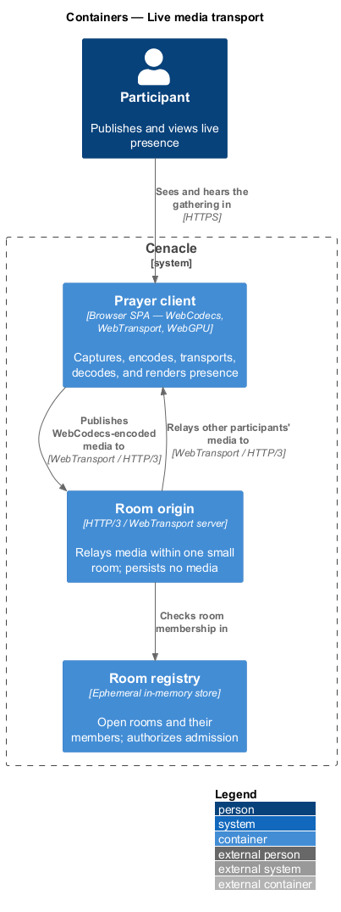
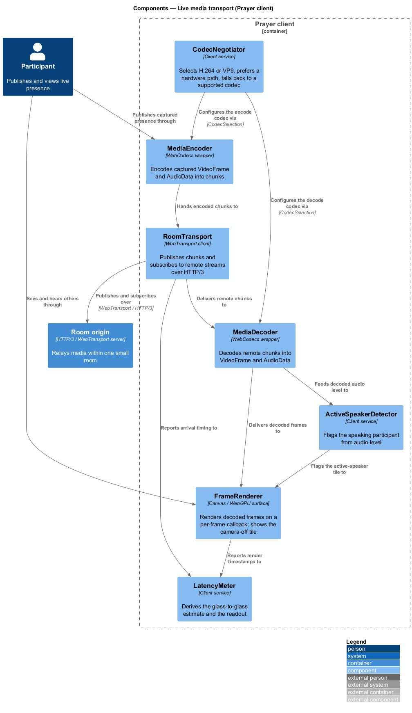
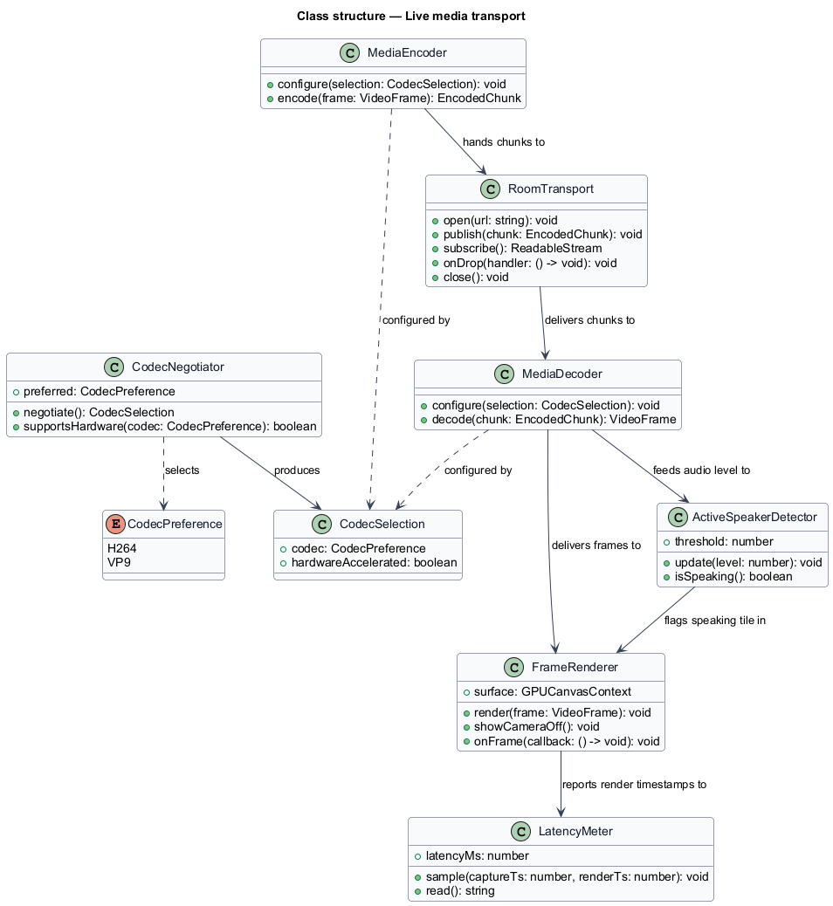
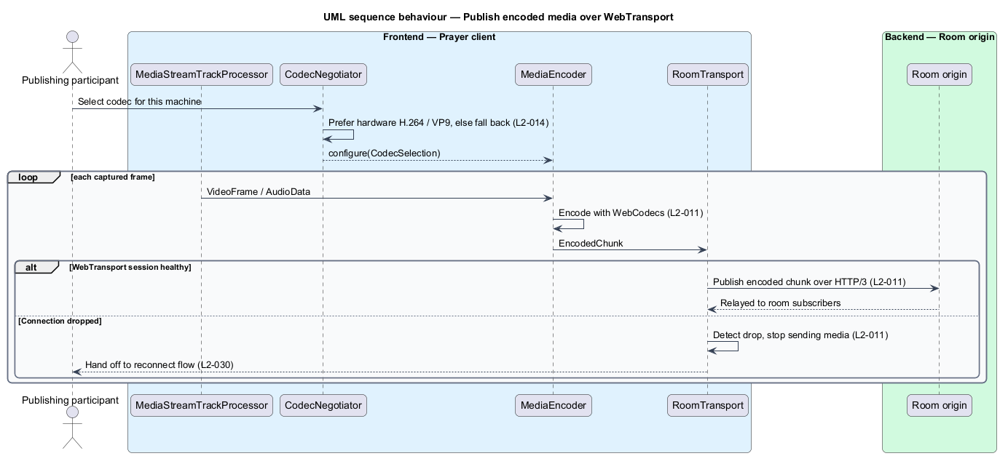
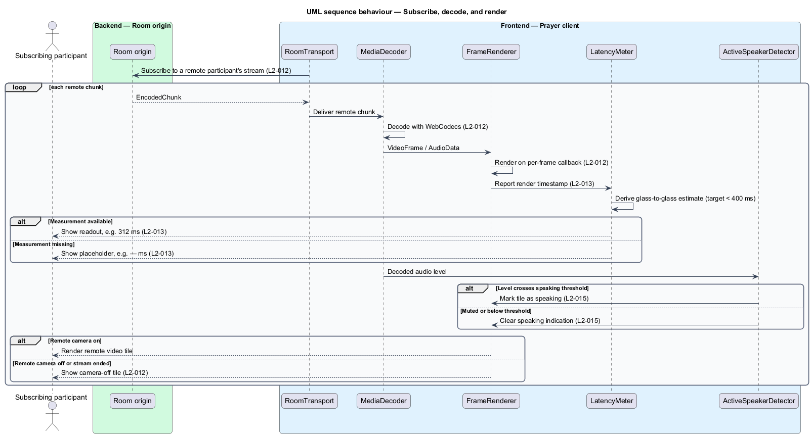

# Live media transport

## Overview

Cenacle is a browser-native prayer gathering space. Once a gathering is open, its
participants see and hear one another in near-real time. This feature is the
*presence pipeline* — the path that carries a participant's audio and video from
their camera and microphone to every other participant's screen and speakers.

*presence pipeline* — capture-to-render path that encodes, transports, decodes,
and renders live audio and video

*glass-to-glass latency* — interval between a moment captured at one participant's
camera and its appearance on another participant's screen

*active speaker* — participant whose audio level crosses a speaking threshold

*hardware path* — encode or decode route executed by a dedicated media engine
rather than in software

The pipeline runs entirely on browser primitives. *WebCodecs* encodes captured
frames into a compressed stream and decodes remote frames back into pictures.
*WebTransport* carries that stream to and from the server over HTTP/3. A
*canvas* or *WebGPU* surface renders each decoded frame on a per-frame callback so
motion stays smooth. The pipeline holds one target above all others: glass-to-glass
latency under 400 ms on a LAN-class connection, so the gathering feels co-located
rather than buffered.

In a small room each person is both a publisher and a subscriber. This document
describes the publish direction and the subscribe direction as two behaviours of
the same pipeline, and states the latency target the pipeline is built to meet.

## Description

The feature is a vertical slice that runs from the capture surface in the browser,
through the room origin, and back to the render surface in another browser.

- **`CodecNegotiator`** — client service that selects the codec. It prefers a
  hardware-accelerated path for H.264 or VP9, and falls back to a supported codec
  when no hardware path exists. It produces a `CodecSelection` that configures both
  the encoder and the decoder. AV1 encode is out of scope for v1.
- **`MediaEncoder`** — WebCodecs wrapper. It configures a `VideoEncoder` and an
  `AudioEncoder` for the selected codec and encodes captured frames into chunks.
- **`RoomTransport`** — WebTransport client. It opens the HTTP/3 session to the
  room origin, publishes encoded chunks, subscribes to each remote participant's
  stream, and signals a dropped connection.
- **`MediaDecoder`** — WebCodecs wrapper. It configures a `VideoDecoder` and an
  `AudioDecoder` for the selected codec and decodes remote chunks into frames.
- **`FrameRenderer`** — canvas or WebGPU surface. It renders each decoded frame on
  a per-frame callback so motion is tearing-free, and it shows a camera-off tile
  when a remote stream carries no video.
- **`LatencyMeter`** — client service that derives the glass-to-glass estimate from
  capture and render timing and produces the latency readout, in monospaced type,
  with a neutral placeholder when no measurement is available.
- **`ActiveSpeakerDetector`** — client service that reads audio level and flags the
  speaking participant when the level crosses the speaking threshold.
- **`Room origin`** — HTTP/3 / WebTransport server. It relays media within one
  small room and persists no media.

The capture source is the browser `MediaStreamTrackProcessor`, which yields
`VideoFrame` and `AudioData` from a captured track for the encoder to consume.

Two facts remain open and are marked rather than invented. The method by which
`LatencyMeter` derives a cross-machine glass-to-glass estimate is `<TO SUPPLY>`;
the target (`400 ms`) and the readout format are fixed here. The numeric speaking
threshold that `ActiveSpeakerDetector` applies is `<TO SUPPLY>`.

Several neighbouring slices meet this pipeline at its edges and own their own
behaviour. Go-live opens the transport and hands the host into the room
(`L2-005`, host-a-gathering). A dropped connection hands off to the reconnect flow
(`L2-030`, room-lifecycle-and-resilience), which pauses outbound media and retries.
The codec preference is chosen in settings (`L2-060`), and this pipeline applies it
through `CodecNegotiator`. Turning a camera off (`L2-017`,
in-room-presence-and-controls) is what causes the camera-off tile this pipeline
renders. The latency readout and present count are placed in the room header
(`L2-021`, in-room-presence-and-controls). Authenticated transport and authorized
admission (`L2-072`, security-and-data-protection) admit the publisher and
subscriber before any media flows.

## Requirements

The feature realizes the following level-2 (L2) requirements. Each L2 refines a
level-1 (L1) requirement, cited by identifier.

| L2 ID | Refines (L1) | Requirement |
|-------|--------------|-------------|
| `L2-011` | `L1-003` | The system shall publish captured media as WebCodecs-encoded frames over a WebTransport (HTTP/3) connection to the room. |
| `L2-012` | `L1-003` | The system shall pull each remote participant's stream, decode it with WebCodecs, and render it to a canvas or WebGPU surface synchronized to frame callbacks. |
| `L2-013` | `L1-003` | Glass-to-glass latency shall stay under 400 ms on a LAN-class connection, and the room shall display a live latency readout. |
| `L2-014` | `L1-003` | The system shall support H.264 and VP9 for WebCodecs, prefer a hardware-accelerated path, and fall back to a supported codec when no hardware path exists; AV1 encode is out of scope for v1. |
| `L2-015` | `L1-003` | The room shall indicate the current speaker on both the main stage and the filmstrip. |

## Diagrams

### System context

Each participant publishes their own captured presence to Cenacle and sees and
hears the others through it, over HTTPS and WebTransport. In a small room one
person fills both roles.

### Containers

The Prayer client publishes WebCodecs-encoded media to the room origin over
WebTransport, and the origin relays other participants' media back to the client;
the origin checks room membership in the ephemeral registry and persists no media.

### Components

Inside the Prayer client, `CodecNegotiator` configures `MediaEncoder` and
`MediaDecoder`; the encoder hands chunks to `RoomTransport`, which publishes to and
subscribes from the room origin. Incoming chunks flow through `MediaDecoder` to
`FrameRenderer`, while `ActiveSpeakerDetector` flags the speaking tile and
`LatencyMeter` derives the readout.

### Class structure

`CodecNegotiator` produces a `CodecSelection` that configures `MediaEncoder` and
`MediaDecoder`; the encoder hands chunks to `RoomTransport`, which delivers remote
chunks to the decoder. The decoder feeds `FrameRenderer` and `ActiveSpeakerDetector`,
and the renderer reports timestamps to `LatencyMeter`.

### Behaviour — publish encoded media over WebTransport

`CodecNegotiator` selects a codec and prefers a hardware path (`L2-014`), then
`MediaEncoder` encodes each captured frame with WebCodecs and `RoomTransport`
publishes it over HTTP/3 (`L2-011`). When the connection drops, `RoomTransport`
stops sending media and hands off to the reconnect flow (`L2-030`).

### Behaviour — subscribe, decode, and render

`RoomTransport` subscribes to a remote stream; `MediaDecoder` decodes each chunk and
`FrameRenderer` renders it on a per-frame callback (`L2-012`). `LatencyMeter` shows
the readout or a neutral placeholder (`L2-013`), `ActiveSpeakerDetector` marks the
speaking tile (`L2-015`), and the renderer shows a camera-off tile when a remote
stream carries no video (`L2-012`).

