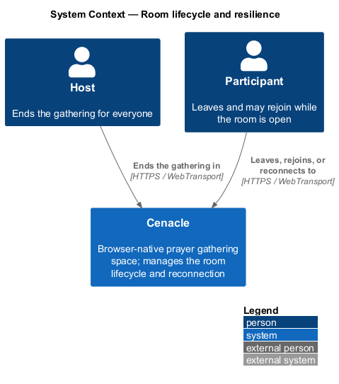
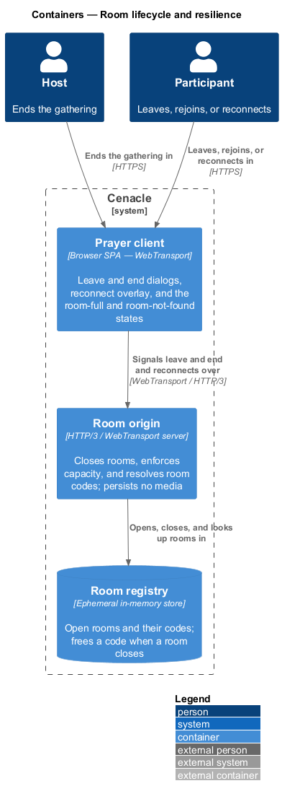
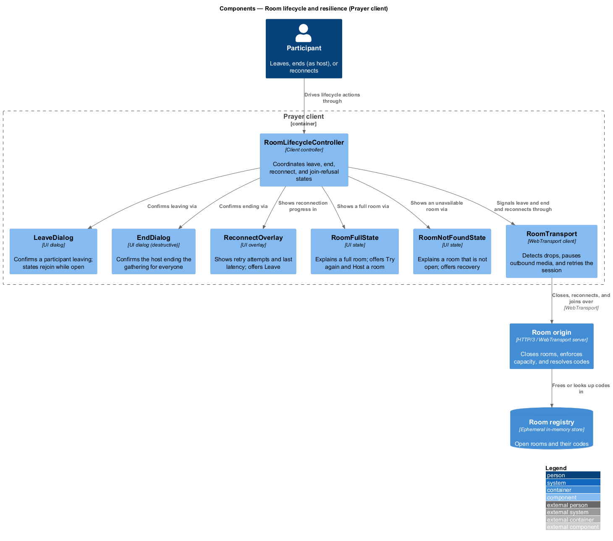
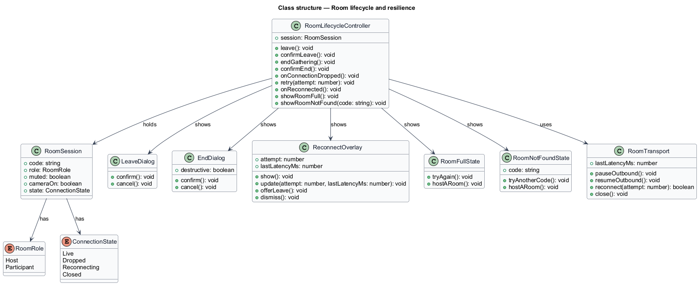
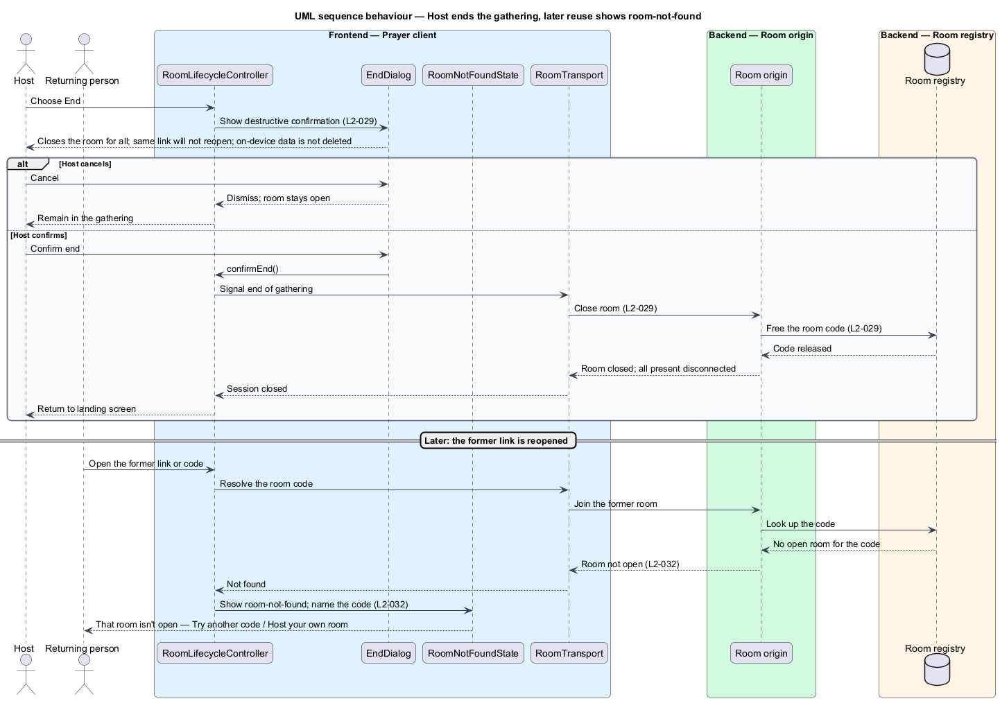
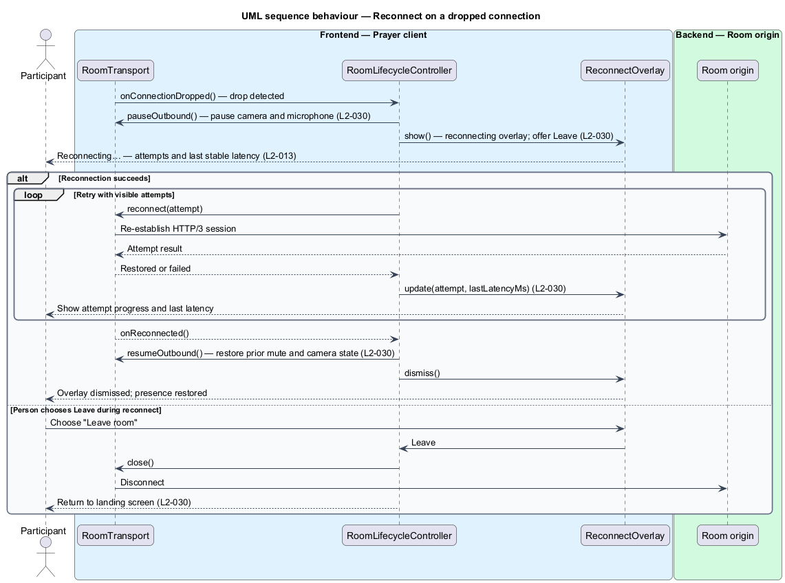
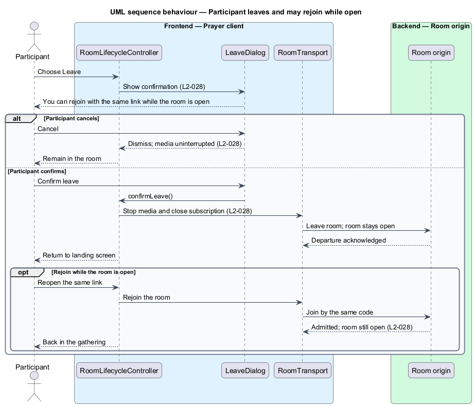
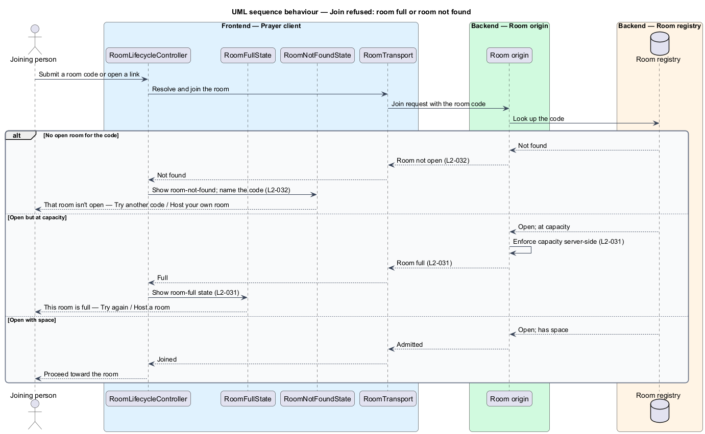

# Room lifecycle and resilience

## Overview

Cenacle is a browser-native prayer gathering space. A *gathering* is a live,
small-room session that one person opens and others join to see and hear one
another in near-real time. The *room* is the server-side relay through which a
gathering's media flows; it exists only while the gathering is open. This
feature covers the *room lifecycle* — the ordered set of states a room passes
through from open to closed — and the resilience behaviours that keep a
gathering coherent when a connection drops or a join cannot be honoured.

Five behaviours make up the slice. A *participant* — a person present in the
room who is not the host — may leave through a confirmation step and rejoin with
the same link while the room stays open. The *host* — the person who opened the
gathering — may end it for everyone through a destructive confirmation that
closes the room. A participant whose connection drops sees a reconnecting
overlay while the client pauses outbound media and retries. A person who tries
to join a room at capacity sees a room-full state. A person who submits a code
or link that matches no open room sees a room-not-found state.

Ending a gathering is a deliberate close, not a data wipe. The room and its code
are released at the server, and everyone present is disconnected, but on-device
content — journal entries, saved passages, settings — is not deleted. A closed
room's code no longer resolves: a later attempt on the former link produces the
room-not-found state rather than reopening the room.

This document assumes no prior knowledge of Cenacle's internals. The terms used
below are defined at first use, and the diagrams show where each part lives.

## Description

The feature is a vertical slice that runs from the in-room lifecycle controls in
the browser to the room origin that opens, closes, and resolves rooms.

- **`RoomLifecycleController`** — client controller that coordinates the slice.
  It drives the leave and end confirmations, the reconnect flow, and the
  join-refusal states, and it holds the client's `RoomSession`.
- **`LeaveDialog`** — confirmation dialog for a participant leaving. It states
  that the person may rejoin with the same link while the room is open (L2-028).
- **`EndDialog`** — destructive-styled confirmation for the host ending the
  gathering. It states that ending closes the room for all present, that the
  same link will not reopen it, and that on-device data is not deleted (L2-029).
- **`ReconnectOverlay`** — overlay shown when the connection drops. It shows the
  retry attempts and the last stable latency, and it offers to leave the room
  (L2-030).
- **`RoomFullState`** — screen state shown when a join is refused for capacity.
  It states that rooms are small on purpose and offers "Try again" and "Host a
  room" (L2-031).
- **`RoomNotFoundState`** — screen state shown when a code or link matches no
  open room. It names the code, states the room may have ended or been mistyped,
  and offers recovery (L2-032).
- **`RoomSession`** — the client's handle on the joined room: the room `code`,
  the `role` (host or participant), the current mute and camera state, and the
  connection state. The reconnect flow captures the mute and camera state before
  pausing outbound media and restores it on recovery.
- **`RoomTransport`** — WebTransport client, shared with the neighbouring
  presence slices. It detects a dropped session, pauses outbound media, retries
  the HTTP/3 connection, and signals leave and end to the origin.
- **`Room origin`** — HTTP/3 / WebTransport server. It closes a room when the
  host ends the gathering, enforces room capacity server-side, and resolves a
  submitted code to an open room or a not-found result. It persists no media.
- **`Room registry`** — ephemeral in-memory store of open rooms and their codes
  at the room origin. It frees a room's code when the room closes, so the code
  no longer resolves.

Room capacity is enforced at the origin; the small-room limit is fixed by the
hosting slice and is marked `<TO SUPPLY>` there rather than duplicated here. The
reconnect retry count and backoff interval are `<TO SUPPLY>`. The latency shown
in the reconnect overlay follows the room's latency readout (L2-013). Server-side
capacity enforcement and abuse resistance are shared with the security slice
(L2-075); this feature consumes those decisions rather than owning them.

## Requirements

The feature realizes the following level-2 (L2) requirements. Each L2 refines a
level-1 (L1) requirement, cited by identifier.

| L2 ID | Refines (L1) | Requirement |
|-------|--------------|-------------|
| `L2-028` | `L1-007` | The system shall let a participant leave through a confirmation step and rejoin with the same link while the room remains open. |
| `L2-029` | `L1-007` | The host shall end the gathering through a destructive confirmation that closes the room, disconnects all present, and retains on-device data. |
| `L2-030` | `L1-007` | On a dropped connection, the client shall show a reconnecting overlay, pause outbound media, retry with visible attempts and the last latency, and offer to leave. |
| `L2-031` | `L1-007` | The system shall refuse a join to a room at capacity, enforcing the limit server-side, and show a room-full state offering to retry or host a room. |
| `L2-032` | `L1-007` | The system shall show a room-not-found state for a code or link that matches no open room, naming the likely causes and offering recovery. |

## Diagrams

### System context

The host ends a gathering and a participant leaves, rejoins, or reconnects; both
act on the same Cenacle system over HTTPS and WebTransport.

### Containers

The Prayer client holds the leave and end dialogs, the reconnect overlay, and
the room-full and room-not-found states; it signals leave and end and reconnects
to the room origin over WebTransport, and the origin opens, closes, and looks up
rooms in the ephemeral room registry.

### Components

Inside the Prayer client, `RoomLifecycleController` drives `LeaveDialog`,
`EndDialog`, `ReconnectOverlay`, `RoomFullState`, and `RoomNotFoundState`, and it
signals lifecycle changes and reconnection through `RoomTransport` to the room
origin, which frees or looks up codes in the room registry.

### Class structure

`RoomLifecycleController` holds a `RoomSession` and shows each dialog, overlay,
and state; it uses `RoomTransport` to pause and resume outbound media and to
reconnect. `RoomSession` carries the `RoomRole` and the `ConnectionState` that
the reconnect flow restores.

### Behaviour — host ends the gathering

On `End`, `RoomLifecycleController` shows the destructive `EndDialog`; on
confirm, `RoomTransport` closes the room at the origin and the origin frees the
code in the registry (`L2-029`). A later attempt on the former link resolves to
no open room, so `RoomNotFoundState` is shown (`L2-032`).

### Behaviour — reconnect on a dropped connection

When `RoomTransport` detects a drop, `RoomLifecycleController` pauses outbound
media and shows `ReconnectOverlay` with attempt progress and the last latency
(`L2-030`). On success it restores the prior mute and camera state and dismisses
the overlay; if the person chooses "Leave room", the client closes cleanly to
the landing screen (`L2-030`).

### Behaviour — participant leaves and may rejoin

On `Leave`, `RoomLifecycleController` shows `LeaveDialog`; cancelling leaves
media uninterrupted, and confirming stops media and returns the person to the
landing screen while the room stays open. Reopening the same link rejoins the
still-open room (`L2-028`).

### Behaviour — join refused (room full or not found)

On a join, the origin looks up the code in the registry: a code that matches no
open room yields `RoomNotFoundState` (`L2-032`), a room at capacity yields
`RoomFullState` after server-side enforcement (`L2-031`), and an open room with
space admits the person toward the room.

