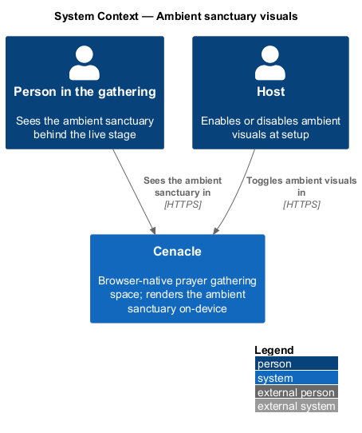
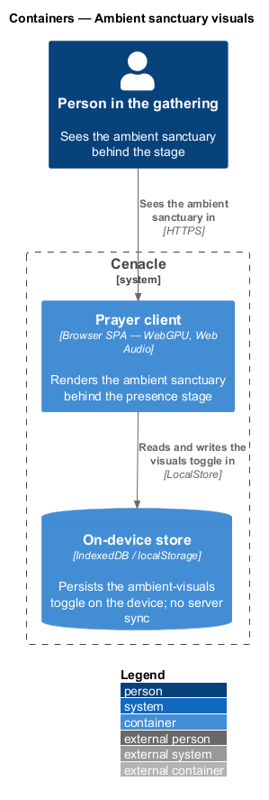
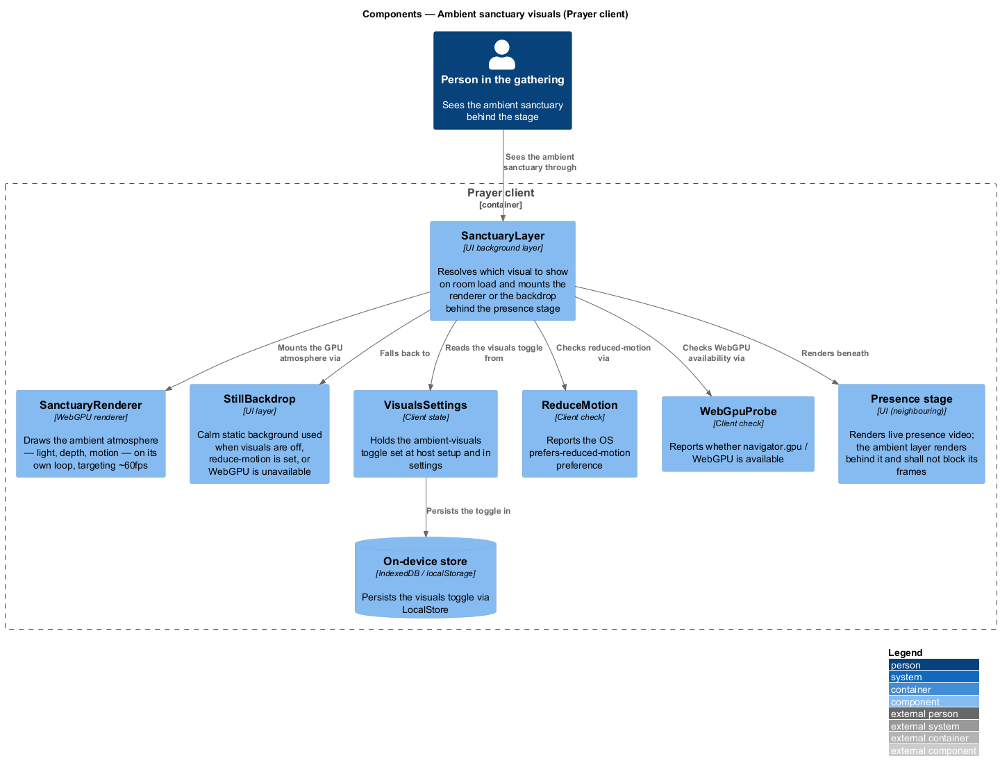
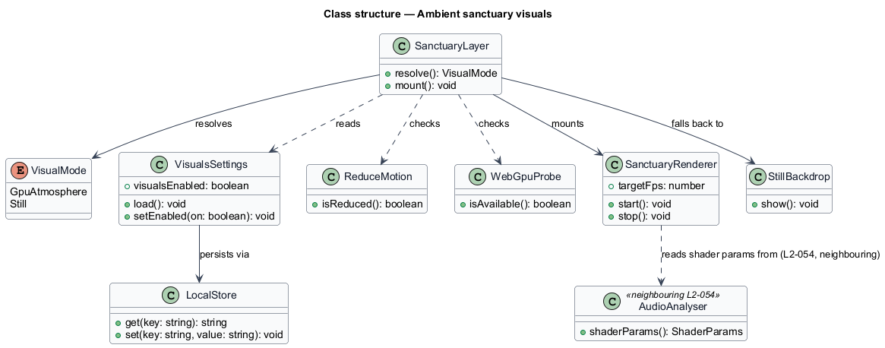
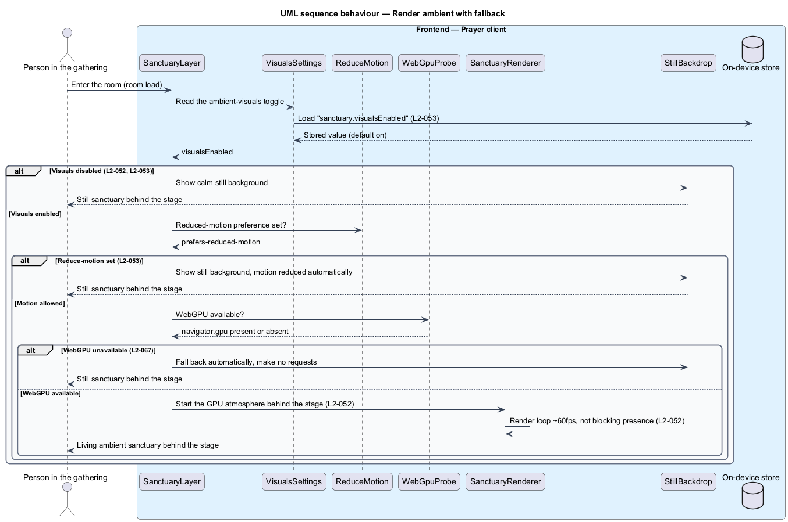

# Ambient sanctuary visuals

## Overview

Cenacle is a browser-native prayer gathering space. A *gathering* is a live,
small-room session in which people see and hear one another in near-real time.
Behind the live faces sits the *sanctuary* — the ambient backdrop of the room.
This feature renders that backdrop.

*Ambient sanctuary visuals* — a GPU-drawn atmosphere of light, depth, and motion
that fills the room behind the live stage, in place of a flat frame. The layer is
optional: it is one background surface among the room's surfaces, and the room
stays whole when it is off.

Two facts shape the design. First, the atmosphere is drawn on the device with
*WebGPU* — the browser API that runs rendering work on the graphics processor —
and it makes no network request; when the graphics processor cannot serve it, a
still image takes its place. Second, the atmosphere sits *behind* presence and
shall never delay it: a person's audio and video come first, and the ambient
layer yields to them.

This document assumes no prior knowledge of Cenacle's internals. Terms are
defined at first use, and the diagrams show where each part lives.

## Description

The feature is a client-only slice of the Prayer client, the browser
single-page application that holds all UI and on-device logic. No server takes
part: the ambient layer renders locally and reads its one setting from
device-local storage.

- **`SanctuaryLayer`** — background layer behind the presence stage. On room
  load it resolves which visual to show and mounts either the renderer or the
  still backdrop. It reads the toggle, the reduced-motion preference, and WebGPU
  availability, then chooses one.
- **`SanctuaryRenderer`** — WebGPU renderer. It draws the ambient atmosphere on
  its own render loop, targets ~60 fps, and renders behind the presence stage
  without blocking presence frames.
- **`StillBackdrop`** — the reduced and fallback layer. It shows a calm static
  background and runs no render loop; it is used when visuals are off, when
  reduced motion is set, or when WebGPU is unavailable.
- **`VisualsSettings`** — the client state holding the ambient-visuals toggle.
  The host sets it at setup and any person sets it in settings; it defaults on.
- **`ReduceMotion`** — client check over the OS `prefers-reduced-motion`
  preference. It reports whether the person has asked the system to reduce
  motion.
- **`WebGpuProbe`** — client check over `navigator.gpu`. It reports whether
  WebGPU is available in the current browser.
- **`LocalStore`** — wrapper over origin-scoped browser storage (`IndexedDB` /
  `localStorage`). It persists the toggle on the device and syncs it to no
  server.

Audio-reactive motion (`L2-054`) is a neighbouring slice: `AudioAnalyser` (Web
Audio) feeds shader parameters into `SanctuaryRenderer` when that feature is
enabled. This feature renders the atmosphere and hands off audio reactivity
rather than owning it. Capability detection at large — the support matrix across
WebTransport, WebCodecs, WebGPU, and on-device AI (`L2-064`) — is also a
neighbouring slice; this feature reads WebGPU availability through `WebGpuProbe`
and does not present the matrix.

## Requirements

The feature realizes the following level-2 (L2) requirements. Each L2 refines a
level-1 (L1) requirement, cited by identifier.

| L2 ID | Refines (L1) | Requirement |
|-------|--------------|-------------|
| `L2-052` | `L1-012` | The system shall render an ambient WebGPU atmosphere behind the stage as an optional layer, targeting ~60 fps, without blocking presence rendering, and shall use a still background when visuals are disabled. |
| `L2-053` | `L1-012` | The system shall let ambient visuals be toggled at host setup and in settings, shall reduce motion automatically when the OS reduce-motion preference is set regardless of the toggle, and shall persist the toggle on the device. |

## Diagrams

### System context

A person in the gathering sees the ambient sanctuary behind the live stage, and
the host toggles it. Cenacle renders the atmosphere on the device; no external
system takes part, since the ambient layer makes no network request.

### Containers

The Prayer client renders the ambient sanctuary in the browser and reads and
writes the visuals toggle in the on-device store; the toggle is never synced to a
server.

### Components

Inside the Prayer client, `SanctuaryLayer` reads `VisualsSettings`, checks
`ReduceMotion` and `WebGpuProbe`, and mounts either `SanctuaryRenderer` or
`StillBackdrop` beneath the presence stage; the toggle persists in the on-device
store.

### Class structure

`SanctuaryLayer` resolves a `VisualMode` from `VisualsSettings`, `ReduceMotion`,
and `WebGpuProbe`, then mounts `SanctuaryRenderer` or `StillBackdrop`;
`VisualsSettings` persists through `LocalStore`, and the renderer reads shader
parameters from the neighbouring `AudioAnalyser`.

### Behaviour — render ambient with fallback

On room load `SanctuaryLayer` reads the toggle from the on-device store, then
branches: a disabled toggle (`L2-052`, `L2-053`) or a set reduce-motion
preference (`L2-053`) or unavailable WebGPU (`L2-067`) mounts `StillBackdrop`;
otherwise `SanctuaryRenderer` starts the ~60 fps GPU atmosphere behind the stage
without blocking presence (`L2-052`).

