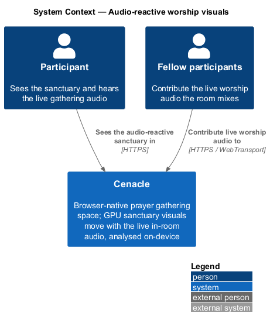
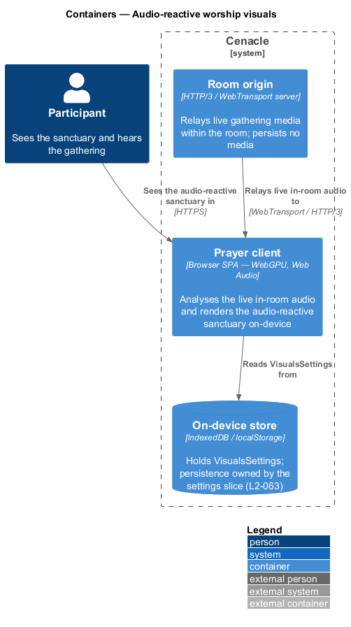
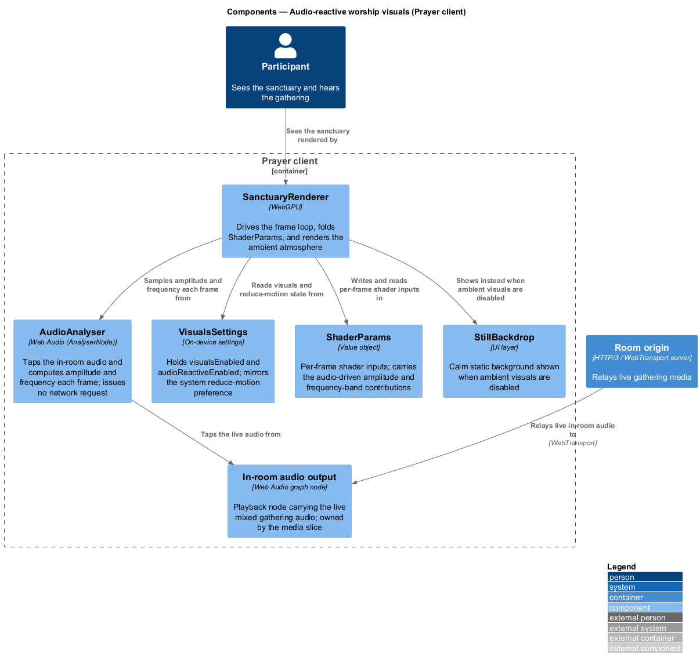
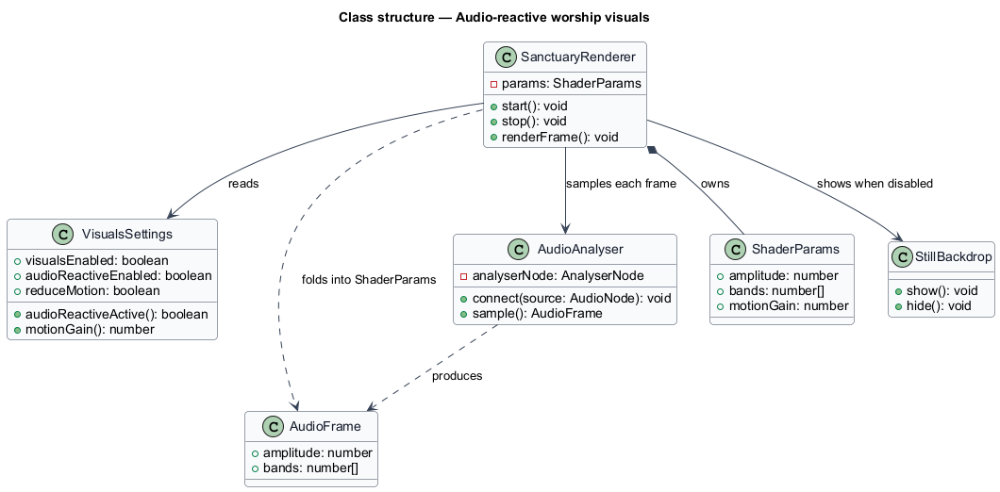
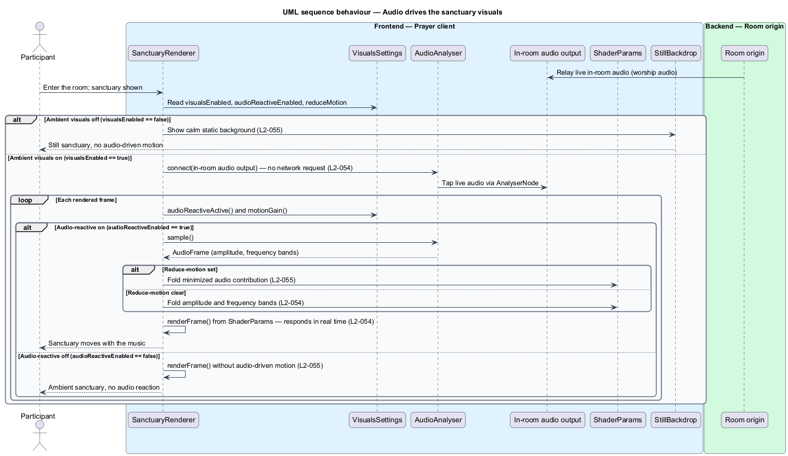

# Audio-reactive worship visuals

## Overview

Cenacle is a browser-native prayer gathering space. The *sanctuary* is the ambient
atmosphere rendered behind the gathering — light, depth, and motion drawn on the
GPU in place of a flat frame. A neighbouring feature renders that atmosphere as a
calm, self-contained loop; this feature makes it move with the sound in the room.

*audio-reactive worship visuals* — sanctuary motion driven, in real time, by the
live audio of the gathering. When enabled, the amplitude and frequency of the live
worship audio steer the parameters the sanctuary shaders read on each frame, so the
space visibly breathes with the music.

Two properties shape the design. The analysis runs on the *live in-room audio* — the
mixed audio the room already plays — and reads it through a local Web Audio node, so
it adds no network request. The behaviour is one optional layer on top of another:
it depends on the ambient visuals being on, it can be turned off on its own, and it
yields to the system reduce-motion preference. When any of those conditions removes
it, the sanctuary still renders; only the audio-driven motion goes away.

This document assumes no prior knowledge of Cenacle's internals. Terms are defined at
first use, and the diagrams show where each part lives.

## Description

The feature is a slice inside the Prayer client — the browser single-page
application that holds all UI and on-device logic. It introduces no server call: the
audio never leaves the device for analysis, and the sanctuary is rendered locally.

- **`AudioAnalyser`** — Web Audio component built on an `AnalyserNode`. It taps the
  in-room audio output, and on request returns the current *amplitude* (overall
  loudness) and a small set of *frequency bands* (energy per band). It reads local
  audio buffers only and issues no network request.
- **`In-room audio output`** — the Web Audio playback node that carries the mixed
  live gathering audio. It is owned by the media slice; this feature reads from it as
  the analysis source and does not alter playback.
- **`VisualsSettings`** — on-device settings for the sanctuary. It holds
  `visualsEnabled` (the ambient layer) and `audioReactiveEnabled` (this layer), and
  mirrors the system reduce-motion preference in `reduceMotion`. Its
  `audioReactiveActive()` reports whether audio-driven motion applies, and
  `motionGain()` reports how strongly it applies. Persistence of these toggles is
  owned by the settings slice (`L2-063`).
- **`ShaderParams`** — value object of the inputs the sanctuary shaders read for one
  frame. This feature writes the audio-driven `amplitude`, `bands`, and `motionGain`
  into it; the baseline atmosphere fields come from the ambient slice.
- **`SanctuaryRenderer`** — WebGPU component that drives the frame loop. On each
  frame it reads `VisualsSettings`, samples `AudioAnalyser` when audio-reactive
  motion applies, folds the result into `ShaderParams`, and renders. When the ambient
  layer is off it shows the `StillBackdrop` instead.
- **`StillBackdrop`** — the reduced, static background shown when ambient visuals are
  disabled. It carries no motion and reads no audio.

The strength of the audio-driven motion is a single gain. `motionGain()` returns zero
when audio-reactive motion does not apply — because `audioReactiveEnabled` is off, or
because the ambient layer itself is off — a minimized value when the reduce-motion
preference is set, and its full value otherwise. The exact minimized gain is
`<TO SUPPLY>`. Folding this one gain into `ShaderParams` is what lets the three
degraded cases share the renderer's single per-frame path.

The smooth frame rate the ambient layer targets (`L2-052`), the toggle's on-device
persistence (`L2-063`), and the media transport that relays the in-room audio are
neighbouring slices; this feature reads from them rather than owning them.

## Requirements

The feature realizes the following level-2 (L2) requirements. Each L2 refines a
level-1 (L1) requirement, cited by identifier.

| L2 ID | Refines (L1) | Requirement |
|-------|--------------|-------------|
| `L2-054` | `L1-013` | When audio-reactive visuals are enabled, the sanctuary shall respond in real time to the live in-room audio through amplitude and frequency analysis feeding the shader parameters, using no network request. |
| `L2-055` | `L1-013` | The audio-reactive layer shall be independently toggleable, shall render without audio-driven motion when it or the ambient visuals are off, and shall minimize audio-driven motion when the reduce-motion preference is set. |

## Diagrams

### System context

The participant sees the audio-reactive sanctuary in Cenacle, and the live worship
audio that drives it is contributed by the fellow participants the room mixes. The
analysis of that audio happens on the device.

### Containers

The Prayer client analyses the live in-room audio and renders the sanctuary
on-device; the Room origin relays that audio into the room over WebTransport, and the
audio-reactive toggle is read from the on-device store whose persistence the settings
slice owns.

### Components

Inside the Prayer client, `SanctuaryRenderer` reads `VisualsSettings`, samples
`AudioAnalyser` — which taps the in-room audio output relayed by the Room origin —
folds the amplitude and frequency bands into `ShaderParams`, and renders; it shows
`StillBackdrop` instead when the ambient layer is off.

### Class structure

`SanctuaryRenderer` owns a `ShaderParams`, reads `VisualsSettings`, and samples
`AudioAnalyser` for an `AudioFrame`; `VisualsSettings` reports both whether
audio-driven motion applies and, through `motionGain()`, how strongly.

### Behaviour — audio drives the visuals

On each rendered frame `SanctuaryRenderer` consults `VisualsSettings` and takes one of
three paths: with ambient visuals off it shows `StillBackdrop`; with audio-reactive
off it renders the ambient frame without audio-driven motion (`L2-055`); with
audio-reactive on it samples `AudioAnalyser` and folds the amplitude and frequency
bands into `ShaderParams` — minimized when reduce-motion is set (`L2-055`), full
otherwise (`L2-054`) — reading the live audio with no network request.

