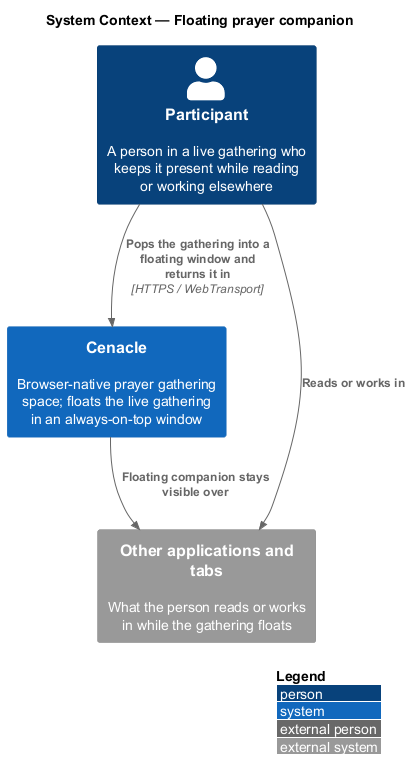
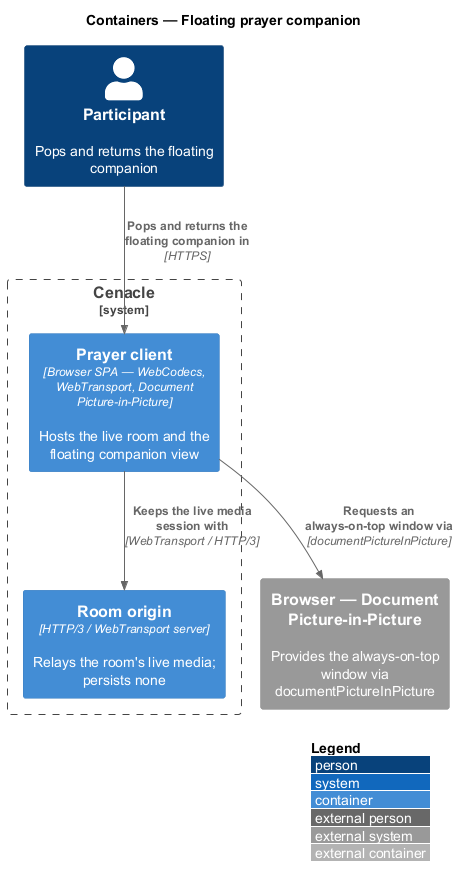
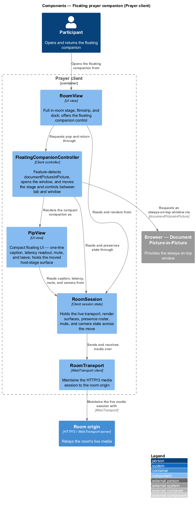
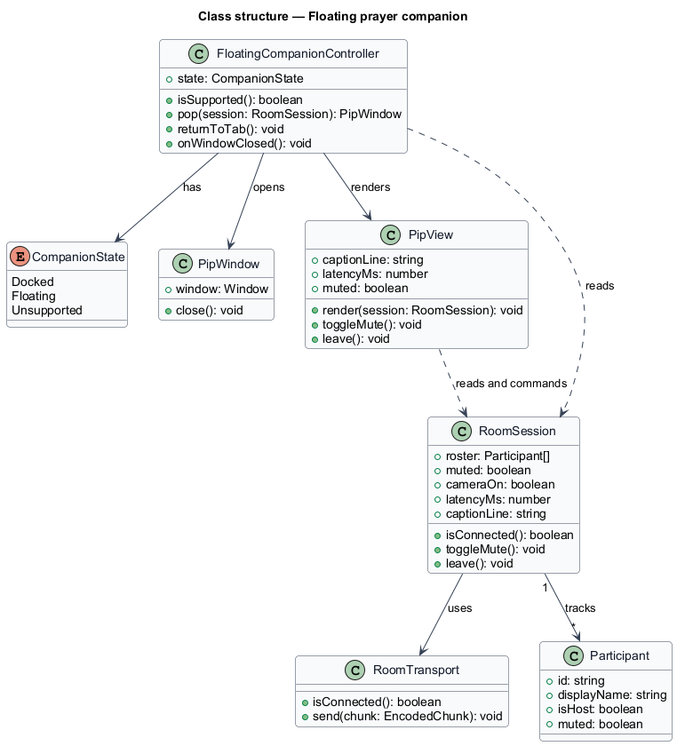
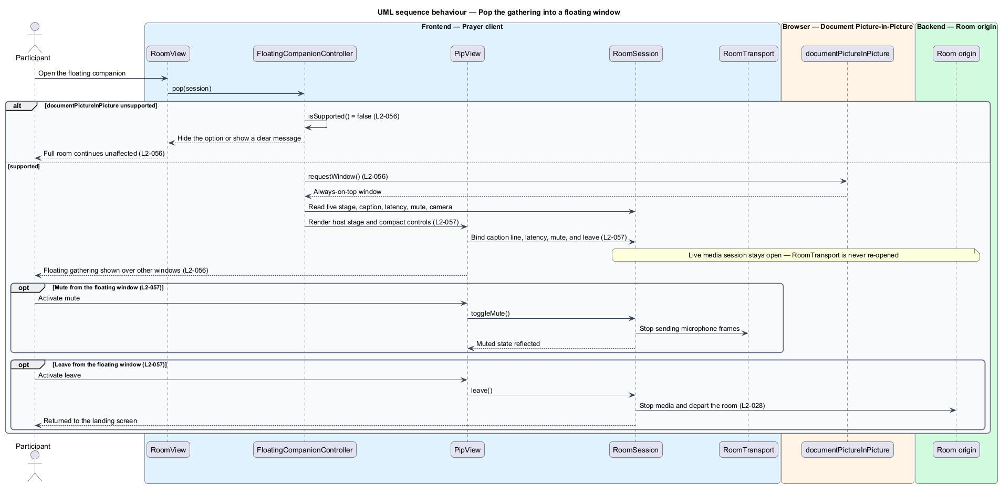
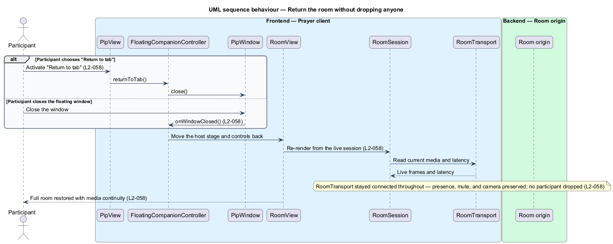

# Floating prayer companion

## Overview

Cenacle is a browser-native prayer gathering space. A *gathering* is a live,
small-room session in which people see and hear one another in near-real time.
The *floating prayer companion* is a compact, always-on-top window that carries
the live gathering out of its browser tab, so a person keeps seeing and hearing
the room while reading Scripture, journaling, or working in another application.

This feature covers popping the gathering into that window, the controls the
window exposes, and returning to the full room. A person in a live room opens the
companion; the gathering appears in a small window that stays above other
windows and tabs; the person reads or works elsewhere while the room stays live;
then the person returns the room, or closes the window, and lands back in the
full room with nobody dropped.

One browser capability carries the feature and is named throughout.
*Document Picture-in-Picture* — the browser API (`documentPictureInPicture`)
that opens an always-on-top window whose content the page supplies as ordinary
DOM. The live media session that feeds the room stays open in the originating
tab throughout the move; only the view relocates. That separation is what lets
the room float and return without re-admitting anyone. Where the browser lacks
Document Picture-in-Picture, the option is hidden or a clear message is shown,
and the full room is unaffected. The floating window uses the night register.

## Description

The feature is a vertical slice inside the Prayer client. The live media session
to the room origin stays open across the whole slice; the feature moves a view
between the tab and a floating window rather than opening or closing a
connection.

- **`RoomView`** — the full in-room UI: the host stage, the filmstrip, and the
  dock. It offers the control that opens the floating companion and is the view
  the person returns to.
- **`FloatingCompanionController`** — client controller for the move. It
  feature-detects `documentPictureInPicture`, requests the always-on-top window,
  moves the host-stage surface and the compact controls into it, and moves them
  back on return or close. Where the capability is absent, it reports
  unsupported so the option is hidden or messaged.
- **`PipView`** — the compact UI rendered inside the floating window. It shows a
  one-line live caption, a latency readout, a mute control, and a leave control,
  and it hosts the moved host-stage surface.
- **`RoomSession`** — the live-room state and media pipeline that persists across
  the move. It holds the `RoomTransport`, the decode and render surfaces, the
  presence roster, and the mute and camera state. Both `RoomView` and `PipView`
  read from and command the same `RoomSession`, so relocating the view drops no
  one.
- **`RoomTransport`** — WebTransport client. It keeps the HTTP/3 media session to
  the room origin open throughout the move; the feature never re-opens it.
- **`PipWindow`** — thin wrapper over the browser `Window` returned by
  `documentPictureInPicture`. It closes the window on return.
- **`Room origin`** — HTTP/3 / WebTransport server. It relays the room's live
  media and is not contacted by the pop or the return; the session it already
  holds stays connected.

The mute control acts through the same `RoomSession` operation as the in-room mic
control (L2-016); the leave control uses the leave flow (L2-028); the caption
line reads the room's on-device caption display (L2-046); and the latency readout
reads the presence latency measurement (L2-013). Capability detection for the
wider client is defined in the capability-detection slice (L2-064). This feature
consumes those neighbours rather than owning them.

## Requirements

The feature realizes the following level-2 (L2) requirements. Each L2 refines a
level-1 (L1) requirement, cited by identifier.

| L2 ID | Refines (L1) | Requirement |
|-------|--------------|-------------|
| `L2-056` | `L1-014` | The system shall let a person pop the gathering into an always-on-top Document Picture-in-Picture window that stays visible over other windows and tabs, hidden or clearly messaged where the capability is unavailable. |
| `L2-057` | `L1-014` | The floating window shall present a one-line live caption, a latency readout, a mute control, and a leave control in a compact form. |
| `L2-058` | `L1-014` | Returning or closing the floating window shall restore the full room with media continuity, dropping no participant and preserving presence, mute, and camera state. |

## Diagrams

### System context

A participant pops the gathering into a floating window and keeps it visible over
the other applications and tabs they read or work in; media travels over HTTPS
and WebTransport.

### Containers

The Prayer client requests the always-on-top window from the browser's Document
Picture-in-Picture capability and keeps its live media session with the room
origin open across the move.

### Components

Inside the Prayer client, `RoomView` invokes `FloatingCompanionController`, which
opens the window and renders `PipView`; both views read from and command one
`RoomSession`, whose `RoomTransport` holds the live media session to the room
origin.

### Class structure

`FloatingCompanionController` reads a `RoomSession`, opens a `PipWindow`, and
renders a `PipView`; `RoomSession` uses `RoomTransport` and tracks the
`Participant` roster that return preserves.

### Behaviour — pop the gathering into a floating window

On open, `FloatingCompanionController` checks `documentPictureInPicture`; when it
is absent the option is hidden or messaged and the full room continues (`L2-056`),
and when present the controller requests the window and `PipView` renders the
stage with the compact caption, latency, mute, and leave controls (`L2-057`).

### Behaviour — return the room without dropping anyone

Return or window-close routes through `FloatingCompanionController`, which moves
the stage and controls back to `RoomView`; because `RoomTransport` stayed
connected throughout, presence, mute, and camera state are preserved and no
participant is dropped (`L2-058`).

