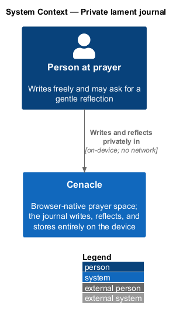
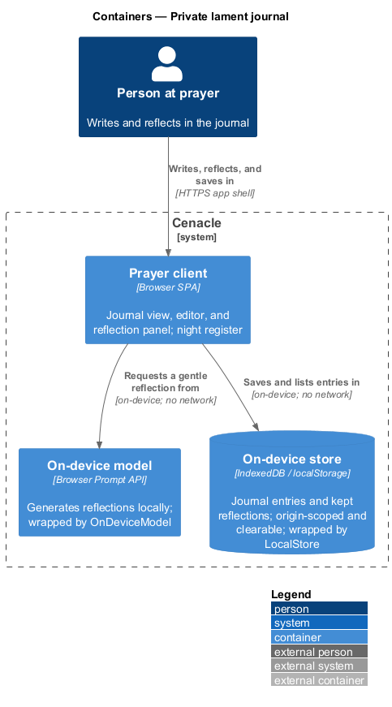
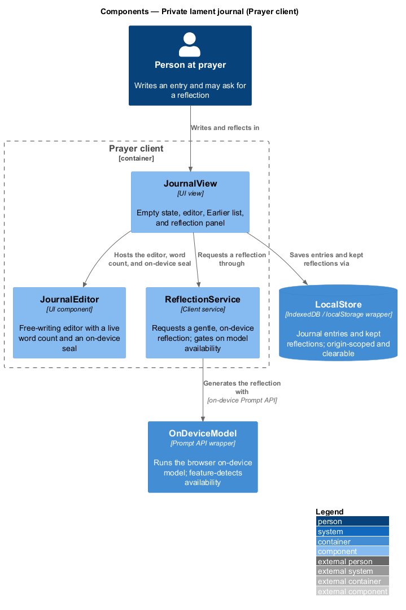
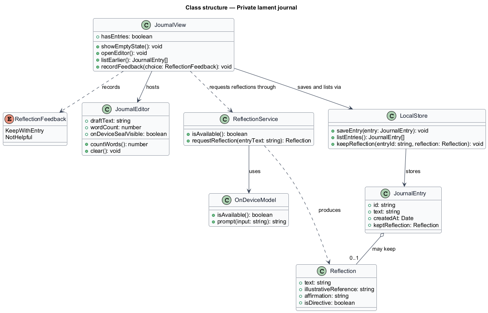
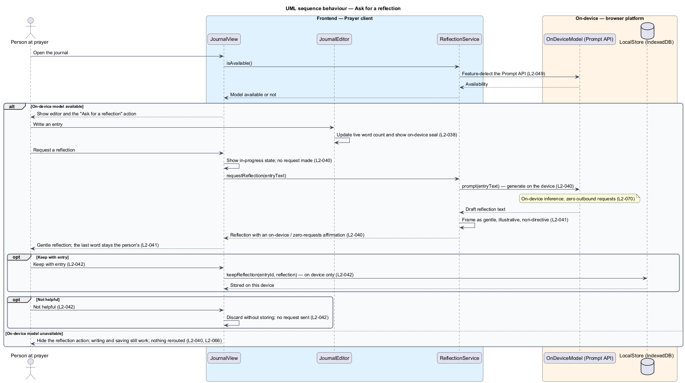
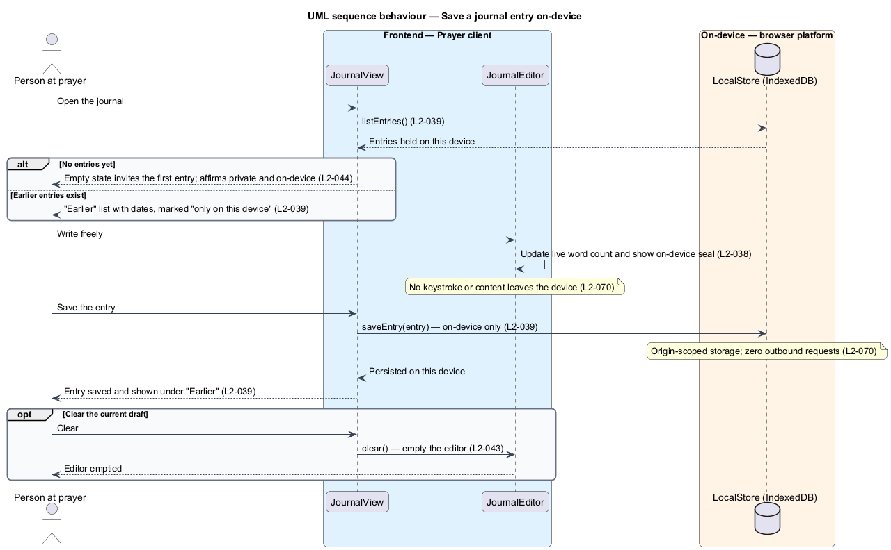

# Private lament journal

## Overview

Cenacle is a browser-native prayer gathering space. Alongside the live gathering
it offers a private companion, the *Word* subsystem, that runs on the device.
This feature is one part of that companion: a lament journal.

*lament journal* — a place where a person writes freely and may ask for a
gentle, grounded reflection on their own words. Every entry, every reflection,
and every piece of feedback is created and held on the device; none is
transmitted. The privacy guarantee is architectural, not a policy promise: the
feature has no code path to a server, so exercising it produces zero outbound
requests (L2-070).

This document assumes no prior knowledge of Cenacle's internals. Two on-device
browser capabilities carry the feature and are named throughout. The *Prompt
API* is the browser's on-device AI interface; it runs a local model and returns
generated text without a network call. *IndexedDB* is the browser's origin-scoped
local database; it holds the journal on the device until the person clears it.
The journal uses the night ("upper room") visual register (L2-085). A reflection
is offered gently: it is illustrative, never directive, and the last word stays
with the person (L2-041).

## Description

The feature is a slice that runs from the journal surface in the browser to the
on-device model and on-device store. No server container sits on its path — the
Room origin that carries live media is not involved here, which is what makes the
zero-egress guarantee verifiable.

- **`JournalView`** — UI view for the journal. It presents the empty state, the
  editor, the "Earlier" list of prior entries, and the reflection panel. It gates
  the reflection action on model availability, saves through `LocalStore`, and
  records reflection feedback.
- **`JournalEditor`** — UI component for free writing. It maintains a live word
  count, shows a persistent on-device seal, and clears the current draft on
  request.
- **`ReflectionService`** — client service that requests a reflection. It reports
  whether the on-device model is available, and for a non-empty entry it obtains a
  gentle, non-directive reflection framed with an on-device / zero-requests
  affirmation.
- **`OnDeviceModel`** — wrapper over the browser Prompt API. It feature-detects
  availability and runs the local model to generate text. It is the shared
  on-device intelligence used across the Word subsystem; it never calls a server.
- **`LocalStore`** — wrapper over origin-scoped browser storage (IndexedDB /
  localStorage). It saves and lists journal entries and keeps a chosen reflection
  alongside its entry. Its contents are clearable by the person.
- **`JournalEntry`** — the stored entry: an `id`, the `text`, a `createdAt`
  timestamp, and an optional kept `Reflection`.
- **`Reflection`** — reflective text with an optional illustrative Scripture
  reference and an affirmation that the reflection is gentle and non-final.

Feature-detection of on-device AI (L2-049), the one-time model download (L2-050),
and the shared hide-never-reroute behaviour when AI is absent (L2-066) are
neighbouring slices in the on-device intelligence foundation; this feature reads
their result rather than owning it. Where a value is not fixed by the specs, it is
marked `<TO SUPPLY>` in the owning design rather than invented here.

## Requirements

The feature realizes the following level-2 (L2) requirements. Each L2 refines a
level-1 (L1) requirement, cited by identifier.

| L2 ID | Refines (L1) | Requirement |
|-------|--------------|-------------|
| `L2-038` | `L1-009` | The journal shall provide a free-writing editor that shows a live word count and a persistent on-device indicator, and shall transmit no keystroke or content off the device. |
| `L2-039` | `L1-009` | The journal shall store entries on the device only and list prior entries under an "Earlier" list marked as local to the device. |
| `L2-040` | `L1-009` | The journal shall let the person request a reflection generated on the device from a non-empty entry, returned with an on-device / zero-requests affirmation and a visible in-progress state. |
| `L2-041` | `L1-009` | A reflection shall be gentle and non-authoritative, shall leave the last word with the person, and shall present any Scripture reference as illustrative rather than directive. |
| `L2-042` | `L1-009` | The journal shall let the person keep a reflection with its entry on the device or dismiss it as not helpful, and neither choice shall issue a network request. |
| `L2-043` | `L1-009` | The journal shall let the person clear the current draft, and clearing an empty editor shall neither throw nor navigate away. |
| `L2-044` | `L1-009` | With no entries, the journal shall present an empty state that invites a first entry and affirms the journal is private and on-device. |

## Diagrams

### System context

The person writes and reflects privately in Cenacle. No external system
participates: the relationship is on-device, with no network, which is the
starting point for the zero-egress guarantee (L2-070).

### Containers

Within Cenacle, the Prayer client depends on two on-device parts: the browser
Prompt API for reflections and IndexedDB for storage. Both connections are local;
no server container is on the path.

### Components

Inside the Prayer client, `JournalView` hosts `JournalEditor`, requests
reflections through `ReflectionService`, and saves through `LocalStore`.
`ReflectionService` generates the reflection with `OnDeviceModel` over the
on-device Prompt API.

### Class structure

`JournalView` hosts `JournalEditor`, records a `ReflectionFeedback` choice, and
persists through `LocalStore`; `ReflectionService` uses `OnDeviceModel` and
produces a `Reflection` that a `JournalEntry` may keep.

### Behaviour — ask for a reflection

`JournalView` gates the reflection action on `ReflectionService.isAvailable()`
(L2-049). When the model is available, a non-empty entry is reflected on the
device through `OnDeviceModel` and shown with a zero-requests affirmation
(L2-040), gentle and non-directive (L2-041); the person may keep or dismiss it
(L2-042). When the model is unavailable, the action is hidden while writing and
saving keep working, and nothing is rerouted (L2-066).

### Behaviour — save a journal entry on-device

On open, `JournalView` lists entries from `LocalStore`, showing the empty state
when there are none (L2-044) or the "Earlier" list otherwise (L2-039). Writing
updates the live word count and on-device seal (L2-038); saving persists to
`LocalStore` on the device only, with zero outbound requests (L2-039, L2-070). The
person may clear the current draft (L2-043).

