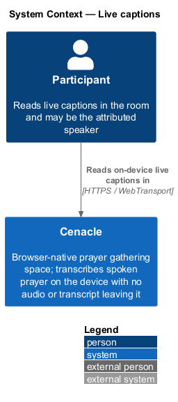
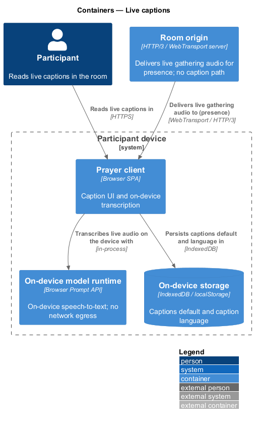
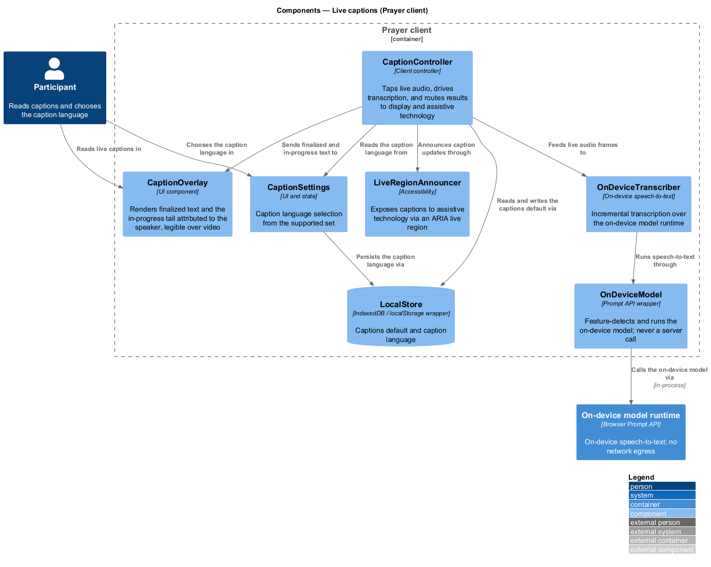
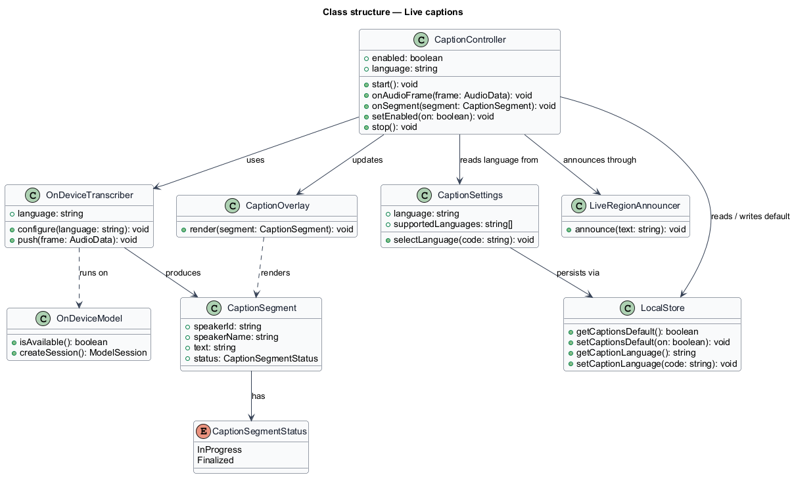
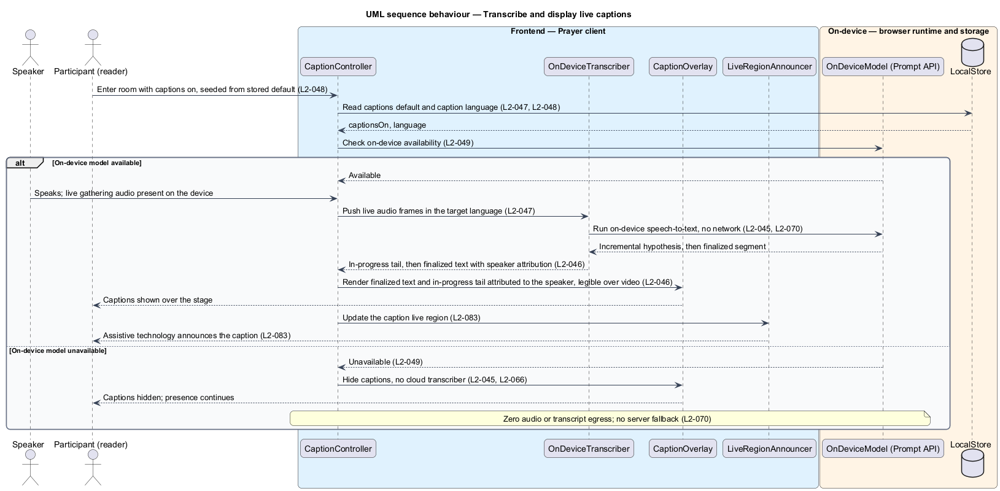
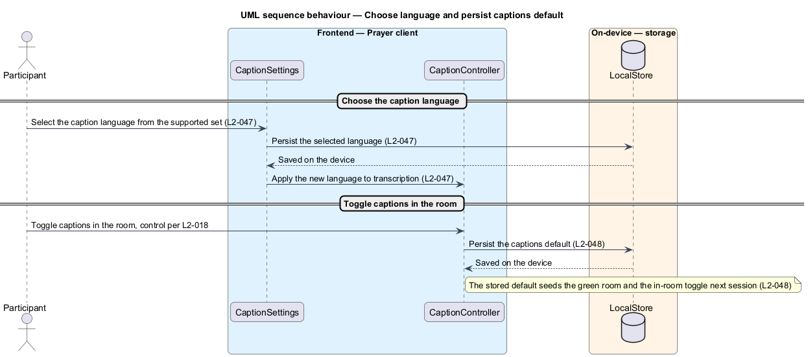

# Live captions

## Overview

Cenacle is a browser-native prayer gathering space. A *gathering* is a live,
small-room session in which people see and hear one another in near-real time.
This feature adds *live captions* — text of the spoken prayer and teaching,
transcribed as it is heard.

*live caption* — line of transcribed speech shown in the room, attributed to the
person speaking, updated as words are recognized

The captions serve accessibility and are produced entirely on the device. The
audio is transcribed by the browser's on-device model; neither the audio nor the
resulting text leaves the machine. The feature transcribes the live gathering
audio already present on the device for presence, adds no network egress of its
own, and — where the on-device model is unavailable — hides captions rather than
routing audio to a server.

Two facts frame the design. First, transcription is on-device: an *on-device
model* — the browser's `Prompt API` runtime, feature-detected before use — runs
speech-to-text in-process. Second, a caption is a two-part thing at any instant:
a *finalized* portion that no longer changes and an *in-progress tail* that the
model may still revise. The display distinguishes the two, attributes the line
to the speaker, keeps it legible over the video, and announces it to assistive
technology through a live region.

## Description

The feature is a vertical slice that lives entirely in the Prayer client — the
browser single-page application — and the on-device browser runtime beneath it.
No caption path reaches any server.

- **`CaptionController`** — client controller that coordinates captioning. It
  seeds the captions default and language from `LocalStore`, checks on-device
  availability, taps the live gathering audio, feeds frames to the transcriber,
  and routes each result to the overlay and the announcer. It owns persistence of
  the captions default.
- **`OnDeviceTranscriber`** — on-device speech-to-text component. It configures a
  target language, accepts pushed audio frames, and emits incremental
  results — an in-progress hypothesis followed by a finalized segment — over the
  on-device model runtime.
- **`OnDeviceModel`** — wrapper over the browser `Prompt API`. It feature-detects
  availability and runs the on-device model. It is never a server call.
- **`CaptionOverlay`** — UI component that renders a caption over the stage. It
  shows the finalized text and the in-progress tail as visually distinct,
  attributes the line to the speaker, and keeps contrast legible over the video.
- **`CaptionSettings`** — UI and state for caption language. It lists the
  supported language set and records the person's choice.
- **`LiveRegionAnnouncer`** — accessibility component that writes caption updates
  into an ARIA live region so assistive technology announces them.
- **`CaptionSegment`** — the unit passed through the slice: the `speakerId` and
  `speakerName` it is attributed to, the `text`, and a `status` of `InProgress`
  or `Finalized`.
- **`LocalStore`** — wrapper over origin-scoped browser storage (`IndexedDB` /
  `localStorage`). It holds the captions default and the caption language, and is
  clearable by the person.

The active-speaker signal that attributes each caption is owned by the presence
slice (L2-015) and is consumed here rather than computed. The in-room captions
toggle control is owned by the in-room controls slice (L2-018); this feature owns
the persistence of the resulting default (L2-048). Where a value the specs leave
open would be needed — for example the exact supported language set — it is left
to `CaptionSettings` configuration rather than fixed here.

## Requirements

The feature realizes the following level-2 (L2) requirements. Each L2 refines a
level-1 (L1) requirement, cited by identifier.

| L2 ID | Refines (L1) | Requirement |
|-------|--------------|-------------|
| `L2-045` | `L1-010` | Live captions shall transcribe spoken audio on the device in real time, shall transmit neither audio nor transcript off-device, and shall hide captions rather than route to a cloud transcriber when the on-device model is unavailable. |
| `L2-046` | `L1-010` | The room shall display captions attributed to the current speaker, shall distinguish finalized text from the in-progress tail, shall keep them legible over the video, and shall announce them to assistive technology through a live region. |
| `L2-047` | `L1-010` | The system shall let a person choose the caption language from the supported set, shall transcribe in that language, and shall persist the choice on the device. |
| `L2-048` | `L1-010` | The system shall persist a person's captions on/off preference across sessions on the device, and shall seed both the green room and the in-room toggle from it. |

## Diagrams

### System context

The participant reads live captions within Cenacle. The captions are transcribed
on the device, and no audio or transcript leaves it; no external transcription
system takes part.

### Containers

Captions live in the Prayer client on the participant's device, alongside the
on-device model runtime and on-device storage. The Room origin delivers the live
gathering audio for presence; the only caption-related flows — transcription and
persistence — stay within the device boundary.

### Components

Inside the Prayer client, `CaptionController` drives `OnDeviceTranscriber`, which
runs speech-to-text through `OnDeviceModel` over the on-device runtime. The
controller sends each `CaptionSegment` to `CaptionOverlay` and
`LiveRegionAnnouncer`, reads the language from `CaptionSettings`, and persists the
default via `LocalStore`.

### Class structure

`CaptionController` uses `OnDeviceTranscriber`, `CaptionOverlay`,
`LiveRegionAnnouncer`, `CaptionSettings`, and `LocalStore`. The transcriber runs
on `OnDeviceModel` and produces a `CaptionSegment`, whose `status` is `InProgress`
or `Finalized`.

### Behaviour — transcribe and display

`CaptionController` seeds its default and language from `LocalStore`, then checks
on-device availability. When the model is available, the speaker's live audio is
pushed to `OnDeviceTranscriber`, which transcribes on-device with zero egress
(`L2-045`, `L2-070`); the controller renders the finalized text and in-progress
tail attributed to the speaker (`L2-046`) and announces the update through the
live region (`L2-083`). When the model is unavailable, captions are hidden rather
than routed to a cloud transcriber (`L2-045`, `L2-066`).

### Behaviour — choose language and persist the default

A person selects the caption language from the supported set; `CaptionSettings`
persists it on the device and applies it to transcription (`L2-047`). When the
person toggles captions in the room, `CaptionController` persists the new
captions default (`L2-048`), which seeds the green room and the in-room toggle in
the next session.

