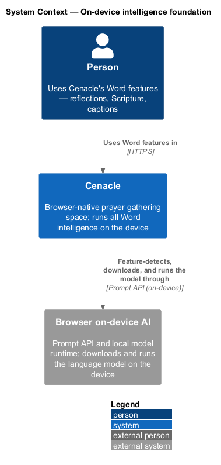
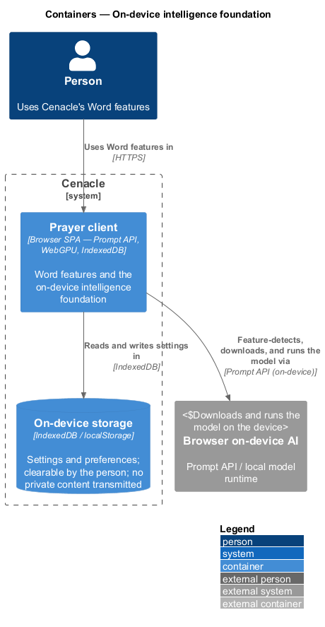
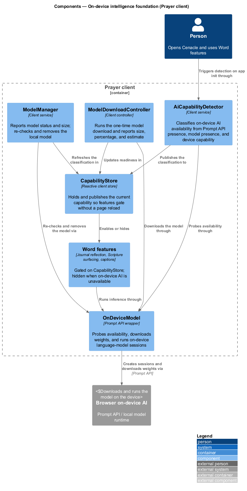
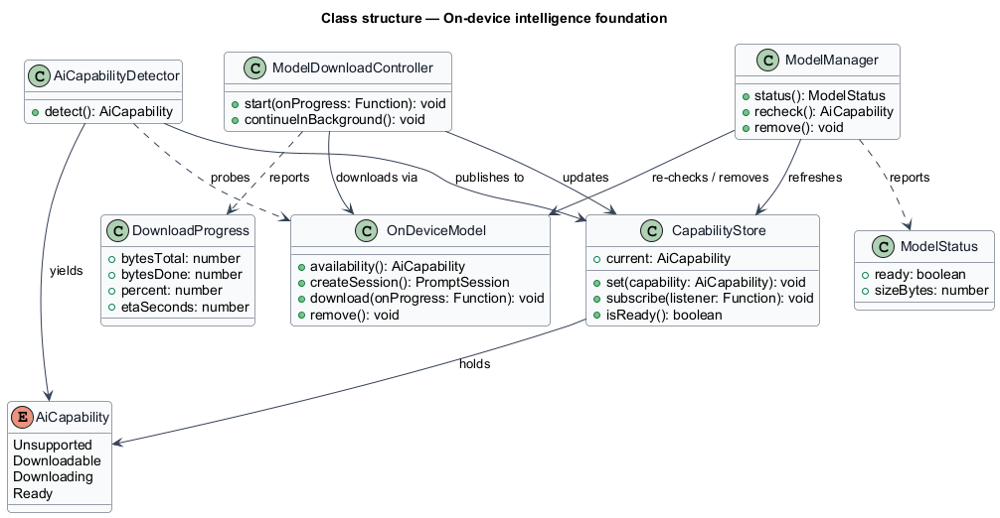
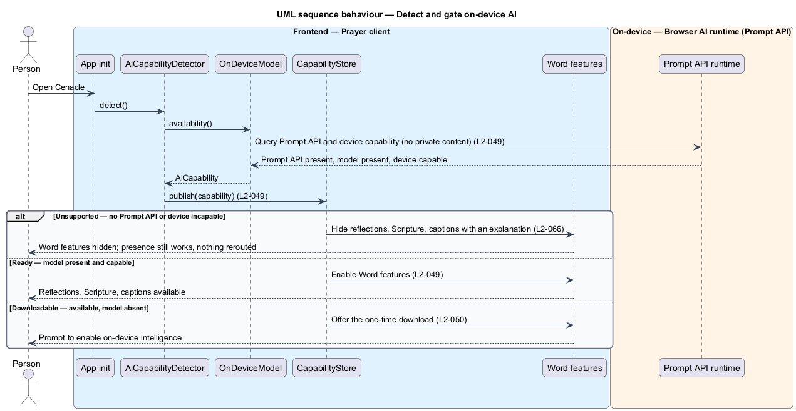
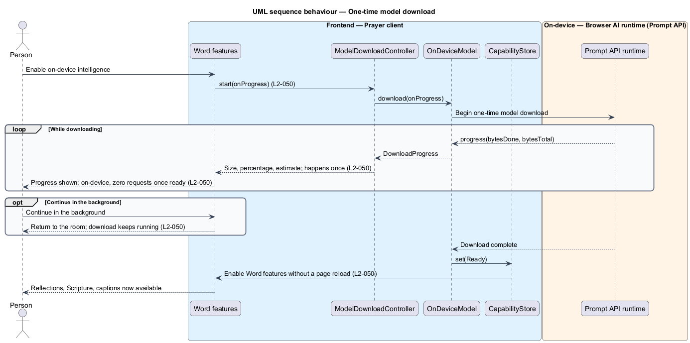

# On-device intelligence foundation

## Overview

Cenacle is a browser-native prayer gathering space. Its *Word* subsystem adds
three kinds of intelligence to a gathering: gentle journal reflections
(L1-009), Scripture surfacing from a plain-language theme (L1-008), and live
captions (L1-010). This feature is the shared foundation those three depend on:
it decides whether on-device intelligence is available, guides a one-time model
download when it is not yet present, and lets the model be managed afterwards.

*On-device AI* — a language model that runs inside the browser on the person's
own device, reached through the browser's Prompt API, with no server call. Every
Word feature runs its inference this way, so private words (journal entries,
themes, spoken prayer) never become a network request. The foundation exists so
that decision is made once, consistently, for all three features.

The feature answers three questions in order. First, is on-device AI available
on this browser and device? Second, if it is available but the model is not yet
downloaded, how does the one-time download proceed while the person keeps using
the room? Third, once present, how is the model inspected, re-checked, or
removed? When the answer to the first question is no, the Word features are
hidden with an explanation and presence keeps working — the system degrades, it
does not reroute to a server (L2-066).

## Description

The feature is a vertical slice that lives entirely in the Prayer client and
talks only to the browser's on-device AI runtime through the Prompt API. No part
of it calls a Cenacle server, and detection carries no private content.

- **`AiCapabilityDetector`** — client service that classifies on-device AI
  availability. It reads Prompt API presence, model presence, and device
  capability, and yields a single `AiCapability` value. It runs at app
  initialization and sends no private content off the device.
- **`AiCapability`** — enumeration of the four states the foundation
  distinguishes: `Unsupported`, `Downloadable`, `Downloading`, `Ready`.
- **`CapabilityStore`** — reactive client store that holds the current
  `AiCapability` and publishes changes to subscribers. It is what lets a
  download completing enable the Word features without a page reload.
- **`OnDeviceModel`** — wrapper over the browser Prompt API. It probes
  availability, downloads the model weights, creates language-model sessions,
  and removes the local model. It is the single shared handle the journal,
  Scripture, and captions features run their inference through; each depends on
  this component rather than calling the Prompt API directly.
- **`ModelDownloadController`** — client controller that runs the one-time
  download. It reports size, percentage, and an estimate, allows continuing in
  the background, and updates readiness in the `CapabilityStore` on completion.
- **`DownloadProgress`** — the progress value carried during a download: bytes
  total, bytes done, percentage, and an estimate in seconds.
- **`ModelManager`** — client service behind the settings model row. It reports
  model status and size, re-checks availability, and removes the local model
  without affecting presence.
- **`ModelStatus`** — the value the settings row shows: readiness and size in
  bytes.

The Word features that consume this foundation — journal reflection (L2-040),
Scripture surfacing (L1-008), and live captions (L2-045) — are neighbouring
slices. Each gates its own UI on the `CapabilityStore` and runs inference
through the shared `OnDeviceModel`; this feature owns the detection, download,
and management, and hands off to those slices rather than owning their behaviour.

## Requirements

The feature realizes the following level-2 (L2) requirements. Each L2 refines a
level-1 (L1) requirement, cited by identifier.

| L2 ID | Refines (L1) | Requirement |
|-------|--------------|-------------|
| `L2-049` | `L1-011` | The system shall feature-detect on-device AI availability from Prompt API presence, model presence, and device capability, gate all Word features on the result, and send no private content during detection. |
| `L2-050` | `L1-011` | When the model is available but absent, the system shall guide a one-time download showing size, percentage, and an estimate, allow continuing in the background, enable Word features on completion without a page reload, and affirm the model runs on-device with zero requests. |
| `L2-051` | `L1-011` | Settings shall show the on-device model status and size and shall let the person re-check or remove the local model without affecting presence, offering the download flow again after removal. |

## Diagrams

### System context

A person uses Cenacle's Word features; Cenacle feature-detects, downloads, and
runs the language model through the browser's on-device AI, which keeps the model
on the device. Detection and inference send no private content off the device.

### Containers

The Prayer client holds the foundation and reaches the browser on-device AI
through the Prompt API; it reads and writes settings in on-device storage. The
browser AI runtime downloads and runs the model locally.

### Components

Inside the Prayer client, `AiCapabilityDetector` classifies availability through
`OnDeviceModel` and publishes the result to `CapabilityStore`, which enables or
hides the Word features. `ModelDownloadController` and `ModelManager` drive the
download and management; all inference runs through the shared `OnDeviceModel`.

### Class structure

`AiCapabilityDetector` probes `OnDeviceModel` to yield an `AiCapability` and
publishes it to `CapabilityStore`. `ModelDownloadController` reports
`DownloadProgress` and updates the store; `ModelManager` reports `ModelStatus`
and re-checks or removes the model.

### Behaviour — detect and gate

At app initialization, `AiCapabilityDetector` classifies availability through
`OnDeviceModel` without sending private content (`L2-049`), and publishes the
result to `CapabilityStore`. An unsupported result hides the Word features with
an explanation while presence continues (`L2-066`); a ready result enables them
(`L2-049`); a downloadable result offers the one-time download (`L2-050`).

### Behaviour — one-time model download

When the model is available but absent, `ModelDownloadController` starts the
download through `OnDeviceModel`, reporting size, percentage, and an estimate and
affirming zero requests once ready (`L2-050`). The person may continue in the
background; on completion the store enables the Word features without a page
reload (`L2-050`).

