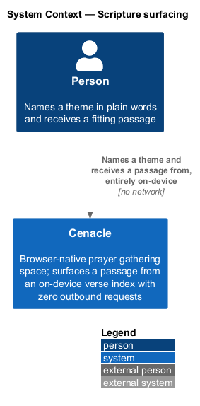
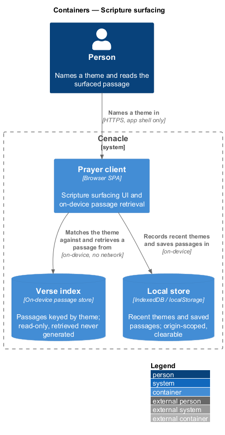
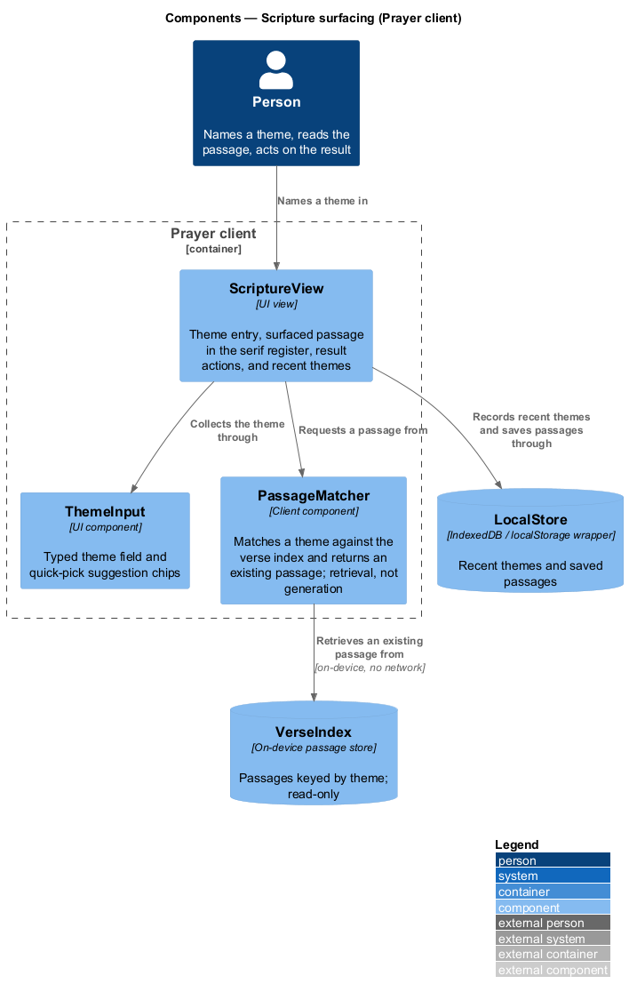
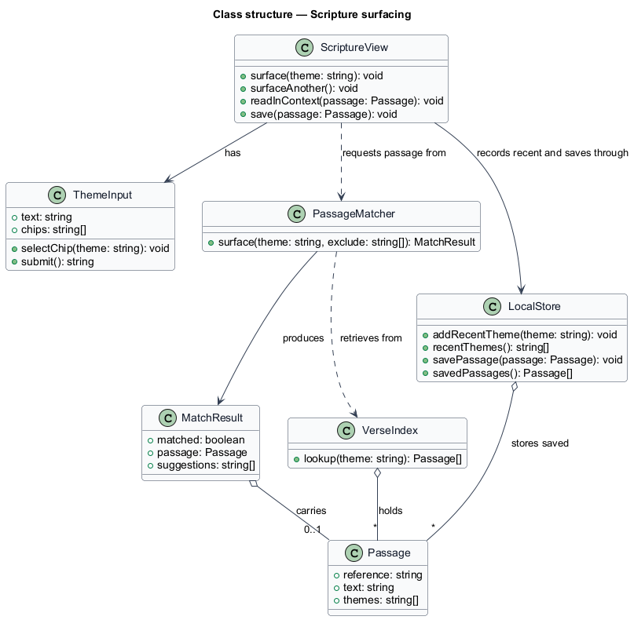
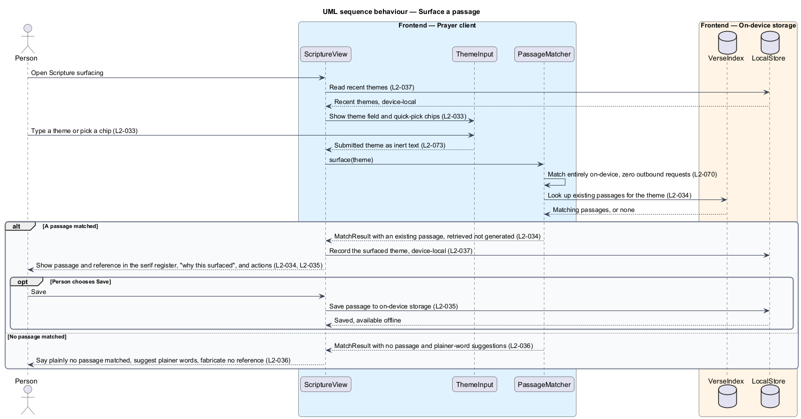

# Scripture surfacing

## Overview

Cenacle is a browser-native prayer gathering space. Alongside the live gathering
it holds a private companion — the *Word* — that a person opens without leaving
the room. This feature covers one act of that companion: naming a theme in plain
words and receiving a fitting passage of Scripture.

*theme* — a plain-language word or short phrase for what a person carries, such
as fear, gratitude, or waiting. A person names a theme by typing it or by
selecting a quick-pick chip. In response the system surfaces a *passage* — an
existing block of Scripture text together with its reference.

The passage is *retrieved, never generated*. It is matched against a *verse
index* — an on-device store of passages keyed by theme — and returned verbatim.
No language model composes or paraphrases it. When the index holds no match, the
system says so plainly and suggests plainer words rather than inventing a
reference. The whole act runs on the device: matching reads local data and issues
zero outbound network requests, and recent themes are held only on the device.

This document assumes no prior knowledge of Cenacle's internals. Terms are
defined at first use, and the diagrams show where each part lives.

## Description

The feature is a vertical slice that runs entirely inside the browser, from the
Scripture screen to the on-device stores it reads and writes.

- **`ScriptureView`** — UI view for Scripture surfacing in the Prayer client. It
  hosts the theme entry, renders the surfaced passage and its reference in the
  serif register, offers the result actions and a plain "why this surfaced"
  explanation, and lists recent themes.
- **`ThemeInput`** — UI component for naming a theme. It holds the typed field and
  a set of quick-pick suggestion chips, and returns the submitted theme as inert
  text.
- **`PassageMatcher`** — client component that matches a theme against the verse
  index and returns an existing passage. It performs retrieval, not generation,
  and issues no network request.
- **`VerseIndex`** — on-device store of passages keyed by theme. It answers a
  theme lookup with the passages that match, or with none. It is read-only at run
  time.
- **`LocalStore`** — wrapper over origin-scoped browser storage (`IndexedDB` /
  `localStorage`) shared across the Word subsystem. For this feature it records
  recent themes and holds saved passages; both are device-local and clearable by
  the person.
- **`Passage`** — an existing block of Scripture text, its `reference`, and the
  `themes` it answers.
- **`MatchResult`** — the outcome of a surfacing: whether a passage matched, the
  passage when one did, and plainer-word suggestions when none did.

Matching is retrieval from the local index; it does not use the on-device Prompt
API that the journal reflection and caption slices rely on. The zero-egress
guarantee (`L2-070`) and the on-device availability gate for Word features
(`L2-066`) are neighbouring slices; this feature depends on them rather than
owning them.

## Requirements

The feature realizes the following level-2 (L2) requirements. Each L2 refines a
level-1 (L1) requirement, cited by identifier.

| L2 ID | Refines (L1) | Requirement |
|-------|--------------|-------------|
| `L2-033` | `L1-008` | Scripture surfacing shall accept a plain-language theme by typing and by quick-pick suggestion chips, and shall echo the theme back as inert text. |
| `L2-034` | `L1-008` | The system shall match the theme against an on-device verse index and return an existing passage with its reference, retrieved and never generated, and shall issue no network request. |
| `L2-035` | `L1-008` | A surfaced passage shall offer to surface another, read in context, and save, and shall present a plain "why this surfaced" explanation and the recent themes. |
| `L2-036` | `L1-008` | When the index holds no match, the system shall state so plainly, suggest plainer alternative words, and shall not fabricate a reference. |
| `L2-037` | `L1-008` | Recent themes shall be stored on the device only and shall not be transmitted off the device. |

## Diagrams

### System context

The person names a theme and receives a passage from Cenacle. The relationship
carries no network traffic beyond loading the application shell: the surfacing
itself is on-device, so no external system appears.

### Containers

Inside Cenacle, the Prayer client matches the theme against the on-device verse
index and reads and writes recent themes and saved passages in the local store.
No container reaches a server for the surfacing.

### Components

Within the Prayer client, `ScriptureView` collects the theme through `ThemeInput`
and requests a passage from `PassageMatcher`, which retrieves an existing passage
from `VerseIndex`. `ScriptureView` records recent themes and saves passages
through `LocalStore`.

### Class structure

`ScriptureView` has a `ThemeInput` and requests a passage from `PassageMatcher`,
which retrieves from `VerseIndex` and produces a `MatchResult` carrying a
`Passage`. `LocalStore` holds recent themes and saved passages.

### Behaviour — surface a passage

`ScriptureView` loads recent themes and shows the theme field and chips (`L2-033`,
`L2-037`); on submit, `PassageMatcher` matches entirely on-device with zero
outbound requests (`L2-070`) and looks the theme up in `VerseIndex` (`L2-034`).
When a passage matches, the view shows it in the serif register with its actions
(`L2-035`); when none matches, the view says so plainly and fabricates no
reference (`L2-036`).

